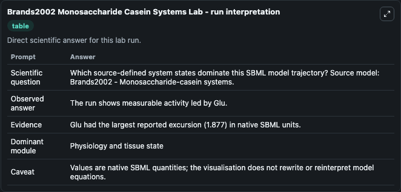
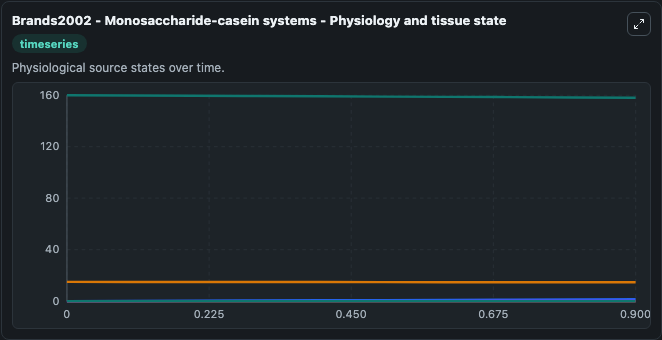
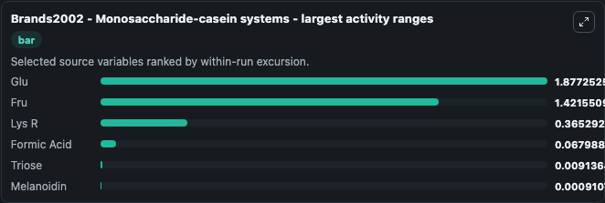
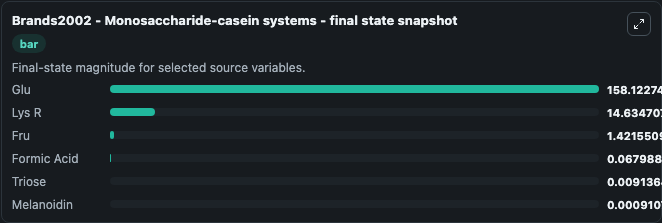
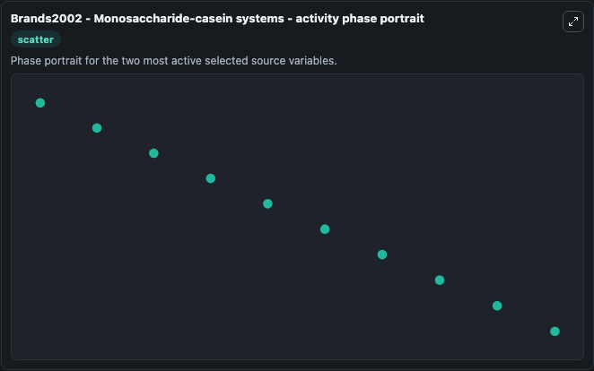

# Brands2002 Monosaccharide Casein Systems

This Biosimulant lab wraps `Brands2002 Monosaccharide Casein Systems` as a runnable systems biology model with a companion visualization module.
Brands2002 - Monosaccharide-casein systems A kinetic model of the Maillard reaction occurring in heated monosaccharide-casein system. It can be used to explore the configured dynamics and compare scenario outcomes across configurations.

## What You'll See

The lab asks: Which source-defined system states dominate this SBML model trajectory? Source model: Brands2002 - Monosaccharide-casein systems. It runs for 1.0 time units with a communication step of 0.1. The run uses the model defaults declared by the curated SBML wrapper. The generated visualizations focus on Glu, Lys R, Triose, Melanoidin, Fru, and Formic Acid, combining trajectory, endpoint-comparison, and summary-table views from one completed dark-mode run.

In this captured run, **Glu** moved from 160.0 to 158.1 across 1.0 simulation windows.


### Output Visualizations



*Summary table for Brands2002 Monosaccharide Casein Systems, reporting the scientific question, observed answer, dominant module, and caveat.*



*Trajectories of Glu, Fru, Lys R, Formic Acid, Triose, and Melanoidin across the 1.0 simulation. In this run **Fru** climbed from 0 to 1.422 and **Glu** fell from 160.0 to 158.1 — the largest movements among the focused observables.*



*Largest-excursion ranking of the focused observables — the absolute movement magnitude during the run. Top 3: **Glu** = 1.877, **Fru** = 1.422, **Lys R** = 0.3653, with 3 more observables below.*



*Endpoint snapshot of the focused observables — final values from the captured run. Top 3 by value: **Glu** = 158.1, **Lys R** = 14.635, **Fru** = 1.422, with 3 more observables below.*



*Visualization card from the Brands2002 Monosaccharide Casein Systems dark-mode run.*


## Model Context

- Core model: `models/core`
- Visualization model: `models/visualisation`
- Standard: `other`
- Upstream source: `biomodels_ebi:BIOMD0000000052`
- License: `CC0`

## Inputs

| Input | Maps To | Default | Notes |
|---|---|---|---|
| Initial Model State Glu | `systemsbiology_sbml_brands2002_monosaccharide_casein_systems_biomd0000000052_model.initial_model_state_glu` | | Source state initial condition exposed as a model-specific control because no explicit intervention parameter is identifiable. Maps to SBML symbol `Glu`. |
| Initial Lys R | `systemsbiology_sbml_brands2002_monosaccharide_casein_systems_biomd0000000052_model.initial_lys_r` | | Source state initial condition exposed as a model-specific control because no explicit intervention parameter is identifiable. Maps to SBML symbol `lys_R`. |
| Initial Triose | `systemsbiology_sbml_brands2002_monosaccharide_casein_systems_biomd0000000052_model.initial_triose` | | Source state initial condition exposed as a model-specific control because no explicit intervention parameter is identifiable. Maps to SBML symbol `Triose`. |
| Initial Melanoidin | `systemsbiology_sbml_brands2002_monosaccharide_casein_systems_biomd0000000052_model.initial_melanoidin` | | Source state initial condition exposed as a model-specific control because no explicit intervention parameter is identifiable. Maps to SBML symbol `Melanoidin`. |
| Initial Model State Fru | `systemsbiology_sbml_brands2002_monosaccharide_casein_systems_biomd0000000052_model.initial_model_state_fru` | | Source state initial condition exposed as a model-specific control because no explicit intervention parameter is identifiable. Maps to SBML symbol `Fru`. |
| Initial Formic Acid | `systemsbiology_sbml_brands2002_monosaccharide_casein_systems_biomd0000000052_model.initial_formic_acid` | | Source state initial condition exposed as a model-specific control because no explicit intervention parameter is identifiable. Maps to SBML symbol `Formic_acid`. |

## Outputs

| Output | Maps To | Role |
|---|---|---|
| `state` | `systemsbiology_sbml_brands2002_monosaccharide_casein_systems_biomd0000000052_model.state` | Available to the visualization model and downstream workflows. |
| `summary` | `systemsbiology_sbml_brands2002_monosaccharide_casein_systems_biomd0000000052_model.summary` | Available to the visualization model and downstream workflows. |
| `species_labels` | `systemsbiology_sbml_brands2002_monosaccharide_casein_systems_biomd0000000052_model.species_labels` | Available to the visualization model and downstream workflows. |
| `glu` | `systemsbiology_sbml_brands2002_monosaccharide_casein_systems_biomd0000000052_model.glu` | Available to the visualization model and downstream workflows. |
| `lys_r` | `systemsbiology_sbml_brands2002_monosaccharide_casein_systems_biomd0000000052_model.lys_r` | Available to the visualization model and downstream workflows. |
| `triose` | `systemsbiology_sbml_brands2002_monosaccharide_casein_systems_biomd0000000052_model.triose` | Available to the visualization model and downstream workflows. |
| `melanoidin` | `systemsbiology_sbml_brands2002_monosaccharide_casein_systems_biomd0000000052_model.melanoidin` | Available to the visualization model and downstream workflows. |
| `fru` | `systemsbiology_sbml_brands2002_monosaccharide_casein_systems_biomd0000000052_model.fru` | Available to the visualization model and downstream workflows. |
| `formic_acid` | `systemsbiology_sbml_brands2002_monosaccharide_casein_systems_biomd0000000052_model.formic_acid` | Available to the visualization model and downstream workflows. |

## Runtime

- Duration: `1.0`
- Communication step: `0.1`

## Running Locally

```bash
biosimulant labs serve
```
