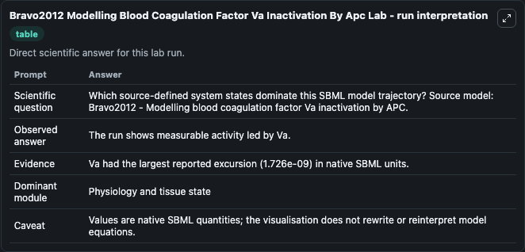
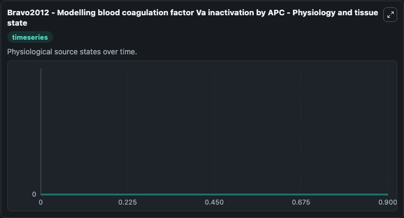

# Bravo2012 Modelling Blood Coagulation Factor Va Inactivation By Apc

This Biosimulant lab wraps `Bravo2012 Modelling Blood Coagulation Factor Va Inactivation By Apc` as a runnable systems biology model with a companion visualization module.
Mathematical model of blood coagulation factor Va and Va fragment inactivation by APC, reactions with Xa and prothrombinase-prothrombin complex formation. It can be used to explore the configured dynamics and compare scenario outcomes across configurations.

## What You'll See

The lab asks: Which source-defined system states dominate this SBML model trajectory? Source model: Bravo2012 - Modelling blood coagulation factor Va inactivation by APC. It runs for 1.0 time units with a communication step of 0.1. The run uses the model defaults declared by the curated SBML wrapper. The generated visualizations focus on Xa:Va_i_506:PT, Xa:Va_i_506, Xa:Va_i_306:PT, Xa:Va_i_306/506:PT, Xa:Va_i_306/506, and Xa:Va_i_306, combining trajectory, endpoint-comparison, and summary-table views from one completed dark-mode run.

In this captured run, **Xa:Va_i_506:PT** moved from 0 to 0 across 1.0 simulation windows.


### Output Visualizations



*Summary table for Bravo2012 Modelling Blood Coagulation Factor Va Inactivation By Apc, reporting the scientific question, observed answer, dominant module, and caveat.*



*Trajectories of Xa:Va_i_506:PT, Xa:Va_i_506, Xa:Va_i_306:PT, Xa:Va_i_306/506:PT, Xa:Va_i_306/506, and Xa:Va_i_306 across the 1.0 simulation. In this run Xa:Va_i_506:PT, Xa:Va_i_506, Xa:Va_i_306:PT, Xa:Va_i_306/506:PT stayed near their initial values — no observable moved appreciably.*


## Model Context

- Core model: `models/core`
- Visualization model: `models/visualisation`
- Standard: `other`
- Upstream source: `biomodels_ebi:BIOMD0000000739`
- License: `CC0`

## Inputs

| Input | Maps To | Default | Notes |
|---|---|---|---|
| Initial Xa Va I 506 Pt | `systemsbiology_sbml_bravo2012_modelling_blood_coagulation_factor_va_biomd0000000739_model.initial_xa_va_i_506_pt` | | Source state initial condition exposed as a model-specific control because no explicit intervention parameter is identifiable. Maps to SBML symbol `Xa_Va_i_506_PT`. |
| Initial Xa Va I 506 | `systemsbiology_sbml_bravo2012_modelling_blood_coagulation_factor_va_biomd0000000739_model.initial_xa_va_i_506` | | Source state initial condition exposed as a model-specific control because no explicit intervention parameter is identifiable. Maps to SBML symbol `Xa_Va_i_506`. |
| Initial Xa Va I 306 Pt | `systemsbiology_sbml_bravo2012_modelling_blood_coagulation_factor_va_biomd0000000739_model.initial_xa_va_i_306_pt` | | Source state initial condition exposed as a model-specific control because no explicit intervention parameter is identifiable. Maps to SBML symbol `Xa_Va_i_306_PT`. |
| Initial Xa Va I 306 506 Pt | `systemsbiology_sbml_bravo2012_modelling_blood_coagulation_factor_va_biomd0000000739_model.initial_xa_va_i_306_506_pt` | | Source state initial condition exposed as a model-specific control because no explicit intervention parameter is identifiable. Maps to SBML symbol `Xa_Va_i_306_506_PT`. |
| Initial Xa Va I 306 506 | `systemsbiology_sbml_bravo2012_modelling_blood_coagulation_factor_va_biomd0000000739_model.initial_xa_va_i_306_506` | | Source state initial condition exposed as a model-specific control because no explicit intervention parameter is identifiable. Maps to SBML symbol `Xa_Va_i_306_506`. |
| Initial Xa Va I 306 | `systemsbiology_sbml_bravo2012_modelling_blood_coagulation_factor_va_biomd0000000739_model.initial_xa_va_i_306` | | Source state initial condition exposed as a model-specific control because no explicit intervention parameter is identifiable. Maps to SBML symbol `Xa_Va_i_306`. |

## Outputs

| Output | Maps To | Role |
|---|---|---|
| `state` | `systemsbiology_sbml_bravo2012_modelling_blood_coagulation_factor_va_biomd0000000739_model.state` | Available to the visualization model and downstream workflows. |
| `summary` | `systemsbiology_sbml_bravo2012_modelling_blood_coagulation_factor_va_biomd0000000739_model.summary` | Available to the visualization model and downstream workflows. |
| `species_labels` | `systemsbiology_sbml_bravo2012_modelling_blood_coagulation_factor_va_biomd0000000739_model.species_labels` | Available to the visualization model and downstream workflows. |
| `xa_va_i_506_pt` | `systemsbiology_sbml_bravo2012_modelling_blood_coagulation_factor_va_biomd0000000739_model.xa_va_i_506_pt` | Available to the visualization model and downstream workflows. |
| `xa_va_i_506` | `systemsbiology_sbml_bravo2012_modelling_blood_coagulation_factor_va_biomd0000000739_model.xa_va_i_506` | Available to the visualization model and downstream workflows. |
| `xa_va_i_306_pt` | `systemsbiology_sbml_bravo2012_modelling_blood_coagulation_factor_va_biomd0000000739_model.xa_va_i_306_pt` | Available to the visualization model and downstream workflows. |
| `xa_va_i_306_506_pt` | `systemsbiology_sbml_bravo2012_modelling_blood_coagulation_factor_va_biomd0000000739_model.xa_va_i_306_506_pt` | Available to the visualization model and downstream workflows. |
| `xa_va_i_306_506` | `systemsbiology_sbml_bravo2012_modelling_blood_coagulation_factor_va_biomd0000000739_model.xa_va_i_306_506` | Available to the visualization model and downstream workflows. |
| `xa_va_i_306` | `systemsbiology_sbml_bravo2012_modelling_blood_coagulation_factor_va_biomd0000000739_model.xa_va_i_306` | Available to the visualization model and downstream workflows. |

## Runtime

- Duration: `1.0`
- Communication step: `0.1`

## Running Locally

```bash
biosimulant labs serve
```
