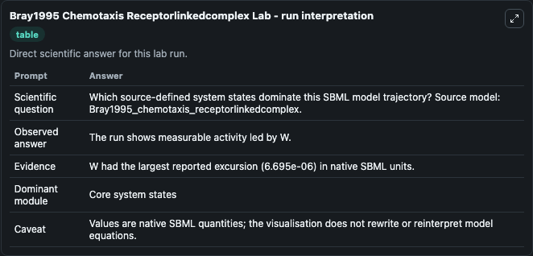
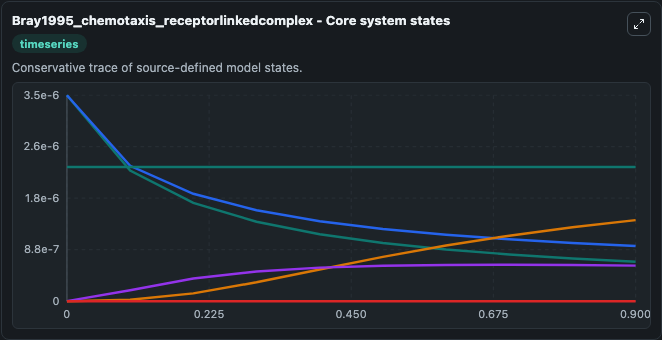
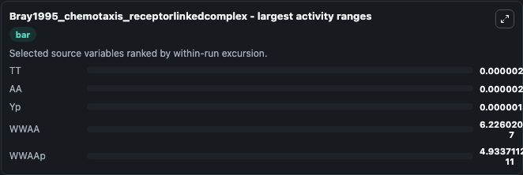
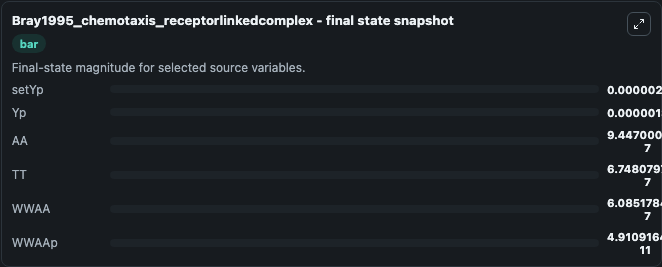
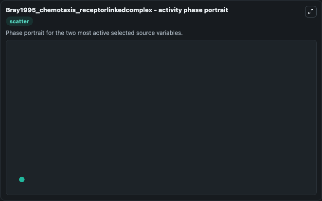

# Bray1995 Chemotaxis Receptorlinkedcomplex

This Biosimulant lab wraps `Bray1995 Chemotaxis Receptorlinkedcomplex` as a runnable systems biology model with a companion visualization module.
This model originates from BioModels Database: A Database of Annotated Published Models. It can be used to explore the configured dynamics and compare scenario outcomes across configurations.

## What You'll See

The lab asks: Which source-defined system states dominate this SBML model trajectory? Source model: Bray1995_chemotaxis_receptorlinkedcomplex. It runs for 1.0 time units with a communication step of 0.1. The run uses the model defaults declared by the curated SBML wrapper. The generated visualizations focus on setYp, TT, AA, Yp, WWAAp, and WWAA, combining trajectory, endpoint-comparison, and summary-table views from one completed dark-mode run.

In this captured run, **TT** moved from 3.53e-06 to 6.75e-07 across 1.0 simulation windows.


### Output Visualizations



*Summary table for Bray1995 Chemotaxis Receptorlinkedcomplex, reporting the scientific question, observed answer, dominant module, and caveat.*



*Trajectories of TT, AA, Yp, WWAA, WWAAp, and setYp across the 1.0 simulation. In this run **Yp** climbed from 0 to 1.39e-06 and **TT** fell from 3.53e-06 to 6.75e-07 — the largest movements among the focused observables.*



*Largest-excursion ranking of the focused observables — the absolute movement magnitude during the run. Top 3: **TT** = 2.85e-06, **AA** = 2.58e-06, **Yp** = 1.39e-06, with 2 more observables below.*



*Endpoint snapshot of the focused observables — final values from the captured run. Top 3 by value: **setYp** = 2.3e-06, **Yp** = 1.39e-06, **AA** = 9.45e-07, with 3 more observables below.*



*Visualization card from the Bray1995 Chemotaxis Receptorlinkedcomplex dark-mode run.*


## Model Context

- Core model: `models/core`
- Visualization model: `models/visualisation`
- Standard: `other`
- Upstream source: `biomodels_ebi:BIOMD0000000200`
- License: `CC0`

## Inputs

| Input | Maps To | Default | Notes |
|---|---|---|---|
| Initial Set Yp | `systemsbiology_sbml_bray1995_chemotaxis_receptorlinkedcomplex_biomd0000000200_model.initial_set_yp` | | Source state initial condition exposed as a model-specific control because no explicit intervention parameter is identifiable. Maps to SBML symbol `SetYp`. |
| Initial Model State Tt | `systemsbiology_sbml_bray1995_chemotaxis_receptorlinkedcomplex_biomd0000000200_model.initial_model_state_tt` | | Source state initial condition exposed as a model-specific control because no explicit intervention parameter is identifiable. Maps to SBML symbol `TT`. |
| Initial Model State Aa | `systemsbiology_sbml_bray1995_chemotaxis_receptorlinkedcomplex_biomd0000000200_model.initial_model_state_aa` | | Source state initial condition exposed as a model-specific control because no explicit intervention parameter is identifiable. Maps to SBML symbol `AA`. |
| Initial Model State Yp | `systemsbiology_sbml_bray1995_chemotaxis_receptorlinkedcomplex_biomd0000000200_model.initial_model_state_yp` | | Source state initial condition exposed as a model-specific control because no explicit intervention parameter is identifiable. Maps to SBML symbol `Yp`. |
| Initial Wwa Ap | `systemsbiology_sbml_bray1995_chemotaxis_receptorlinkedcomplex_biomd0000000200_model.initial_wwa_ap` | | Source state initial condition exposed as a model-specific control because no explicit intervention parameter is identifiable. Maps to SBML symbol `WWAAp`. |
| Initial Wwaa | `systemsbiology_sbml_bray1995_chemotaxis_receptorlinkedcomplex_biomd0000000200_model.initial_wwaa` | | Source state initial condition exposed as a model-specific control because no explicit intervention parameter is identifiable. Maps to SBML symbol `WWAA`. |

## Outputs

| Output | Maps To | Role |
|---|---|---|
| `state` | `systemsbiology_sbml_bray1995_chemotaxis_receptorlinkedcomplex_biomd0000000200_model.state` | Available to the visualization model and downstream workflows. |
| `summary` | `systemsbiology_sbml_bray1995_chemotaxis_receptorlinkedcomplex_biomd0000000200_model.summary` | Available to the visualization model and downstream workflows. |
| `species_labels` | `systemsbiology_sbml_bray1995_chemotaxis_receptorlinkedcomplex_biomd0000000200_model.species_labels` | Available to the visualization model and downstream workflows. |
| `set_yp` | `systemsbiology_sbml_bray1995_chemotaxis_receptorlinkedcomplex_biomd0000000200_model.set_yp` | Available to the visualization model and downstream workflows. |
| `model_state_tt` | `systemsbiology_sbml_bray1995_chemotaxis_receptorlinkedcomplex_biomd0000000200_model.model_state_tt` | Available to the visualization model and downstream workflows. |
| `model_state_aa` | `systemsbiology_sbml_bray1995_chemotaxis_receptorlinkedcomplex_biomd0000000200_model.model_state_aa` | Available to the visualization model and downstream workflows. |
| `model_state_yp` | `systemsbiology_sbml_bray1995_chemotaxis_receptorlinkedcomplex_biomd0000000200_model.model_state_yp` | Available to the visualization model and downstream workflows. |
| `wwa_ap` | `systemsbiology_sbml_bray1995_chemotaxis_receptorlinkedcomplex_biomd0000000200_model.wwa_ap` | Available to the visualization model and downstream workflows. |
| `wwaa` | `systemsbiology_sbml_bray1995_chemotaxis_receptorlinkedcomplex_biomd0000000200_model.wwaa` | Available to the visualization model and downstream workflows. |

## Runtime

- Duration: `1.0`
- Communication step: `0.1`

## Running Locally

```bash
biosimulant labs serve
```
