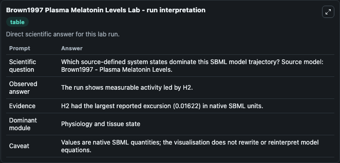
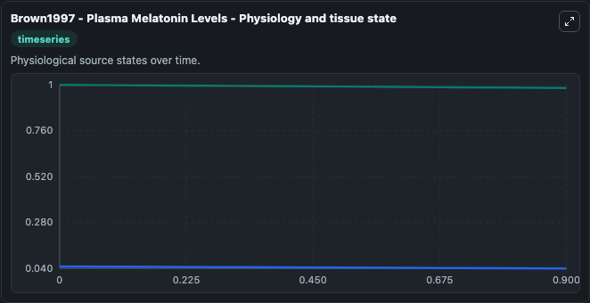
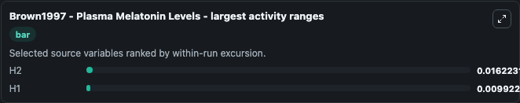
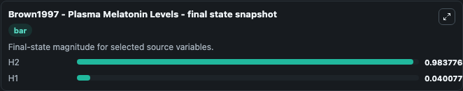
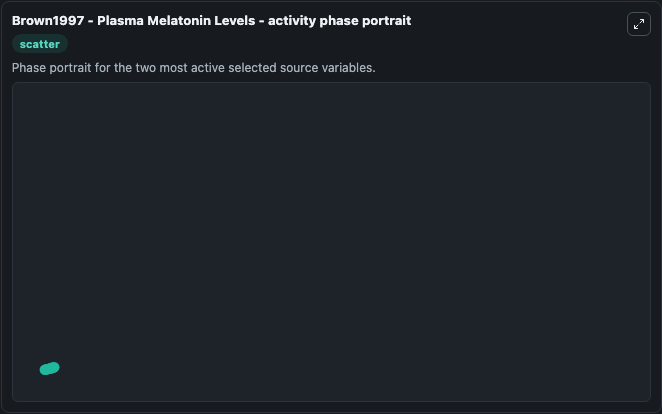

# Brown1997 Plasma Melatonin Levels

This Biosimulant lab wraps `Brown1997 Plasma Melatonin Levels` as a runnable systems biology model with a companion visualization module.
Brown1997 - Plasma Melatonin Levels A mathematical model that incorporatesa piecewise function for NAT activity to predict melatoninconcentration. It can be used to explore the configured dynamics and compare scenario outcomes across configurations.

## What You'll See

The lab asks: Which source-defined system states dominate this SBML model trajectory? Source model: Brown1997 - Plasma Melatonin Levels. It runs for 1.0 time units with a communication step of 0.1. The run uses the model defaults declared by the curated SBML wrapper. The generated visualizations focus on H2, and H1, combining trajectory, endpoint-comparison, and summary-table views from one completed dark-mode run.

In this captured run, **H2** moved from 1.000 to 0.9838 across 1.0 simulation windows.


### Output Visualizations



*Summary table for Brown1997 Plasma Melatonin Levels, reporting the scientific question, observed answer, dominant module, and caveat.*



*Trajectories of H2, and H1 across the 1.0 simulation. In this run **H2** fell from 1.000 to 0.9838 — the largest movements among the focused observables.*



*Largest-excursion ranking of the focused observables — the absolute movement magnitude during the run. Top 2: **H2** = 0.0162, **H1** = 0.00992.*



*Endpoint snapshot of the focused observables — final values from the captured run. Top 2 by value: **H2** = 0.9838, **H1** = 0.0401.*



*Visualization card from the Brown1997 Plasma Melatonin Levels dark-mode run.*


## Model Context

- Core model: `models/core`
- Visualization model: `models/visualisation`
- Standard: `other`
- Upstream source: `biomodels_ebi:BIOMD0000000672`
- License: `CC0`

## Inputs

| Input | Maps To | Default | Notes |
|---|---|---|---|
| Initial Model State H2 | `systemsbiology_sbml_brown1997_plasma_melatonin_levels_biomd0000000672_model.initial_model_state_h2` | | Source state initial condition exposed as a model-specific control because no explicit intervention parameter is identifiable. Maps to SBML symbol `H2`. |
| Initial Model State H1 | `systemsbiology_sbml_brown1997_plasma_melatonin_levels_biomd0000000672_model.initial_model_state_h1` | | Source state initial condition exposed as a model-specific control because no explicit intervention parameter is identifiable. Maps to SBML symbol `H1`. |

## Outputs

| Output | Maps To | Role |
|---|---|---|
| `state` | `systemsbiology_sbml_brown1997_plasma_melatonin_levels_biomd0000000672_model.state` | Available to the visualization model and downstream workflows. |
| `summary` | `systemsbiology_sbml_brown1997_plasma_melatonin_levels_biomd0000000672_model.summary` | Available to the visualization model and downstream workflows. |
| `species_labels` | `systemsbiology_sbml_brown1997_plasma_melatonin_levels_biomd0000000672_model.species_labels` | Available to the visualization model and downstream workflows. |
| `model_state_h2` | `systemsbiology_sbml_brown1997_plasma_melatonin_levels_biomd0000000672_model.model_state_h2` | Available to the visualization model and downstream workflows. |
| `model_state_h1` | `systemsbiology_sbml_brown1997_plasma_melatonin_levels_biomd0000000672_model.model_state_h1` | Available to the visualization model and downstream workflows. |

## Runtime

- Duration: `1.0`
- Communication step: `0.1`

## Running Locally

```bash
biosimulant labs serve
```
