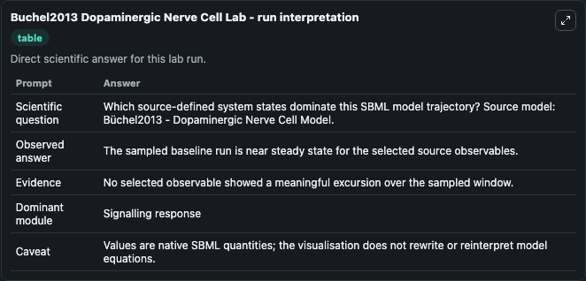
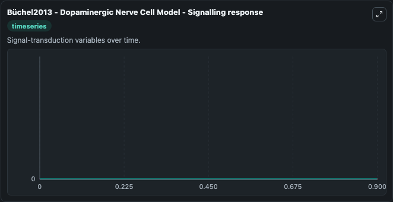

# Buchel2013 Dopaminergic Nerve Cell

This Biosimulant lab wraps `Buchel2013 Dopaminergic Nerve Cell` as a runnable systems biology model with a companion visualization module.
Systems Biology BChel2013Dopaminergic Nerve Cell Model Model1302200000Model models core biological dynamics as a OTHER simulation curated from biomodels_ebi (biomodels_ebi:MODEL1302200000), focused on systemsbi. It can be used to explore the configured dynamics and compare scenario outcomes across configurations.

## What You'll See

The lab asks: Which source-defined system states dominate this SBML model trajectory? Source model: Büchel2013 - Dopaminergic Nerve Cell Model. It runs for 1.0 time units with a communication step of 0.1. The run uses the model defaults declared by the curated SBML wrapper. The generated visualizations focus on BiogenesisMitochondria, mtDNADefect, damagedProtein, NAD+, ADP+Pi, and Complex_damagedProtein_TRAP1P, combining trajectory, endpoint-comparison, and summary-table views from one completed dark-mode run.

In this captured run, **BiogenesisMitochondria** moved from 0 to 0 across 1.0 simulation windows.


### Output Visualizations



*Summary table for Buchel2013 Dopaminergic Nerve Cell, reporting the scientific question, observed answer, dominant module, and caveat.*



*Trajectories of BiogenesisMitochondria, mtDNADefect, damagedProtein, NAD+, ADP+Pi, and Complex_damagedProtein_TRAP1P across the 1.0 simulation. In this run BiogenesisMitochondria, mtDNADefect, damagedProtein, NAD+ stayed near their initial values — no observable moved appreciably.*


## Model Context

- Core model: `models/core`
- Visualization model: `models/visualisation`
- Standard: `other`
- Upstream source: `biomodels_ebi:MODEL1302200000`
- License: `CC0`

## Inputs

| Input | Maps To | Default | Notes |
|---|---|---|---|
| Initial Biogenesis Mitochondria | `systemsbiology_sbml_b_chel2013_dopaminergic_nerve_cell_model_model1302200000_model.initial_biogenesis_mitochondria` | | Source state initial condition exposed as a model-specific control because no explicit intervention parameter is identifiable. Maps to SBML symbol `BiogenesisMitochondria`. |
| Initial Mt DNA Defect | `systemsbiology_sbml_b_chel2013_dopaminergic_nerve_cell_model_model1302200000_model.initial_mt_dna_defect` | | Source state initial condition exposed as a model-specific control because no explicit intervention parameter is identifiable. Maps to SBML symbol `mtDNADefect`. |
| Initial Damaged Protein | `systemsbiology_sbml_b_chel2013_dopaminergic_nerve_cell_model_model1302200000_model.initial_damaged_protein` | | Source state initial condition exposed as a model-specific control because no explicit intervention parameter is identifiable. Maps to SBML symbol `damagedProtein`. |
| Initial Model State Nad | `systemsbiology_sbml_b_chel2013_dopaminergic_nerve_cell_model_model1302200000_model.initial_model_state_nad` | | Source state initial condition exposed as a model-specific control because no explicit intervention parameter is identifiable. Maps to SBML symbol `NAD`. |
| Initial ADP Pi | `systemsbiology_sbml_b_chel2013_dopaminergic_nerve_cell_model_model1302200000_model.initial_adp_pi` | | Source state initial condition exposed as a model-specific control because no explicit intervention parameter is identifiable. Maps to SBML symbol `ADP_P`. |
| Initial Complex Damaged Protein Trap1 P | `systemsbiology_sbml_b_chel2013_dopaminergic_nerve_cell_model_model1302200000_model.initial_complex_damaged_protein_trap1_p` | | Source state initial condition exposed as a model-specific control because no explicit intervention parameter is identifiable. Maps to SBML symbol `Complex_damagedProtein_TRAP1P`. |

## Outputs

| Output | Maps To | Role |
|---|---|---|
| `state` | `systemsbiology_sbml_b_chel2013_dopaminergic_nerve_cell_model_model1302200000_model.state` | Available to the visualization model and downstream workflows. |
| `summary` | `systemsbiology_sbml_b_chel2013_dopaminergic_nerve_cell_model_model1302200000_model.summary` | Available to the visualization model and downstream workflows. |
| `species_labels` | `systemsbiology_sbml_b_chel2013_dopaminergic_nerve_cell_model_model1302200000_model.species_labels` | Available to the visualization model and downstream workflows. |
| `biogenesis_mitochondria` | `systemsbiology_sbml_b_chel2013_dopaminergic_nerve_cell_model_model1302200000_model.biogenesis_mitochondria` | Available to the visualization model and downstream workflows. |
| `mt_dna_defect` | `systemsbiology_sbml_b_chel2013_dopaminergic_nerve_cell_model_model1302200000_model.mt_dna_defect` | Available to the visualization model and downstream workflows. |
| `damaged_protein` | `systemsbiology_sbml_b_chel2013_dopaminergic_nerve_cell_model_model1302200000_model.damaged_protein` | Available to the visualization model and downstream workflows. |
| `nad` | `systemsbiology_sbml_b_chel2013_dopaminergic_nerve_cell_model_model1302200000_model.nad` | Available to the visualization model and downstream workflows. |
| `adp_pi` | `systemsbiology_sbml_b_chel2013_dopaminergic_nerve_cell_model_model1302200000_model.adp_pi` | Available to the visualization model and downstream workflows. |
| `complex_damaged_protein_trap1_p` | `systemsbiology_sbml_b_chel2013_dopaminergic_nerve_cell_model_model1302200000_model.complex_damaged_protein_trap1_p` | Available to the visualization model and downstream workflows. |

## Runtime

- Duration: `1.0`
- Communication step: `0.1`

## Running Locally

```bash
biosimulant labs serve
```
