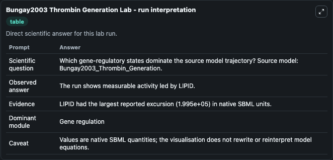
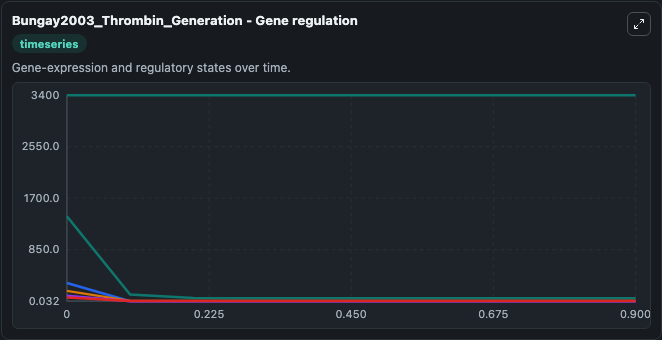
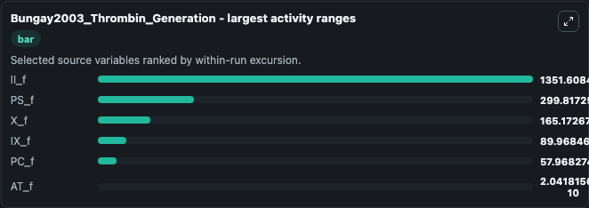
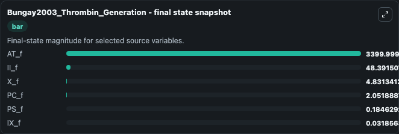
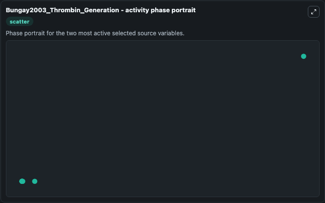

# Bungay2003 Thrombin Generation

This Biosimulant lab wraps `Bungay2003 Thrombin Generation` as a runnable systems biology model with a companion visualization module.
This model is from the article: A mathematical model of lipid-mediated thrombin generation Bungay Sharene D., Gentry Patricia A., Gentry Rodney D. It can be used to explore the configured dynamics and compare scenario outcomes across configurations.

## What You'll See

The lab asks: Which gene-regulatory states dominate the source model trajectory? Source model: Bungay2003_Thrombin_Generation. It runs for 1.0 time units with a communication step of 0.1. The run uses the model defaults declared by the curated SBML wrapper. The generated visualizations focus on AT_f, II_f, PS_f, X_f, IX_f, and PC_f, combining trajectory, endpoint-comparison, and summary-table views from one completed dark-mode run.

In this captured run, **II_f** moved from 1400.0 to 48.392 across 1.0 simulation windows.


### Output Visualizations



*Summary table for Bungay2003 Thrombin Generation, reporting the scientific question, observed answer, dominant module, and caveat.*



*Trajectories of II_f, PS_f, X_f, IX_f, PC_f, and AT_f across the 1.0 simulation. In this run **II_f** fell from 1400.0 to 48.392 — the largest movements among the focused observables.*



*Largest-excursion ranking of the focused observables — the absolute movement magnitude during the run. Top 3: **II_f** = 1351.6, **PS_f** = 299.8, **X_f** = 165.2, with 3 more observables below.*



*Endpoint snapshot of the focused observables — final values from the captured run. Top 3 by value: **AT_f** = 3400.0, **II_f** = 48.392, **X_f** = 4.831, with 3 more observables below.*



*Visualization card from the Bungay2003 Thrombin Generation dark-mode run.*


## Model Context

- Core model: `models/core`
- Visualization model: `models/visualisation`
- Standard: `other`
- Upstream source: `biomodels_ebi:BIOMD0000000334`
- License: `CC0`

## Inputs

| Input | Maps To | Default | Notes |
|---|---|---|---|
| Initial At F | `systemsbiology_sbml_bungay2003_thrombin_generation_biomd0000000334_model.initial_at_f` | | Source state initial condition exposed as a model-specific control because no explicit intervention parameter is identifiable. Maps to SBML symbol `AT_f`. |
| Initial Ii F | `systemsbiology_sbml_bungay2003_thrombin_generation_biomd0000000334_model.initial_ii_f` | | Source state initial condition exposed as a model-specific control because no explicit intervention parameter is identifiable. Maps to SBML symbol `II_f`. |
| Initial Ps F | `systemsbiology_sbml_bungay2003_thrombin_generation_biomd0000000334_model.initial_ps_f` | | Source state initial condition exposed as a model-specific control because no explicit intervention parameter is identifiable. Maps to SBML symbol `PS_f`. |
| Initial Model State X F | `systemsbiology_sbml_bungay2003_thrombin_generation_biomd0000000334_model.initial_model_state_x_f` | | Source state initial condition exposed as a model-specific control because no explicit intervention parameter is identifiable. Maps to SBML symbol `X_f`. |
| Initial Ix F | `systemsbiology_sbml_bungay2003_thrombin_generation_biomd0000000334_model.initial_ix_f` | | Source state initial condition exposed as a model-specific control because no explicit intervention parameter is identifiable. Maps to SBML symbol `IX_f`. |
| Initial Pc F | `systemsbiology_sbml_bungay2003_thrombin_generation_biomd0000000334_model.initial_pc_f` | | Source state initial condition exposed as a model-specific control because no explicit intervention parameter is identifiable. Maps to SBML symbol `PC_f`. |

## Outputs

| Output | Maps To | Role |
|---|---|---|
| `state` | `systemsbiology_sbml_bungay2003_thrombin_generation_biomd0000000334_model.state` | Available to the visualization model and downstream workflows. |
| `summary` | `systemsbiology_sbml_bungay2003_thrombin_generation_biomd0000000334_model.summary` | Available to the visualization model and downstream workflows. |
| `species_labels` | `systemsbiology_sbml_bungay2003_thrombin_generation_biomd0000000334_model.species_labels` | Available to the visualization model and downstream workflows. |
| `at_f` | `systemsbiology_sbml_bungay2003_thrombin_generation_biomd0000000334_model.at_f` | Available to the visualization model and downstream workflows. |
| `ii_f` | `systemsbiology_sbml_bungay2003_thrombin_generation_biomd0000000334_model.ii_f` | Available to the visualization model and downstream workflows. |
| `ps_f` | `systemsbiology_sbml_bungay2003_thrombin_generation_biomd0000000334_model.ps_f` | Available to the visualization model and downstream workflows. |
| `x_f` | `systemsbiology_sbml_bungay2003_thrombin_generation_biomd0000000334_model.x_f` | Available to the visualization model and downstream workflows. |
| `ix_f` | `systemsbiology_sbml_bungay2003_thrombin_generation_biomd0000000334_model.ix_f` | Available to the visualization model and downstream workflows. |
| `pc_f` | `systemsbiology_sbml_bungay2003_thrombin_generation_biomd0000000334_model.pc_f` | Available to the visualization model and downstream workflows. |

## Runtime

- Duration: `1.0`
- Communication step: `0.1`

## Running Locally

```bash
biosimulant labs serve
```
