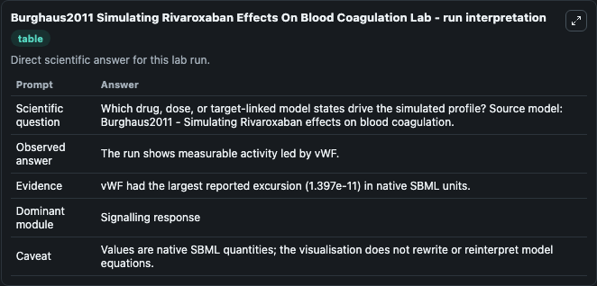
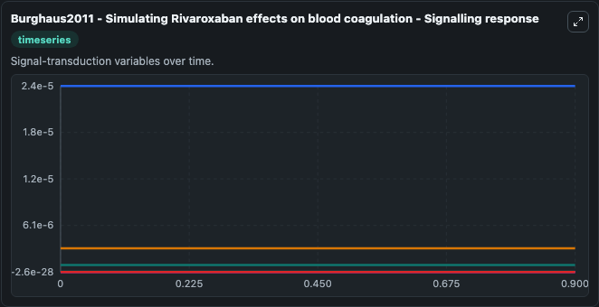
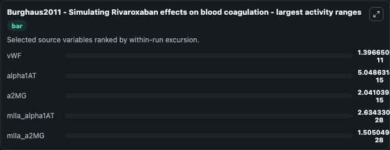
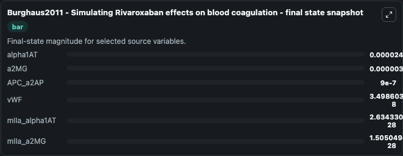
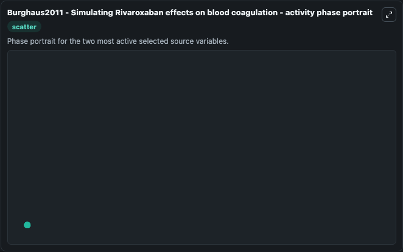

# Burghaus2011 Simulating Rivaroxaban Effects On Blood Coagulation

This Biosimulant lab wraps `Burghaus2011 Simulating Rivaroxaban Effects On Blood Coagulation` as a runnable systems biology model with a companion visualization module.
Systems Biology Burghaus2011Simulating Rivaroxaban Effects On BModel1805140001Model represents core biological mechanisms from biomodels_ebi reference biomodels_ebi:MODEL1805140001. It can be used to explore the configured dynamics and compare scenario outcomes across configurations.

## What You'll See

The lab asks: Which drug, dose, or target-linked model states drive the simulated profile? Source model: Burghaus2011 - Simulating Rivaroxaban effects on blood coagulation. It runs for 1.0 time units with a communication step of 0.1. The run uses the model defaults declared by the curated SBML wrapper. The generated visualizations focus on alpha1AT, a2MG, APC_a2AP, vWF, mIIa_alpha1AT, and mIIa_a2MG, combining trajectory, endpoint-comparison, and summary-table views from one completed dark-mode run.

In this captured run, **vWF** moved from 3.5e-08 to 3.5e-08 across 1.0 simulation windows.


### Output Visualizations



*Summary table for Burghaus2011 Simulating Rivaroxaban Effects On Blood Coagulation, reporting the scientific question, observed answer, dominant module, and caveat.*



*Trajectories of vWF, alpha1AT, a2MG, mIIa_alpha1AT, mIIa_a2MG, and APC_a2AP across the 1.0 simulation. In this run **vWF** fell from 3.5e-08 to 3.5e-08 — the largest movements among the focused observables.*



*Largest-excursion ranking of the focused observables — the absolute movement magnitude during the run. Top 3: **vWF** = 1.4e-11, **alpha1AT** = 5.05e-15, **a2MG** = 2.04e-15, with 2 more observables below.*



*Trajectories of vWF, alpha1AT, a2MG, mIIa_alpha1AT, mIIa_a2MG, and APC_a2AP across the 1.0 simulation. In this run **vWF** fell from 3.5e-08 to 3.5e-08 — the largest movements among the focused observables.*



*Visualization card from the Burghaus2011 Simulating Rivaroxaban Effects On Blood Coagulation dark-mode run.*


## Model Context

- Core model: `models/core`
- Visualization model: `models/visualisation`
- Standard: `other`
- Upstream source: `biomodels_ebi:MODEL1805140001`
- License: `CC0`

## Inputs

| Input | Maps To | Default | Notes |
|---|---|---|---|
| Initial Alpha1 At | `systemsbiology_sbml_burghaus2011_simulating_rivaroxaban_effects_on_b_model1805140001_model.initial_alpha1_at` | | Source state initial condition exposed as a model-specific control because no explicit intervention parameter is identifiable. Maps to SBML symbol `alpha1AT`. |
| Initial A2 Mg | `systemsbiology_sbml_burghaus2011_simulating_rivaroxaban_effects_on_b_model1805140001_model.initial_a2_mg` | | Source state initial condition exposed as a model-specific control because no explicit intervention parameter is identifiable. Maps to SBML symbol `a2MG`. |
| Initial Apc A2 Ap | `systemsbiology_sbml_burghaus2011_simulating_rivaroxaban_effects_on_b_model1805140001_model.initial_apc_a2_ap` | | Source state initial condition exposed as a model-specific control because no explicit intervention parameter is identifiable. Maps to SBML symbol `APC_a2AP`. |
| Initial V Wf | `systemsbiology_sbml_burghaus2011_simulating_rivaroxaban_effects_on_b_model1805140001_model.initial_v_wf` | | Source state initial condition exposed as a model-specific control because no explicit intervention parameter is identifiable. Maps to SBML symbol `vWF`. |
| Initial M I Ia Alpha1 At | `systemsbiology_sbml_burghaus2011_simulating_rivaroxaban_effects_on_b_model1805140001_model.initial_m_i_ia_alpha1_at` | | Source state initial condition exposed as a model-specific control because no explicit intervention parameter is identifiable. Maps to SBML symbol `mIIa_alpha1AT`. |
| Initial M I Ia A2 Mg | `systemsbiology_sbml_burghaus2011_simulating_rivaroxaban_effects_on_b_model1805140001_model.initial_m_i_ia_a2_mg` | | Source state initial condition exposed as a model-specific control because no explicit intervention parameter is identifiable. Maps to SBML symbol `mIIa_a2MG`. |

## Outputs

| Output | Maps To | Role |
|---|---|---|
| `state` | `systemsbiology_sbml_burghaus2011_simulating_rivaroxaban_effects_on_b_model1805140001_model.state` | Available to the visualization model and downstream workflows. |
| `summary` | `systemsbiology_sbml_burghaus2011_simulating_rivaroxaban_effects_on_b_model1805140001_model.summary` | Available to the visualization model and downstream workflows. |
| `species_labels` | `systemsbiology_sbml_burghaus2011_simulating_rivaroxaban_effects_on_b_model1805140001_model.species_labels` | Available to the visualization model and downstream workflows. |
| `alpha1_at` | `systemsbiology_sbml_burghaus2011_simulating_rivaroxaban_effects_on_b_model1805140001_model.alpha1_at` | Available to the visualization model and downstream workflows. |
| `a2_mg` | `systemsbiology_sbml_burghaus2011_simulating_rivaroxaban_effects_on_b_model1805140001_model.a2_mg` | Available to the visualization model and downstream workflows. |
| `apc_a2_ap` | `systemsbiology_sbml_burghaus2011_simulating_rivaroxaban_effects_on_b_model1805140001_model.apc_a2_ap` | Available to the visualization model and downstream workflows. |
| `v_wf` | `systemsbiology_sbml_burghaus2011_simulating_rivaroxaban_effects_on_b_model1805140001_model.v_wf` | Available to the visualization model and downstream workflows. |
| `m_i_ia_alpha1_at` | `systemsbiology_sbml_burghaus2011_simulating_rivaroxaban_effects_on_b_model1805140001_model.m_i_ia_alpha1_at` | Available to the visualization model and downstream workflows. |
| `m_i_ia_a2_mg` | `systemsbiology_sbml_burghaus2011_simulating_rivaroxaban_effects_on_b_model1805140001_model.m_i_ia_a2_mg` | Available to the visualization model and downstream workflows. |

## Runtime

- Duration: `1.0`
- Communication step: `0.1`

## Running Locally

```bash
biosimulant labs serve
```
