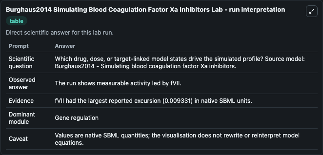
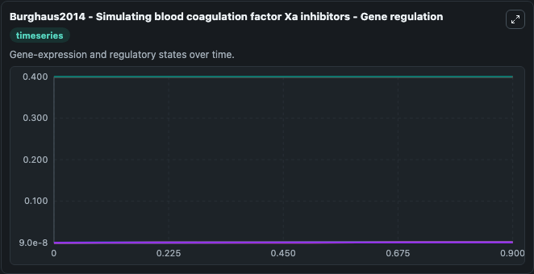
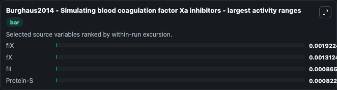
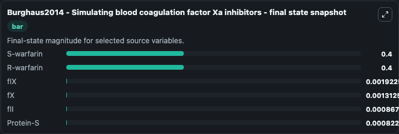
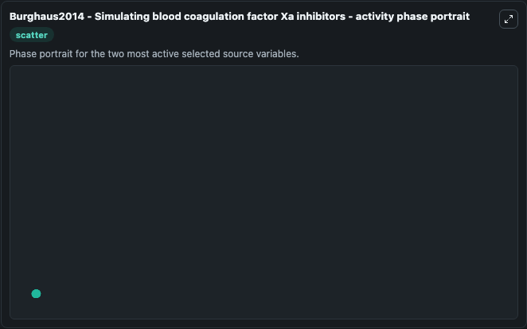

# Burghaus2014 Simulating Blood Coagulation Factor Xa Inhibitors

This Biosimulant lab wraps `Burghaus2014 Simulating Blood Coagulation Factor Xa Inhibitors` as a runnable systems biology model with a companion visualization module.
Mathematical model of blood coagulation factors II, VII, IX and X as well as protein C and protein S and the effect of warfarin on kinetic rates. It can be used to explore the configured dynamics and compare scenario outcomes across configurations.

## What You'll See

The lab asks: Which drug, dose, or target-linked model states drive the simulated profile? Source model: Burghaus2014 - Simulating blood coagulation factor Xa inhibitors. It runs for 1.0 time units with a communication step of 0.1. The run uses the model defaults declared by the curated SBML wrapper. The generated visualizations focus on S-warfarin, R-warfarin, fII, fX, Protein-S, and fIX, combining trajectory, endpoint-comparison, and summary-table views from one completed dark-mode run.

In this captured run, **fIX** moved from 9e-08 to 0.00192 across 1.0 simulation windows.


### Output Visualizations



*Summary table for Burghaus2014 Simulating Blood Coagulation Factor Xa Inhibitors, reporting the scientific question, observed answer, dominant module, and caveat.*



*Trajectories of fIX, fX, fII, Protein-S, S-warfarin, and R-warfarin across the 1.0 simulation. In this run **fIX** climbed from 9e-08 to 0.00192 — the largest movements among the focused observables.*



*Largest-excursion ranking of the focused observables — the absolute movement magnitude during the run. Top 3: **fIX** = 0.00192, **fX** = 0.00131, **fII** = 0.000866, with 1 more observable below.*



*Trajectories of fIX, fX, fII, Protein-S, S-warfarin, and R-warfarin across the 1.0 simulation. In this run **fIX** climbed from 9e-08 to 0.00192 — the largest movements among the focused observables.*



*Visualization card from the Burghaus2014 Simulating Blood Coagulation Factor Xa Inhibitors dark-mode run.*


## Model Context

- Core model: `models/core`
- Visualization model: `models/visualisation`
- Standard: `other`
- Upstream source: `biomodels_ebi:MODEL1807180005`
- License: `CC0`

## Inputs

| Input | Maps To | Default | Notes |
|---|---|---|---|
| Initial S Warfarin | `systemsbiology_sbml_burghaus2014_simulating_blood_coagulation_factor_model1807180005_model.initial_s_warfarin` | | Source state initial condition exposed as a model-specific control because no explicit intervention parameter is identifiable. Maps to SBML symbol `S_warfarin`. |
| Initial R Warfarin | `systemsbiology_sbml_burghaus2014_simulating_blood_coagulation_factor_model1807180005_model.initial_r_warfarin` | | Source state initial condition exposed as a model-specific control because no explicit intervention parameter is identifiable. Maps to SBML symbol `R_warfarin`. |
| Initial F Ii | `systemsbiology_sbml_burghaus2014_simulating_blood_coagulation_factor_model1807180005_model.initial_f_ii` | | Source state initial condition exposed as a model-specific control because no explicit intervention parameter is identifiable. Maps to SBML symbol `fII`. |
| Initial Model State F X | `systemsbiology_sbml_burghaus2014_simulating_blood_coagulation_factor_model1807180005_model.initial_model_state_f_x` | | Source state initial condition exposed as a model-specific control because no explicit intervention parameter is identifiable. Maps to SBML symbol `fX`. |
| Initial Protein S | `systemsbiology_sbml_burghaus2014_simulating_blood_coagulation_factor_model1807180005_model.initial_protein_s` | | Source state initial condition exposed as a model-specific control because no explicit intervention parameter is identifiable. Maps to SBML symbol `Protein_S`. |
| Initial F Ix | `systemsbiology_sbml_burghaus2014_simulating_blood_coagulation_factor_model1807180005_model.initial_f_ix` | | Source state initial condition exposed as a model-specific control because no explicit intervention parameter is identifiable. Maps to SBML symbol `fIX`. |

## Outputs

| Output | Maps To | Role |
|---|---|---|
| `state` | `systemsbiology_sbml_burghaus2014_simulating_blood_coagulation_factor_model1807180005_model.state` | Available to the visualization model and downstream workflows. |
| `summary` | `systemsbiology_sbml_burghaus2014_simulating_blood_coagulation_factor_model1807180005_model.summary` | Available to the visualization model and downstream workflows. |
| `species_labels` | `systemsbiology_sbml_burghaus2014_simulating_blood_coagulation_factor_model1807180005_model.species_labels` | Available to the visualization model and downstream workflows. |
| `s_warfarin` | `systemsbiology_sbml_burghaus2014_simulating_blood_coagulation_factor_model1807180005_model.s_warfarin` | Available to the visualization model and downstream workflows. |
| `r_warfarin` | `systemsbiology_sbml_burghaus2014_simulating_blood_coagulation_factor_model1807180005_model.r_warfarin` | Available to the visualization model and downstream workflows. |
| `f_ii` | `systemsbiology_sbml_burghaus2014_simulating_blood_coagulation_factor_model1807180005_model.f_ii` | Available to the visualization model and downstream workflows. |
| `f_x` | `systemsbiology_sbml_burghaus2014_simulating_blood_coagulation_factor_model1807180005_model.f_x` | Available to the visualization model and downstream workflows. |
| `protein_s` | `systemsbiology_sbml_burghaus2014_simulating_blood_coagulation_factor_model1807180005_model.protein_s` | Available to the visualization model and downstream workflows. |
| `f_ix` | `systemsbiology_sbml_burghaus2014_simulating_blood_coagulation_factor_model1807180005_model.f_ix` | Available to the visualization model and downstream workflows. |

## Runtime

- Duration: `1.0`
- Communication step: `0.1`

## Running Locally

```bash
biosimulant labs serve
```
