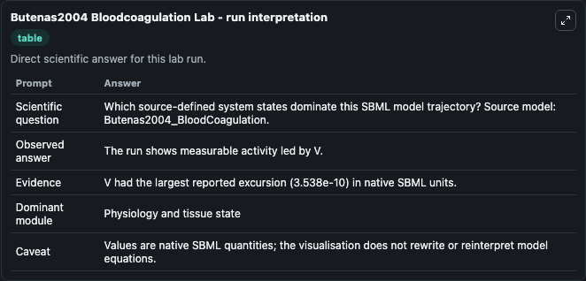
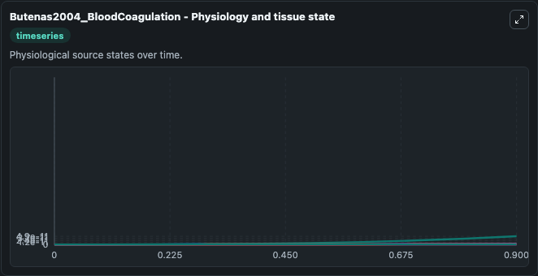
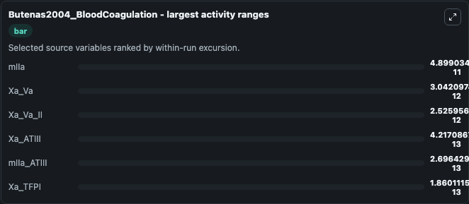
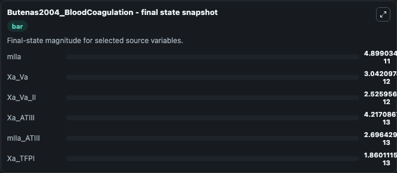
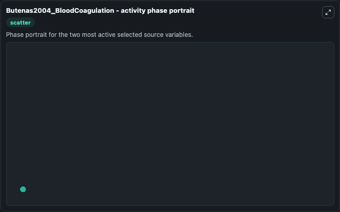

# Butenas2004 Bloodcoagulation

This Biosimulant lab wraps `Butenas2004 Bloodcoagulation` as a runnable systems biology model with a companion visualization module.
This model originates from BioModels Database: A Database of Annotated Published Models (http://www.ebi.ac.uk/biomodels/). It can be used to explore the configured dynamics and compare scenario outcomes across configurations.

## What You'll See

The lab asks: Which source-defined system states dominate this SBML model trajectory? Source model: Butenas2004_BloodCoagulation. It runs for 1.0 time units with a communication step of 0.1. The run uses the model defaults declared by the curated SBML wrapper. The generated visualizations focus on mIIa_ATIII, mIIa, Xa_Va_II, Xa_Va, Xa_TFPI, and Xa_ATIII, combining trajectory, endpoint-comparison, and summary-table views from one completed dark-mode run.

In this captured run, **mIIa** moved from 0 to 4.9e-11 across 1.0 simulation windows.


### Output Visualizations



*Summary table for Butenas2004 Bloodcoagulation, reporting the scientific question, observed answer, dominant module, and caveat.*



*Trajectories of mIIa, Xa_Va, Xa_Va_II, Xa_ATIII, mIIa_ATIII, and Xa_TFPI across the 1.0 simulation. In this run **mIIa** climbed from 0 to 4.9e-11 — the largest movements among the focused observables.*



*Largest-excursion ranking of the focused observables — the absolute movement magnitude during the run. Top 3: **mIIa** = 4.9e-11, **Xa_Va** = 3.04e-12, **Xa_Va_II** = 2.53e-12, with 3 more observables below.*



*Endpoint snapshot of the focused observables — final values from the captured run. Top 3 by value: **mIIa** = 4.9e-11, **Xa_Va** = 3.04e-12, **Xa_Va_II** = 2.53e-12, with 3 more observables below.*



*Visualization card from the Butenas2004 Bloodcoagulation dark-mode run.*


## Model Context

- Core model: `models/core`
- Visualization model: `models/visualisation`
- Standard: `other`
- Upstream source: `biomodels_ebi:BIOMD0000000362`
- License: `CC0`

## Inputs

| Input | Maps To | Default | Notes |
|---|---|---|---|
| Initial M I Ia Atiii | `systemsbiology_sbml_butenas2004_bloodcoagulation_biomd0000000362_model.initial_m_i_ia_atiii` | | Source state initial condition exposed as a model-specific control because no explicit intervention parameter is identifiable. Maps to SBML symbol `mIIa_ATIII`. |
| Initial M I Ia | `systemsbiology_sbml_butenas2004_bloodcoagulation_biomd0000000362_model.initial_m_i_ia` | | Source state initial condition exposed as a model-specific control because no explicit intervention parameter is identifiable. Maps to SBML symbol `mIIa`. |
| Initial Xa Va Ii | `systemsbiology_sbml_butenas2004_bloodcoagulation_biomd0000000362_model.initial_xa_va_ii` | | Source state initial condition exposed as a model-specific control because no explicit intervention parameter is identifiable. Maps to SBML symbol `Xa_Va_II`. |
| Initial Xa Va | `systemsbiology_sbml_butenas2004_bloodcoagulation_biomd0000000362_model.initial_xa_va` | | Source state initial condition exposed as a model-specific control because no explicit intervention parameter is identifiable. Maps to SBML symbol `Xa_Va`. |
| Initial Xa Tfpi | `systemsbiology_sbml_butenas2004_bloodcoagulation_biomd0000000362_model.initial_xa_tfpi` | | Source state initial condition exposed as a model-specific control because no explicit intervention parameter is identifiable. Maps to SBML symbol `Xa_TFPI`. |
| Initial Xa Atiii | `systemsbiology_sbml_butenas2004_bloodcoagulation_biomd0000000362_model.initial_xa_atiii` | | Source state initial condition exposed as a model-specific control because no explicit intervention parameter is identifiable. Maps to SBML symbol `Xa_ATIII`. |

## Outputs

| Output | Maps To | Role |
|---|---|---|
| `state` | `systemsbiology_sbml_butenas2004_bloodcoagulation_biomd0000000362_model.state` | Available to the visualization model and downstream workflows. |
| `summary` | `systemsbiology_sbml_butenas2004_bloodcoagulation_biomd0000000362_model.summary` | Available to the visualization model and downstream workflows. |
| `species_labels` | `systemsbiology_sbml_butenas2004_bloodcoagulation_biomd0000000362_model.species_labels` | Available to the visualization model and downstream workflows. |
| `m_i_ia_atiii` | `systemsbiology_sbml_butenas2004_bloodcoagulation_biomd0000000362_model.m_i_ia_atiii` | Available to the visualization model and downstream workflows. |
| `m_i_ia` | `systemsbiology_sbml_butenas2004_bloodcoagulation_biomd0000000362_model.m_i_ia` | Available to the visualization model and downstream workflows. |
| `xa_va_ii` | `systemsbiology_sbml_butenas2004_bloodcoagulation_biomd0000000362_model.xa_va_ii` | Available to the visualization model and downstream workflows. |
| `xa_va` | `systemsbiology_sbml_butenas2004_bloodcoagulation_biomd0000000362_model.xa_va` | Available to the visualization model and downstream workflows. |
| `xa_tfpi` | `systemsbiology_sbml_butenas2004_bloodcoagulation_biomd0000000362_model.xa_tfpi` | Available to the visualization model and downstream workflows. |
| `xa_atiii` | `systemsbiology_sbml_butenas2004_bloodcoagulation_biomd0000000362_model.xa_atiii` | Available to the visualization model and downstream workflows. |

## Runtime

- Duration: `1.0`
- Communication step: `0.1`

## Running Locally

```bash
biosimulant labs serve
```
