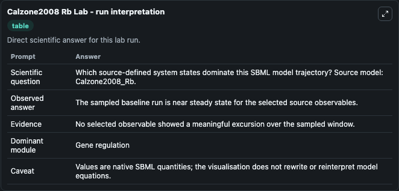
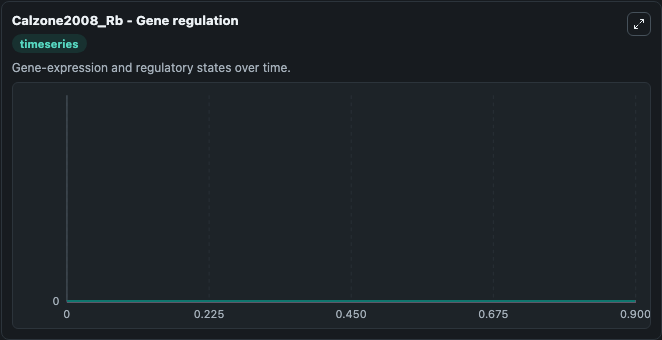

# Calzone2008 Rb

This Biosimulant lab wraps `Calzone2008 Rb` as a runnable systems biology model with a companion visualization module.
Protein names are HUGO names or usual names. It can be used to explore the configured dynamics and compare scenario outcomes across configurations.

## What You'll See

The lab asks: Which source-defined system states dominate this SBML model trajectory? Source model: Calzone2008_Rb. It runs for 1.0 time units with a communication step of 0.1. The run uses the model defaults declared by the curated SBML wrapper. The generated visualizations focus on cyclin H*, cyclin E1*/CDK2/p130, cyclin E1*/CDK2/p107, cyclin E1*/CDK2/CDKN1A, and cyclin E1*/CDK2, combining trajectory, endpoint-comparison, and summary-table views from one completed dark-mode run.

In this captured run, **cyclin H*** moved from 0 to 0 across 1.0 simulation windows.


### Output Visualizations



*Summary table for Calzone2008 Rb, reporting the scientific question, observed answer, dominant module, and caveat.*



*Trajectories of cyclin H*, cyclin E1*/CDK2/p130, cyclin E1*/CDK2/p107, cyclin E1*/CDK2/CDKN1A, cyclin E1*/CDK2, and cyclin E1*/CDK2 across the 1.0 simulation. In this run cyclin H*, cyclin E1*/CDK2/p130, cyclin E1*/CDK2/p107, cyclin E1*/CDK2/CDKN1A stayed near their initial values — no observable moved appreciably.*


## Model Context

- Core model: `models/core`
- Visualization model: `models/visualisation`
- Standard: `other`
- Upstream source: `biomodels_ebi:MODEL4132046015`
- License: `CC0`

## Inputs

| Input | Maps To | Default | Notes |
|---|---|---|---|
| Initial Cyclin H | `systemsbiology_sbml_calzone2008_rb_model4132046015_model.initial_cyclin_h` | | Source state initial condition exposed as a model-specific control because no explicit intervention parameter is identifiable. Maps to SBML symbol `s401`. |
| Initial Cyclin E1 Cdk2 P130 | `systemsbiology_sbml_calzone2008_rb_model4132046015_model.initial_cyclin_e1_cdk2_p130` | | Source state initial condition exposed as a model-specific control because no explicit intervention parameter is identifiable. Maps to SBML symbol `s1486`. |
| Initial Cyclin E1 Cdk2 P107 | `systemsbiology_sbml_calzone2008_rb_model4132046015_model.initial_cyclin_e1_cdk2_p107` | | Source state initial condition exposed as a model-specific control because no explicit intervention parameter is identifiable. Maps to SBML symbol `s1487`. |
| Initial Cyclin E1 Cdk2 Cdkn1 A | `systemsbiology_sbml_calzone2008_rb_model4132046015_model.initial_cyclin_e1_cdk2_cdkn1_a` | | Source state initial condition exposed as a model-specific control because no explicit intervention parameter is identifiable. Maps to SBML symbol `s787`. |
| Initial Cyclin E1 Cdk2 | `systemsbiology_sbml_calzone2008_rb_model4132046015_model.initial_cyclin_e1_cdk2` | | Source state initial condition exposed as a model-specific control because no explicit intervention parameter is identifiable. Maps to SBML symbol `s723`. |
| Initial Cyclin E1 Cdk2 2 | `systemsbiology_sbml_calzone2008_rb_model4132046015_model.initial_cyclin_e1_cdk2_2` | | Source state initial condition exposed as a model-specific control because no explicit intervention parameter is identifiable. Maps to SBML symbol `s721`. |

## Outputs

| Output | Maps To | Role |
|---|---|---|
| `state` | `systemsbiology_sbml_calzone2008_rb_model4132046015_model.state` | Available to the visualization model and downstream workflows. |
| `summary` | `systemsbiology_sbml_calzone2008_rb_model4132046015_model.summary` | Available to the visualization model and downstream workflows. |
| `species_labels` | `systemsbiology_sbml_calzone2008_rb_model4132046015_model.species_labels` | Available to the visualization model and downstream workflows. |
| `cyclin_h` | `systemsbiology_sbml_calzone2008_rb_model4132046015_model.cyclin_h` | Available to the visualization model and downstream workflows. |
| `cyclin_e1_cdk2_p130` | `systemsbiology_sbml_calzone2008_rb_model4132046015_model.cyclin_e1_cdk2_p130` | Available to the visualization model and downstream workflows. |
| `cyclin_e1_cdk2_p107` | `systemsbiology_sbml_calzone2008_rb_model4132046015_model.cyclin_e1_cdk2_p107` | Available to the visualization model and downstream workflows. |
| `cyclin_e1_cdk2_cdkn1_a` | `systemsbiology_sbml_calzone2008_rb_model4132046015_model.cyclin_e1_cdk2_cdkn1_a` | Available to the visualization model and downstream workflows. |
| `cyclin_e1_cdk2` | `systemsbiology_sbml_calzone2008_rb_model4132046015_model.cyclin_e1_cdk2` | Available to the visualization model and downstream workflows. |
| `cyclin_e1_cdk2_2` | `systemsbiology_sbml_calzone2008_rb_model4132046015_model.cyclin_e1_cdk2_2` | Available to the visualization model and downstream workflows. |

## Runtime

- Duration: `1.0`
- Communication step: `0.1`

## Running Locally

```bash
biosimulant labs serve
```
