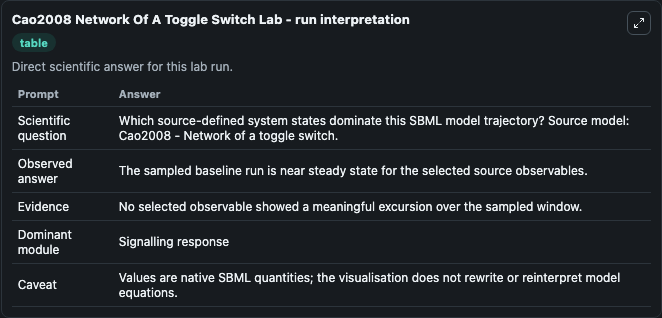
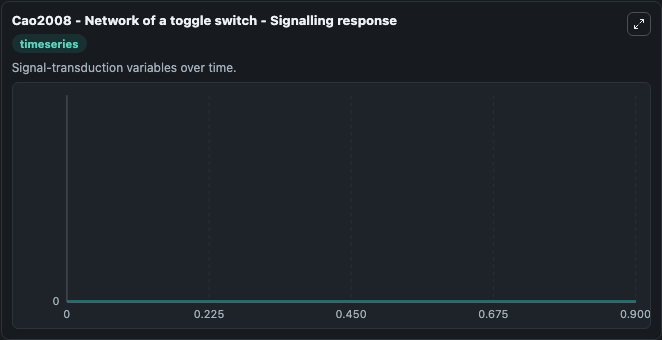

# Cao2008 Network Of A Toggle Switch

This Biosimulant lab wraps `Cao2008 Network Of A Toggle Switch` as a runnable systems biology model with a companion visualization module.
Youfang Cao & Jie Liang. It can be used to explore the configured dynamics and compare scenario outcomes across configurations.

## What You'll See

The lab asks: Which source-defined system states dominate this SBML model trajectory? Source model: Cao2008 - Network of a toggle switch. It runs for 1.0 time units with a communication step of 0.1. The run uses the model defaults declared by the curated SBML wrapper. The generated visualizations focus on Pb, Pa, Db, Da, BDb, and BDa, combining trajectory, endpoint-comparison, and summary-table views from one completed dark-mode run.

In this captured run, **Pb** moved from 0 to 0 across 1.0 simulation windows.


### Output Visualizations



*Summary table for Cao2008 Network Of A Toggle Switch, reporting the scientific question, observed answer, dominant module, and caveat.*



*Trajectories of Pb, Pa, Db, Da, BDb, and BDa across the 1.0 simulation. In this run Pb, Pa, Db, Da stayed near their initial values — no observable moved appreciably.*


## Model Context

- Core model: `models/core`
- Visualization model: `models/visualisation`
- Standard: `other`
- Upstream source: `biomodels_ebi:BIOMD0000000483`
- License: `CC0`

## Inputs

| Input | Maps To | Default | Notes |
|---|---|---|---|
| Initial Model State Pb | `systemsbiology_sbml_cao2008_network_of_a_toggle_switch_biomd0000000483_model.initial_model_state_pb` | | Source state initial condition exposed as a model-specific control because no explicit intervention parameter is identifiable. Maps to SBML symbol `Pb`. |
| Initial Model State Pa | `systemsbiology_sbml_cao2008_network_of_a_toggle_switch_biomd0000000483_model.initial_model_state_pa` | | Source state initial condition exposed as a model-specific control because no explicit intervention parameter is identifiable. Maps to SBML symbol `Pa`. |
| Initial Model State Db | `systemsbiology_sbml_cao2008_network_of_a_toggle_switch_biomd0000000483_model.initial_model_state_db` | | Source state initial condition exposed as a model-specific control because no explicit intervention parameter is identifiable. Maps to SBML symbol `Db`. |
| Initial Model State Da | `systemsbiology_sbml_cao2008_network_of_a_toggle_switch_biomd0000000483_model.initial_model_state_da` | | Source state initial condition exposed as a model-specific control because no explicit intervention parameter is identifiable. Maps to SBML symbol `Da`. |
| Initial B Db | `systemsbiology_sbml_cao2008_network_of_a_toggle_switch_biomd0000000483_model.initial_b_db` | | Source state initial condition exposed as a model-specific control because no explicit intervention parameter is identifiable. Maps to SBML symbol `BDb`. |
| Initial B Da | `systemsbiology_sbml_cao2008_network_of_a_toggle_switch_biomd0000000483_model.initial_b_da` | | Source state initial condition exposed as a model-specific control because no explicit intervention parameter is identifiable. Maps to SBML symbol `BDa`. |

## Outputs

| Output | Maps To | Role |
|---|---|---|
| `state` | `systemsbiology_sbml_cao2008_network_of_a_toggle_switch_biomd0000000483_model.state` | Available to the visualization model and downstream workflows. |
| `summary` | `systemsbiology_sbml_cao2008_network_of_a_toggle_switch_biomd0000000483_model.summary` | Available to the visualization model and downstream workflows. |
| `species_labels` | `systemsbiology_sbml_cao2008_network_of_a_toggle_switch_biomd0000000483_model.species_labels` | Available to the visualization model and downstream workflows. |
| `model_state_pb` | `systemsbiology_sbml_cao2008_network_of_a_toggle_switch_biomd0000000483_model.model_state_pb` | Available to the visualization model and downstream workflows. |
| `model_state_pa` | `systemsbiology_sbml_cao2008_network_of_a_toggle_switch_biomd0000000483_model.model_state_pa` | Available to the visualization model and downstream workflows. |
| `model_state_db` | `systemsbiology_sbml_cao2008_network_of_a_toggle_switch_biomd0000000483_model.model_state_db` | Available to the visualization model and downstream workflows. |
| `model_state_da` | `systemsbiology_sbml_cao2008_network_of_a_toggle_switch_biomd0000000483_model.model_state_da` | Available to the visualization model and downstream workflows. |
| `b_db` | `systemsbiology_sbml_cao2008_network_of_a_toggle_switch_biomd0000000483_model.b_db` | Available to the visualization model and downstream workflows. |
| `b_da` | `systemsbiology_sbml_cao2008_network_of_a_toggle_switch_biomd0000000483_model.b_da` | Available to the visualization model and downstream workflows. |

## Runtime

- Duration: `1.0`
- Communication step: `0.1`

## Running Locally

```bash
biosimulant labs serve
```
