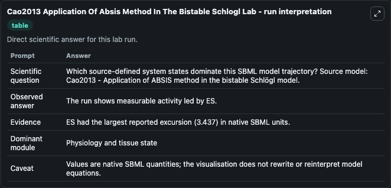
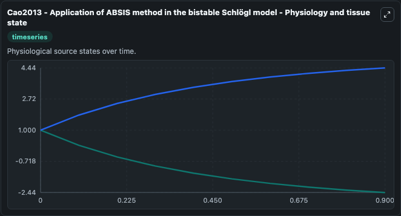
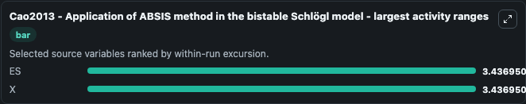
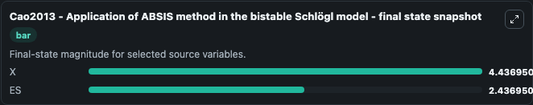
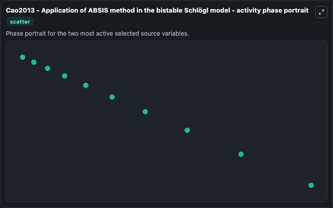

# Cao2013 Application Of Absis Method In The Bistable Schlogl

This Biosimulant lab wraps `Cao2013 Application Of Absis Method In The Bistable Schlogl` as a runnable systems biology model with a companion visualization module.
F. It can be used to explore the configured dynamics and compare scenario outcomes across configurations.

## What You'll See

The lab asks: Which source-defined system states dominate this SBML model trajectory? Source model: Cao2013 - Application of ABSIS method in the bistable Schlögl model. It runs for 1.0 time units with a communication step of 0.1. The run uses the model defaults declared by the curated SBML wrapper. The generated visualizations focus on ES, and X, combining trajectory, endpoint-comparison, and summary-table views from one completed dark-mode run.

In this captured run, **ES** moved from 1.000 to -2.437 across 1.0 simulation windows.


### Output Visualizations



*Summary table for Cao2013 Application Of Absis Method In The Bistable Schlogl, reporting the scientific question, observed answer, dominant module, and caveat.*



*Trajectories of ES, and X across the 1.0 simulation. In this run **X** climbed from 1.000 to 4.437 and **ES** fell from 1.000 to -2.437 — the largest movements among the focused observables.*



*Largest-excursion ranking of the focused observables — the absolute movement magnitude during the run. Top 2: **ES** = 3.437, **X** = 3.437.*



*Trajectories of ES, and X across the 1.0 simulation. In this run **X** climbed from 1.000 to 4.437 and **ES** fell from 1.000 to -2.437 — the largest movements among the focused observables.*



*Visualization card from the Cao2013 Application Of Absis Method In The Bistable Schlogl dark-mode run.*


## Model Context

- Core model: `models/core`
- Visualization model: `models/visualisation`
- Standard: `other`
- Upstream source: `biomodels_ebi:BIOMD0000000485`
- License: `CC0`

## Inputs

| Input | Maps To | Default | Notes |
|---|---|---|---|
| Initial Model State Es | `systemsbiology_sbml_cao2013_application_of_absis_method_in_the_bista_biomd0000000485_model.initial_model_state_es` | | Source state initial condition exposed as a model-specific control because no explicit intervention parameter is identifiable. Maps to SBML symbol `ES`. |
| Initial Model State X | `systemsbiology_sbml_cao2013_application_of_absis_method_in_the_bista_biomd0000000485_model.initial_model_state_x` | | Source state initial condition exposed as a model-specific control because no explicit intervention parameter is identifiable. Maps to SBML symbol `X`. |

## Outputs

| Output | Maps To | Role |
|---|---|---|
| `state` | `systemsbiology_sbml_cao2013_application_of_absis_method_in_the_bista_biomd0000000485_model.state` | Available to the visualization model and downstream workflows. |
| `summary` | `systemsbiology_sbml_cao2013_application_of_absis_method_in_the_bista_biomd0000000485_model.summary` | Available to the visualization model and downstream workflows. |
| `species_labels` | `systemsbiology_sbml_cao2013_application_of_absis_method_in_the_bista_biomd0000000485_model.species_labels` | Available to the visualization model and downstream workflows. |
| `model_state_es` | `systemsbiology_sbml_cao2013_application_of_absis_method_in_the_bista_biomd0000000485_model.model_state_es` | Available to the visualization model and downstream workflows. |
| `model_state_x` | `systemsbiology_sbml_cao2013_application_of_absis_method_in_the_bista_biomd0000000485_model.model_state_x` | Available to the visualization model and downstream workflows. |

## Runtime

- Duration: `1.0`
- Communication step: `0.1`

## Running Locally

```bash
biosimulant labs serve
```
