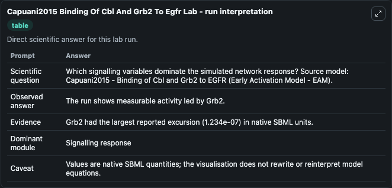
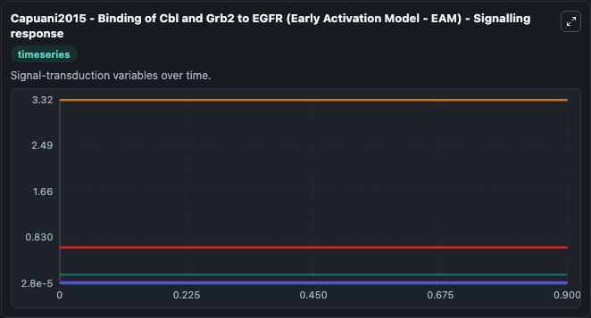
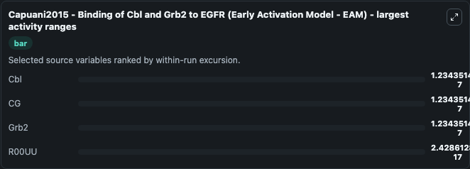
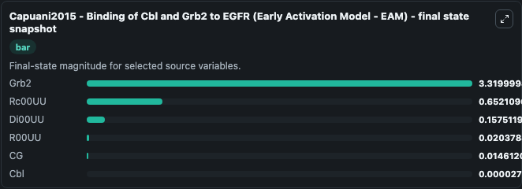
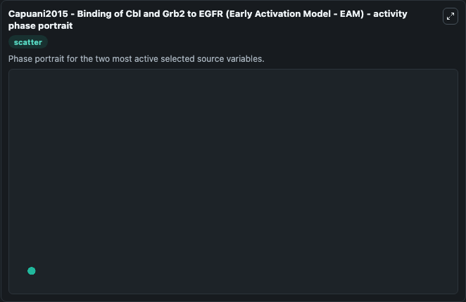

# Capuani2015 Binding Of Cbl And Grb2 To Egfr

This Biosimulant lab wraps `Capuani2015 Binding Of Cbl And Grb2 To Egfr` as a runnable systems biology model with a companion visualization module.
Fabrizio Capuani, Alexia Conte, Elisabetta Argenzio, Luca Marchetti, Corrado Priami, Simona Polo, Pier Paolo Di Fiore, Sara Sigismund & Andrea Ciliberto. It can be used to explore the configured dynamics and compare scenario outcomes across configurations.

## What You'll See

The lab asks: Which signalling variables dominate the simulated network response? Source model: Capuani2015 - Binding of Cbl and Grb2 to EGFR (Early Activation Model - EAM). It runs for 1.0 time units with a communication step of 0.1. The run uses the model defaults declared by the curated SBML wrapper. The generated visualizations focus on Grb2, Rc00UU, Di00UU, R00UU, CG, and Cbl, combining trajectory, endpoint-comparison, and summary-table views from one completed dark-mode run.

In this captured run, **Grb2** moved from 3.320 to 3.320 across 1.0 simulation windows.


### Output Visualizations



*Summary table for Capuani2015 Binding Of Cbl And Grb2 To Egfr, reporting the scientific question, observed answer, dominant module, and caveat.*



*Trajectories of Cbl, CG, Grb2, R00UU, Rc00UU, and Di00UU across the 1.0 simulation. In this run **CG** climbed from 0.0146 to 0.0146 and **Grb2** fell from 3.320 to 3.320 — the largest movements among the focused observables.*



*Largest-excursion ranking of the focused observables — the absolute movement magnitude during the run. Top 3: **Cbl** = 1.23e-07, **CG** = 1.23e-07, **Grb2** = 1.23e-07, with 1 more observable below.*



*Endpoint snapshot of the focused observables — final values from the captured run. Top 3 by value: **Grb2** = 3.320, **Rc00UU** = 0.6521, **Di00UU** = 0.1575, with 3 more observables below.*



*Visualization card from the Capuani2015 Binding Of Cbl And Grb2 To Egfr dark-mode run.*


## Model Context

- Core model: `models/core`
- Visualization model: `models/visualisation`
- Standard: `other`
- Upstream source: `biomodels_ebi:BIOMD0000000595`
- License: `CC0`

## Inputs

| Input | Maps To | Default | Notes |
|---|---|---|---|
| Initial Grb2 | `systemsbiology_sbml_capuani2015_binding_of_cbl_and_grb2_to_egfr_earl_biomd0000000595_model.initial_grb2` | | Source state initial condition exposed as a model-specific control because no explicit intervention parameter is identifiable. Maps to SBML symbol `Grb2`. |
| Initial Rc00 Uu | `systemsbiology_sbml_capuani2015_binding_of_cbl_and_grb2_to_egfr_earl_biomd0000000595_model.initial_rc00_uu` | | Source state initial condition exposed as a model-specific control because no explicit intervention parameter is identifiable. Maps to SBML symbol `Rc00UU`. |
| Initial Di00 Uu | `systemsbiology_sbml_capuani2015_binding_of_cbl_and_grb2_to_egfr_earl_biomd0000000595_model.initial_di00_uu` | | Source state initial condition exposed as a model-specific control because no explicit intervention parameter is identifiable. Maps to SBML symbol `Di00UU`. |
| Initial R00 Uu | `systemsbiology_sbml_capuani2015_binding_of_cbl_and_grb2_to_egfr_earl_biomd0000000595_model.initial_r00_uu` | | Source state initial condition exposed as a model-specific control because no explicit intervention parameter is identifiable. Maps to SBML symbol `R00UU`. |
| Initial Model State Cg | `systemsbiology_sbml_capuani2015_binding_of_cbl_and_grb2_to_egfr_earl_biomd0000000595_model.initial_model_state_cg` | | Source state initial condition exposed as a model-specific control because no explicit intervention parameter is identifiable. Maps to SBML symbol `CG`. |
| Initial Model State Cbl | `systemsbiology_sbml_capuani2015_binding_of_cbl_and_grb2_to_egfr_earl_biomd0000000595_model.initial_model_state_cbl` | | Source state initial condition exposed as a model-specific control because no explicit intervention parameter is identifiable. Maps to SBML symbol `Cbl`. |

## Outputs

| Output | Maps To | Role |
|---|---|---|
| `state` | `systemsbiology_sbml_capuani2015_binding_of_cbl_and_grb2_to_egfr_earl_biomd0000000595_model.state` | Available to the visualization model and downstream workflows. |
| `summary` | `systemsbiology_sbml_capuani2015_binding_of_cbl_and_grb2_to_egfr_earl_biomd0000000595_model.summary` | Available to the visualization model and downstream workflows. |
| `species_labels` | `systemsbiology_sbml_capuani2015_binding_of_cbl_and_grb2_to_egfr_earl_biomd0000000595_model.species_labels` | Available to the visualization model and downstream workflows. |
| `grb2` | `systemsbiology_sbml_capuani2015_binding_of_cbl_and_grb2_to_egfr_earl_biomd0000000595_model.grb2` | Available to the visualization model and downstream workflows. |
| `rc00_uu` | `systemsbiology_sbml_capuani2015_binding_of_cbl_and_grb2_to_egfr_earl_biomd0000000595_model.rc00_uu` | Available to the visualization model and downstream workflows. |
| `di00_uu` | `systemsbiology_sbml_capuani2015_binding_of_cbl_and_grb2_to_egfr_earl_biomd0000000595_model.di00_uu` | Available to the visualization model and downstream workflows. |
| `r00_uu` | `systemsbiology_sbml_capuani2015_binding_of_cbl_and_grb2_to_egfr_earl_biomd0000000595_model.r00_uu` | Available to the visualization model and downstream workflows. |
| `model_state_cg` | `systemsbiology_sbml_capuani2015_binding_of_cbl_and_grb2_to_egfr_earl_biomd0000000595_model.model_state_cg` | Available to the visualization model and downstream workflows. |
| `cbl` | `systemsbiology_sbml_capuani2015_binding_of_cbl_and_grb2_to_egfr_earl_biomd0000000595_model.cbl` | Available to the visualization model and downstream workflows. |

## Runtime

- Duration: `1.0`
- Communication step: `0.1`

## Running Locally

```bash
biosimulant labs serve
```
