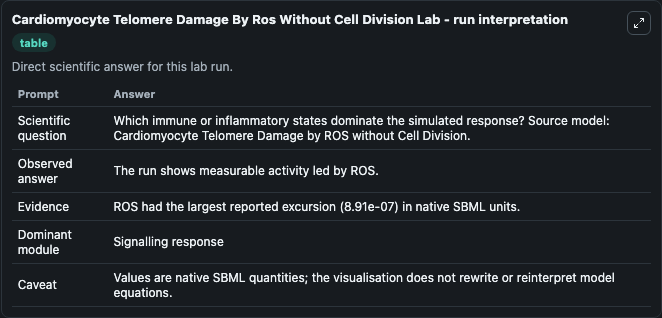
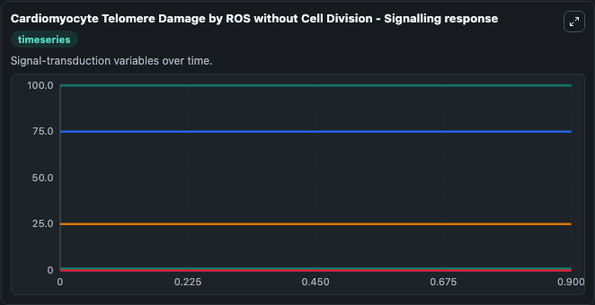
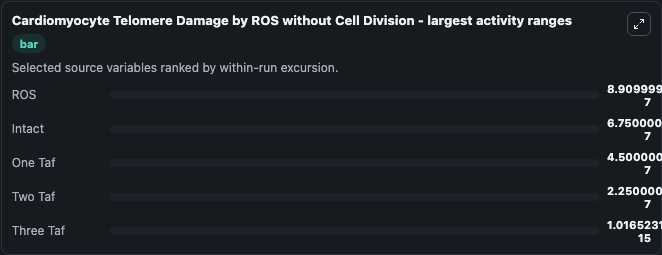
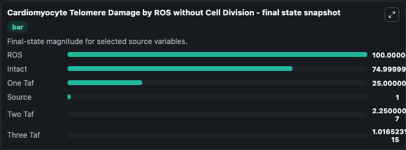
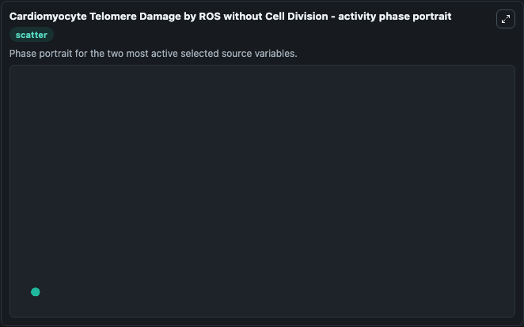

# Cardiomyocyte Telomere Damage By Ros Without Cell Division

This Biosimulant lab wraps `Cardiomyocyte Telomere Damage By Ros Without Cell Division` as a runnable systems biology model with a companion visualization module.
Systems Biology Cardiomyocyte Telomere Damage By Ros Without Cel Model1608250001Model models core biological dynamics as a OTHER simulation curated from biomodels_ebi (biomodels_ebi:MODEL1608250001), focused on. It can be used to explore the configured dynamics and compare scenario outcomes across configurations.

## What You'll See

The lab asks: Which immune or inflammatory states dominate the simulated response? Source model: Cardiomyocyte Telomere Damage by ROS without Cell Division. It runs for 1.0 time units with a communication step of 0.1. The run uses the model defaults declared by the curated SBML wrapper. The generated visualizations focus on ROS, Intact, One Taf, Source, Two Taf, and Three Taf, combining trajectory, endpoint-comparison, and summary-table views from one completed dark-mode run.

In this captured run, **ROS** moved from 100.0 to 100.0 across 1.0 simulation windows.


### Output Visualizations



*Summary table for Cardiomyocyte Telomere Damage By Ros Without Cell Division, reporting the scientific question, observed answer, dominant module, and caveat.*



*Trajectories of ROS, Intact, One Taf, Two Taf, Three Taf, and Source across the 1.0 simulation. In this run **ROS** climbed from 100.0 to 100.0 and **Intact** fell from 75.000 to 75.000 — the largest movements among the focused observables.*



*Largest-excursion ranking of the focused observables — the absolute movement magnitude during the run. Top 3: **ROS** = 8.91e-07, **Intact** = 6.75e-07, **One Taf** = 4.5e-07, with 2 more observables below.*



*Endpoint snapshot of the focused observables — final values from the captured run. Top 3 by value: **ROS** = 100.0, **Intact** = 75.000, **One Taf** = 25.000, with 3 more observables below.*



*Visualization card from the Cardiomyocyte Telomere Damage By Ros Without Cell Division dark-mode run.*


## Model Context

- Core model: `models/core`
- Visualization model: `models/visualisation`
- Standard: `other`
- Upstream source: `biomodels_ebi:MODEL1608250001`
- License: `CC0`

## Inputs

| Input | Maps To | Default | Notes |
|---|---|---|---|
| Initial Model State Ros | `systemsbiology_sbml_cardiomyocyte_telomere_damage_by_ros_without_cel_model1608250001_model.initial_model_state_ros` | | Source state initial condition exposed as a model-specific control because no explicit intervention parameter is identifiable. Maps to SBML symbol `ROS`. |
| Initial Intact | `systemsbiology_sbml_cardiomyocyte_telomere_damage_by_ros_without_cel_model1608250001_model.initial_intact` | | Source state initial condition exposed as a model-specific control because no explicit intervention parameter is identifiable. Maps to SBML symbol `intact`. |
| Initial One Taf | `systemsbiology_sbml_cardiomyocyte_telomere_damage_by_ros_without_cel_model1608250001_model.initial_one_taf` | | Source state initial condition exposed as a model-specific control because no explicit intervention parameter is identifiable. Maps to SBML symbol `one_taf`. |
| Initial Source | `systemsbiology_sbml_cardiomyocyte_telomere_damage_by_ros_without_cel_model1608250001_model.initial_source` | | Source state initial condition exposed as a model-specific control because no explicit intervention parameter is identifiable. Maps to SBML symbol `Source`. |
| Initial Two Taf | `systemsbiology_sbml_cardiomyocyte_telomere_damage_by_ros_without_cel_model1608250001_model.initial_two_taf` | | Source state initial condition exposed as a model-specific control because no explicit intervention parameter is identifiable. Maps to SBML symbol `two_taf`. |
| Initial Three Taf | `systemsbiology_sbml_cardiomyocyte_telomere_damage_by_ros_without_cel_model1608250001_model.initial_three_taf` | | Source state initial condition exposed as a model-specific control because no explicit intervention parameter is identifiable. Maps to SBML symbol `three_taf`. |

## Outputs

| Output | Maps To | Role |
|---|---|---|
| `state` | `systemsbiology_sbml_cardiomyocyte_telomere_damage_by_ros_without_cel_model1608250001_model.state` | Available to the visualization model and downstream workflows. |
| `summary` | `systemsbiology_sbml_cardiomyocyte_telomere_damage_by_ros_without_cel_model1608250001_model.summary` | Available to the visualization model and downstream workflows. |
| `species_labels` | `systemsbiology_sbml_cardiomyocyte_telomere_damage_by_ros_without_cel_model1608250001_model.species_labels` | Available to the visualization model and downstream workflows. |
| `ros` | `systemsbiology_sbml_cardiomyocyte_telomere_damage_by_ros_without_cel_model1608250001_model.ros` | Available to the visualization model and downstream workflows. |
| `intact` | `systemsbiology_sbml_cardiomyocyte_telomere_damage_by_ros_without_cel_model1608250001_model.intact` | Available to the visualization model and downstream workflows. |
| `one_taf` | `systemsbiology_sbml_cardiomyocyte_telomere_damage_by_ros_without_cel_model1608250001_model.one_taf` | Available to the visualization model and downstream workflows. |
| `source` | `systemsbiology_sbml_cardiomyocyte_telomere_damage_by_ros_without_cel_model1608250001_model.source` | Available to the visualization model and downstream workflows. |
| `two_taf` | `systemsbiology_sbml_cardiomyocyte_telomere_damage_by_ros_without_cel_model1608250001_model.two_taf` | Available to the visualization model and downstream workflows. |
| `three_taf` | `systemsbiology_sbml_cardiomyocyte_telomere_damage_by_ros_without_cel_model1608250001_model.three_taf` | Available to the visualization model and downstream workflows. |

## Runtime

- Duration: `1.0`
- Communication step: `0.1`

## Running Locally

```bash
biosimulant labs serve
```
