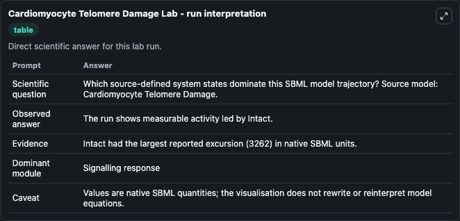
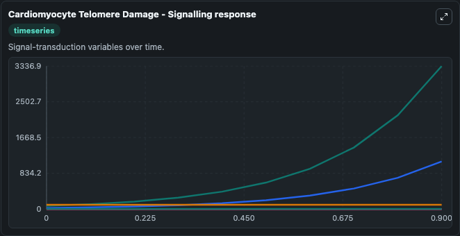
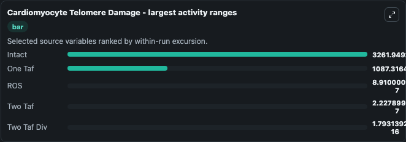
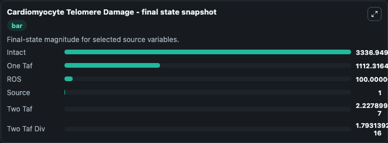
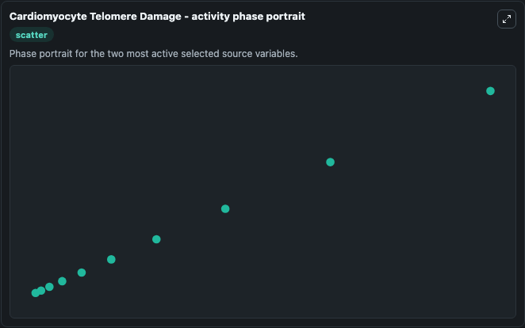

# Cardiomyocyte Telomere Damage

This Biosimulant lab wraps `Cardiomyocyte Telomere Damage` as a runnable systems biology model with a companion visualization module.
Systems Biology Cardiomyocyte Telomere Damage Model1608250000Model represents systems biology cardiomyocyte telomere damage model1608250000 mechanisms from biomodels_ebi reference biomodels_ebi:MODEL1608250000. It can be used to explore the configured dynamics and compare scenario outcomes across configurations.

## What You'll See

The lab asks: Which source-defined system states dominate this SBML model trajectory? Source model: Cardiomyocyte Telomere Damage. It runs for 1.0 time units with a communication step of 0.1. The run uses the model defaults declared by the curated SBML wrapper. The generated visualizations focus on ROS, Intact, One Taf, Source, Two Taf Div, and Two Taf, combining trajectory, endpoint-comparison, and summary-table views from one completed dark-mode run.

In this captured run, **Intact** moved from 75.000 to 3336.9 across 1.0 simulation windows.


### Output Visualizations



*Summary table for Cardiomyocyte Telomere Damage, reporting the scientific question, observed answer, dominant module, and caveat.*



*Trajectories of Intact, One Taf, ROS, Two Taf, Two Taf Div, and Source across the 1.0 simulation. In this run **Intact** climbed from 75.000 to 3336.9 — the largest movements among the focused observables.*



*Largest-excursion ranking of the focused observables — the absolute movement magnitude during the run. Top 3: **Intact** = 3261.9, **One Taf** = 1087.3, **ROS** = 8.91e-07, with 2 more observables below.*



*Endpoint snapshot of the focused observables — final values from the captured run. Top 3 by value: **Intact** = 3336.9, **One Taf** = 1112.3, **ROS** = 100.0, with 3 more observables below.*



*Visualization card from the Cardiomyocyte Telomere Damage dark-mode run.*


## Model Context

- Core model: `models/core`
- Visualization model: `models/visualisation`
- Standard: `other`
- Upstream source: `biomodels_ebi:MODEL1608250000`
- License: `CC0`

## Inputs

| Input | Maps To | Default | Notes |
|---|---|---|---|
| Initial Model State Ros | `systemsbiology_sbml_cardiomyocyte_telomere_damage_model1608250000_model.initial_model_state_ros` | | Source state initial condition exposed as a model-specific control because no explicit intervention parameter is identifiable. Maps to SBML symbol `ROS`. |
| Initial Intact | `systemsbiology_sbml_cardiomyocyte_telomere_damage_model1608250000_model.initial_intact` | | Source state initial condition exposed as a model-specific control because no explicit intervention parameter is identifiable. Maps to SBML symbol `intact`. |
| Initial One Taf | `systemsbiology_sbml_cardiomyocyte_telomere_damage_model1608250000_model.initial_one_taf` | | Source state initial condition exposed as a model-specific control because no explicit intervention parameter is identifiable. Maps to SBML symbol `one_taf`. |
| Initial Source | `systemsbiology_sbml_cardiomyocyte_telomere_damage_model1608250000_model.initial_source` | | Source state initial condition exposed as a model-specific control because no explicit intervention parameter is identifiable. Maps to SBML symbol `Source`. |
| Initial Two Taf Div | `systemsbiology_sbml_cardiomyocyte_telomere_damage_model1608250000_model.initial_two_taf_div` | | Source state initial condition exposed as a model-specific control because no explicit intervention parameter is identifiable. Maps to SBML symbol `two_taf_div`. |
| Initial Two Taf | `systemsbiology_sbml_cardiomyocyte_telomere_damage_model1608250000_model.initial_two_taf` | | Source state initial condition exposed as a model-specific control because no explicit intervention parameter is identifiable. Maps to SBML symbol `two_taf`. |

## Outputs

| Output | Maps To | Role |
|---|---|---|
| `state` | `systemsbiology_sbml_cardiomyocyte_telomere_damage_model1608250000_model.state` | Available to the visualization model and downstream workflows. |
| `summary` | `systemsbiology_sbml_cardiomyocyte_telomere_damage_model1608250000_model.summary` | Available to the visualization model and downstream workflows. |
| `species_labels` | `systemsbiology_sbml_cardiomyocyte_telomere_damage_model1608250000_model.species_labels` | Available to the visualization model and downstream workflows. |
| `ros` | `systemsbiology_sbml_cardiomyocyte_telomere_damage_model1608250000_model.ros` | Available to the visualization model and downstream workflows. |
| `intact` | `systemsbiology_sbml_cardiomyocyte_telomere_damage_model1608250000_model.intact` | Available to the visualization model and downstream workflows. |
| `one_taf` | `systemsbiology_sbml_cardiomyocyte_telomere_damage_model1608250000_model.one_taf` | Available to the visualization model and downstream workflows. |
| `source` | `systemsbiology_sbml_cardiomyocyte_telomere_damage_model1608250000_model.source` | Available to the visualization model and downstream workflows. |
| `two_taf_div` | `systemsbiology_sbml_cardiomyocyte_telomere_damage_model1608250000_model.two_taf_div` | Available to the visualization model and downstream workflows. |
| `two_taf` | `systemsbiology_sbml_cardiomyocyte_telomere_damage_model1608250000_model.two_taf` | Available to the visualization model and downstream workflows. |

## Runtime

- Duration: `1.0`
- Communication step: `0.1`

## Running Locally

```bash
biosimulant labs serve
```
