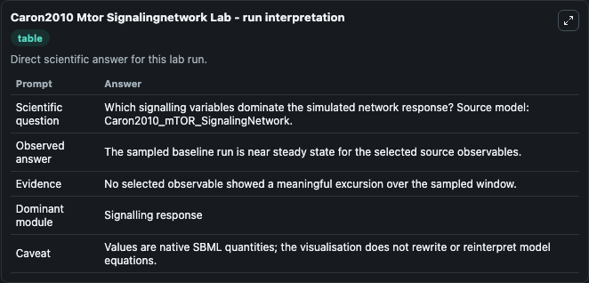
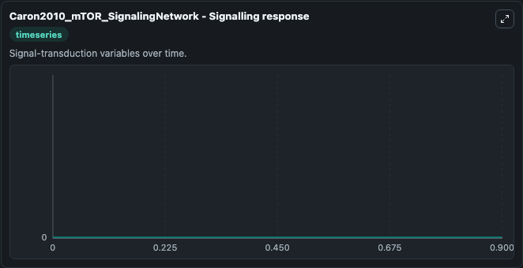

# Caron2010 Mtor Signalingnetwork

This Biosimulant lab wraps `Caron2010 Mtor Signalingnetwork` as a runnable systems biology model with a companion visualization module.
This model originates from BioModels Database: A Database of Annotated Published Models (http://www.ebi.ac.uk/biomodels/). It can be used to explore the configured dynamics and compare scenario outcomes across configurations.

## What You'll See

The lab asks: Which signalling variables dominate the simulated network response? Source model: Caron2010_mTOR_SignalingNetwork. It runs for 1.0 time units with a communication step of 0.1. The run uses the model defaults declared by the curated SBML wrapper. The generated visualizations focus on VEGF, tumor angiogenesis, tRNA, ribosomal mRNA, rRNA, oxidative phosphorylation_br_tricarboxylic acid cycle_br_uncoupling respiration, and mTORC1-YY1-PGC-1_alpha-Mito genes, combining trajectory, endpoint-comparison, and summary-table views from one completed dark-mode run.

In this captured run, **VEGF, tumor angiogenesis** moved from 0 to 0 across 1.0 simulation windows.


### Output Visualizations



*Summary table for Caron2010 Mtor Signalingnetwork, reporting the scientific question, observed answer, dominant module, and caveat.*



*Trajectories of VEGF, tumor angiogenesis, tRNA, ribosomal mRNA, rRNA, oxidative phosphorylation_br_tricarboxylic acid cycle_br_uncoupling respiration, and mTORC1-YY1-PGC-1_alpha-Mito genes across the 1.0 simulation. In this run VEGF, tumor angiogenesis, tRNA, ribosomal mRNA, rRNA stayed near their initial values — no observable moved appreciably.*


## Model Context

- Core model: `models/core`
- Visualization model: `models/visualisation`
- Standard: `other`
- Upstream source: `biomodels_ebi:MODEL1012220002`
- License: `CC0`

## Inputs

| Input | Maps To | Default | Notes |
|---|---|---|---|
| Initial Vegf Tumor Angiogenesis | `systemsbiology_sbml_caron2010_mtor_signalingnetwork_model1012220002_model.initial_vegf_tumor_angiogenesis` | | Source state initial condition exposed as a model-specific control because no explicit intervention parameter is identifiable. Maps to SBML symbol `s2387`. |
| Initial T RNA | `systemsbiology_sbml_caron2010_mtor_signalingnetwork_model1012220002_model.initial_t_rna` | | Source state initial condition exposed as a model-specific control because no explicit intervention parameter is identifiable. Maps to SBML symbol `s2121`. |
| Initial Ribosomal MRNA | `systemsbiology_sbml_caron2010_mtor_signalingnetwork_model1012220002_model.initial_ribosomal_mrna` | | Source state initial condition exposed as a model-specific control because no explicit intervention parameter is identifiable. Maps to SBML symbol `s2114`. |
| Initial R RNA | `systemsbiology_sbml_caron2010_mtor_signalingnetwork_model1012220002_model.initial_r_rna` | | Source state initial condition exposed as a model-specific control because no explicit intervention parameter is identifiable. Maps to SBML symbol `s2112`. |
| Initial Oxidative Phosphorylation Br Tricarboxylic Acid Cycle Br Uncoupling Respiration | `systemsbiology_sbml_caron2010_mtor_signalingnetwork_model1012220002_model.initial_oxidative_phosphorylation_br_tricarboxylic_acid_cycle_br_uncoupling_respiration` | | Source state initial condition exposed as a model-specific control because no explicit intervention parameter is identifiable. Maps to SBML symbol `s3277`. |
| Initial M Torc1 YY1 Pgc 1 Alpha Mito Genes | `systemsbiology_sbml_caron2010_mtor_signalingnetwork_model1012220002_model.initial_m_torc1_yy1_pgc_1_alpha_mito_genes` | | Source state initial condition exposed as a model-specific control because no explicit intervention parameter is identifiable. Maps to SBML symbol `s3279`. |

## Outputs

| Output | Maps To | Role |
|---|---|---|
| `state` | `systemsbiology_sbml_caron2010_mtor_signalingnetwork_model1012220002_model.state` | Available to the visualization model and downstream workflows. |
| `summary` | `systemsbiology_sbml_caron2010_mtor_signalingnetwork_model1012220002_model.summary` | Available to the visualization model and downstream workflows. |
| `species_labels` | `systemsbiology_sbml_caron2010_mtor_signalingnetwork_model1012220002_model.species_labels` | Available to the visualization model and downstream workflows. |
| `vegf_tumor_angiogenesis` | `systemsbiology_sbml_caron2010_mtor_signalingnetwork_model1012220002_model.vegf_tumor_angiogenesis` | Available to the visualization model and downstream workflows. |
| `t_rna` | `systemsbiology_sbml_caron2010_mtor_signalingnetwork_model1012220002_model.t_rna` | Available to the visualization model and downstream workflows. |
| `ribosomal_mrna` | `systemsbiology_sbml_caron2010_mtor_signalingnetwork_model1012220002_model.ribosomal_mrna` | Available to the visualization model and downstream workflows. |
| `r_rna` | `systemsbiology_sbml_caron2010_mtor_signalingnetwork_model1012220002_model.r_rna` | Available to the visualization model and downstream workflows. |
| `oxidative_phosphorylation_br_tricarboxylic_acid_cycle_br_uncoupling_respiration` | `systemsbiology_sbml_caron2010_mtor_signalingnetwork_model1012220002_model.oxidative_phosphorylation_br_tricarboxylic_acid_cycle_br_uncoupling_respiration` | Available to the visualization model and downstream workflows. |
| `m_torc1_yy1_pgc_1_alpha_mito_genes` | `systemsbiology_sbml_caron2010_mtor_signalingnetwork_model1012220002_model.m_torc1_yy1_pgc_1_alpha_mito_genes` | Available to the visualization model and downstream workflows. |

## Runtime

- Duration: `1.0`
- Communication step: `0.1`

## Running Locally

```bash
biosimulant labs serve
```
