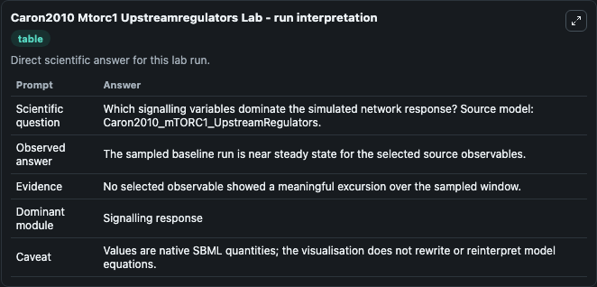
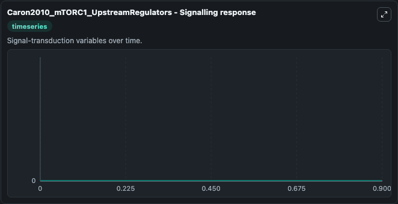

# Caron2010 Mtorc1 Upstreamregulators

This Biosimulant lab wraps `Caron2010 Mtorc1 Upstreamregulators` as a runnable systems biology model with a companion visualization module.
This model originates from BioModels Database: A Database of Annotated Published Models (http://www.ebi.ac.uk/biomodels/). It can be used to explore the configured dynamics and compare scenario outcomes across configurations.

## What You'll See

The lab asks: Which signalling variables dominate the simulated network response? Source model: Caron2010_mTORC1_UpstreamRegulators. It runs for 1.0 time units with a communication step of 0.1. The run uses the model defaults declared by the curated SBML wrapper. The generated visualizations focus on Protein synthesis, Growth factor, sa11_degraded, s3560, s16, and s149, combining trajectory, endpoint-comparison, and summary-table views from one completed dark-mode run.

In this captured run, **Protein synthesis** moved from 0 to 0 across 1.0 simulation windows.


### Output Visualizations



*Summary table for Caron2010 Mtorc1 Upstreamregulators, reporting the scientific question, observed answer, dominant module, and caveat.*



*Trajectories of Protein synthesis, Growth factor, sa11_degraded, s3560, s16, and s149 across the 1.0 simulation. In this run Protein synthesis, Growth factor, sa11_degraded, s3560 stayed near their initial values — no observable moved appreciably.*


## Model Context

- Core model: `models/core`
- Visualization model: `models/visualisation`
- Standard: `other`
- Upstream source: `biomodels_ebi:MODEL1012220003`
- License: `CC0`

## Inputs

| Input | Maps To | Default | Notes |
|---|---|---|---|
| Initial Protein Synthesis | `systemsbiology_sbml_caron2010_mtorc1_upstreamregulators_model1012220003_model.initial_protein_synthesis` | | Source state initial condition exposed as a model-specific control because no explicit intervention parameter is identifiable. Maps to SBML symbol `s3574`. |
| Initial Growth Factor | `systemsbiology_sbml_caron2010_mtorc1_upstreamregulators_model1012220003_model.initial_growth_factor` | | Source state initial condition exposed as a model-specific control because no explicit intervention parameter is identifiable. Maps to SBML symbol `s79`. |
| Initial Sa11 Degraded | `systemsbiology_sbml_caron2010_mtorc1_upstreamregulators_model1012220003_model.initial_sa11_degraded` | | Source state initial condition exposed as a model-specific control because no explicit intervention parameter is identifiable. Maps to SBML symbol `s3447`. |
| Initial S3560 | `systemsbiology_sbml_caron2010_mtorc1_upstreamregulators_model1012220003_model.initial_s3560` | | Source state initial condition exposed as a model-specific control because no explicit intervention parameter is identifiable. Maps to SBML symbol `s3560`. |
| Initial Model State S16 | `systemsbiology_sbml_caron2010_mtorc1_upstreamregulators_model1012220003_model.initial_model_state_s16` | | Source state initial condition exposed as a model-specific control because no explicit intervention parameter is identifiable. Maps to SBML symbol `s117`. |
| Initial S149 | `systemsbiology_sbml_caron2010_mtorc1_upstreamregulators_model1012220003_model.initial_s149` | | Source state initial condition exposed as a model-specific control because no explicit intervention parameter is identifiable. Maps to SBML symbol `s149`. |

## Outputs

| Output | Maps To | Role |
|---|---|---|
| `state` | `systemsbiology_sbml_caron2010_mtorc1_upstreamregulators_model1012220003_model.state` | Available to the visualization model and downstream workflows. |
| `summary` | `systemsbiology_sbml_caron2010_mtorc1_upstreamregulators_model1012220003_model.summary` | Available to the visualization model and downstream workflows. |
| `species_labels` | `systemsbiology_sbml_caron2010_mtorc1_upstreamregulators_model1012220003_model.species_labels` | Available to the visualization model and downstream workflows. |
| `protein_synthesis` | `systemsbiology_sbml_caron2010_mtorc1_upstreamregulators_model1012220003_model.protein_synthesis` | Available to the visualization model and downstream workflows. |
| `growth_factor` | `systemsbiology_sbml_caron2010_mtorc1_upstreamregulators_model1012220003_model.growth_factor` | Available to the visualization model and downstream workflows. |
| `sa11_degraded` | `systemsbiology_sbml_caron2010_mtorc1_upstreamregulators_model1012220003_model.sa11_degraded` | Available to the visualization model and downstream workflows. |
| `s3560` | `systemsbiology_sbml_caron2010_mtorc1_upstreamregulators_model1012220003_model.s3560` | Available to the visualization model and downstream workflows. |
| `s16` | `systemsbiology_sbml_caron2010_mtorc1_upstreamregulators_model1012220003_model.s16` | Available to the visualization model and downstream workflows. |
| `s149` | `systemsbiology_sbml_caron2010_mtorc1_upstreamregulators_model1012220003_model.s149` | Available to the visualization model and downstream workflows. |

## Runtime

- Duration: `1.0`
- Communication step: `0.1`

## Running Locally

```bash
biosimulant labs serve
```
