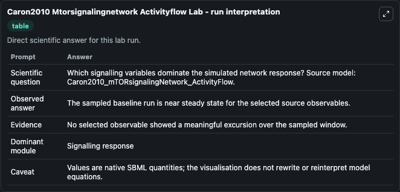
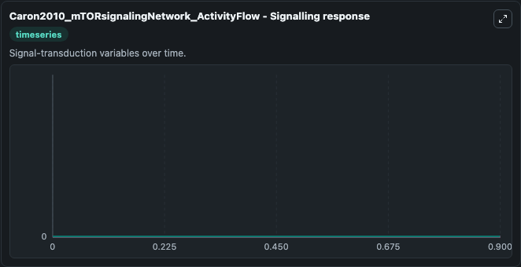

# Caron2010 Mtorsignalingnetwork Activityflow

This Biosimulant lab wraps `Caron2010 Mtorsignalingnetwork Activityflow` as a runnable systems biology model with a companion visualization module.
This model originates from BioModels Database: A Database of Annotated Published Models (http://www.ebi.ac.uk/biomodels/). It can be used to explore the configured dynamics and compare scenario outcomes across configurations.

## What You'll See

The lab asks: Which signalling variables dominate the simulated network response? Source model: Caron2010_mTORsignalingNetwork_ActivityFlow. It runs for 1.0 time units with a communication step of 0.1. The run uses the model defaults declared by the curated SBML wrapper. The generated visualizations focus on Metabolism_br_Stress resistance_br_Apoptosis, rRNA synthesis, mRNA_br_biogenesis, Survival_br_Apoptosis, Mitochondrial_br_metabolism, and Growth factor, combining trajectory, endpoint-comparison, and summary-table views from one completed dark-mode run.

In this captured run, **Metabolism_br_Stress resistance_br_Apoptosis** moved from 0 to 0 across 1.0 simulation windows.


### Output Visualizations



*Summary table for Caron2010 Mtorsignalingnetwork Activityflow, reporting the scientific question, observed answer, dominant module, and caveat.*



*Trajectories of Metabolism_br_Stress resistance_br_Apoptosis, rRNA synthesis, mRNA_br_biogenesis, Survival_br_Apoptosis, Mitochondrial_br_metabolism, and Growth factor across the 1.0 simulation. In this run Metabolism_br_Stress resistance_br_Apoptosis, rRNA synthesis, mRNA_br_biogenesis, Survival_br_Apoptosis stayed near their initial values — no observable moved appreciably.*


## Model Context

- Core model: `models/core`
- Visualization model: `models/visualisation`
- Standard: `other`
- Upstream source: `biomodels_ebi:MODEL1012220004`
- License: `CC0`

## Inputs

| Input | Maps To | Default | Notes |
|---|---|---|---|
| Initial Metabolism Br Stress Resistance Br Apoptosis | `systemsbiology_sbml_caron2010_mtorsignalingnetwork_activityflow_model1012220004_model.initial_metabolism_br_stress_resistance_br_apoptosis` | | Source state initial condition exposed as a model-specific control because no explicit intervention parameter is identifiable. Maps to SBML symbol `s147`. |
| Initial R RNA Synthesis | `systemsbiology_sbml_caron2010_mtorsignalingnetwork_activityflow_model1012220004_model.initial_r_rna_synthesis` | | Source state initial condition exposed as a model-specific control because no explicit intervention parameter is identifiable. Maps to SBML symbol `s149`. |
| Initial MRNA Br Biogenesis | `systemsbiology_sbml_caron2010_mtorsignalingnetwork_activityflow_model1012220004_model.initial_mrna_br_biogenesis` | | Source state initial condition exposed as a model-specific control because no explicit intervention parameter is identifiable. Maps to SBML symbol `s74`. |
| Initial Survival Br Apoptosis | `systemsbiology_sbml_caron2010_mtorsignalingnetwork_activityflow_model1012220004_model.initial_survival_br_apoptosis` | | Source state initial condition exposed as a model-specific control because no explicit intervention parameter is identifiable. Maps to SBML symbol `s212`. |
| Initial Mitochondrial Br Metabolism | `systemsbiology_sbml_caron2010_mtorsignalingnetwork_activityflow_model1012220004_model.initial_mitochondrial_br_metabolism` | | Source state initial condition exposed as a model-specific control because no explicit intervention parameter is identifiable. Maps to SBML symbol `s223`. |
| Initial Growth Factor | `systemsbiology_sbml_caron2010_mtorsignalingnetwork_activityflow_model1012220004_model.initial_growth_factor` | | Source state initial condition exposed as a model-specific control because no explicit intervention parameter is identifiable. Maps to SBML symbol `s167`. |

## Outputs

| Output | Maps To | Role |
|---|---|---|
| `state` | `systemsbiology_sbml_caron2010_mtorsignalingnetwork_activityflow_model1012220004_model.state` | Available to the visualization model and downstream workflows. |
| `summary` | `systemsbiology_sbml_caron2010_mtorsignalingnetwork_activityflow_model1012220004_model.summary` | Available to the visualization model and downstream workflows. |
| `species_labels` | `systemsbiology_sbml_caron2010_mtorsignalingnetwork_activityflow_model1012220004_model.species_labels` | Available to the visualization model and downstream workflows. |
| `metabolism_br_stress_resistance_br_apoptosis` | `systemsbiology_sbml_caron2010_mtorsignalingnetwork_activityflow_model1012220004_model.metabolism_br_stress_resistance_br_apoptosis` | Available to the visualization model and downstream workflows. |
| `r_rna_synthesis` | `systemsbiology_sbml_caron2010_mtorsignalingnetwork_activityflow_model1012220004_model.r_rna_synthesis` | Available to the visualization model and downstream workflows. |
| `mrna_br_biogenesis` | `systemsbiology_sbml_caron2010_mtorsignalingnetwork_activityflow_model1012220004_model.mrna_br_biogenesis` | Available to the visualization model and downstream workflows. |
| `survival_br_apoptosis` | `systemsbiology_sbml_caron2010_mtorsignalingnetwork_activityflow_model1012220004_model.survival_br_apoptosis` | Available to the visualization model and downstream workflows. |
| `mitochondrial_br_metabolism` | `systemsbiology_sbml_caron2010_mtorsignalingnetwork_activityflow_model1012220004_model.mitochondrial_br_metabolism` | Available to the visualization model and downstream workflows. |
| `growth_factor` | `systemsbiology_sbml_caron2010_mtorsignalingnetwork_activityflow_model1012220004_model.growth_factor` | Available to the visualization model and downstream workflows. |

## Runtime

- Duration: `1.0`
- Communication step: `0.1`

## Running Locally

```bash
biosimulant labs serve
```
