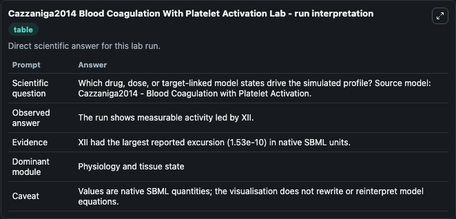
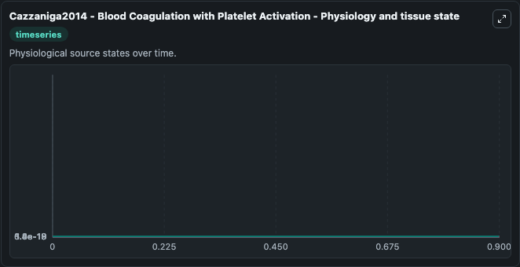
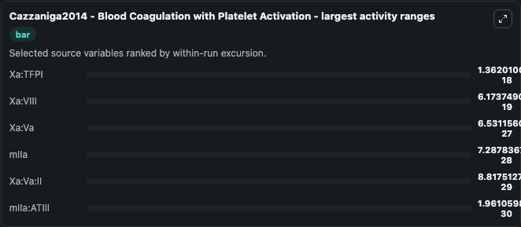
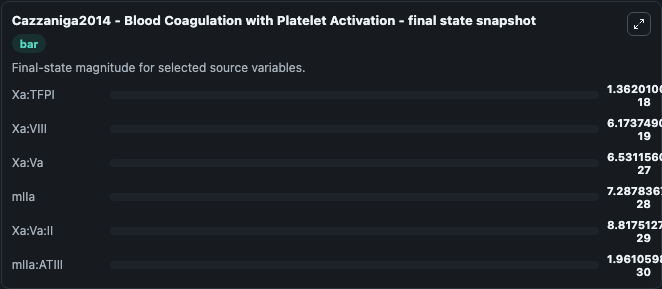
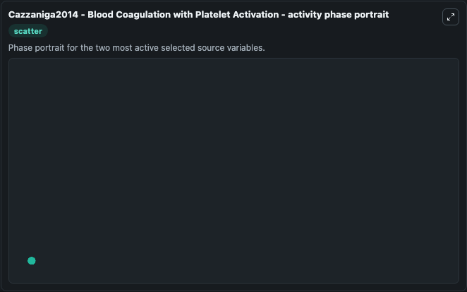

# Cazzaniga2014 Blood Coagulation With Platelet Activation

This Biosimulant lab wraps `Cazzaniga2014 Blood Coagulation With Platelet Activation` as a runnable systems biology model with a companion visualization module.
Mathematical model of blood coagulation with platelet activation. It can be used to explore the configured dynamics and compare scenario outcomes across configurations.

## What You'll See

The lab asks: Which drug, dose, or target-linked model states drive the simulated profile? Source model: Cazzaniga2014 - Blood Coagulation with Platelet Activation. It runs for 1.0 time units with a communication step of 0.1. The run uses the model defaults declared by the curated SBML wrapper. The generated visualizations focus on mIIa:ATIII, mIIa, Xa:Va:II, Xa:Va, Xa:VIII, and Xa:TFPI, combining trajectory, endpoint-comparison, and summary-table views from one completed dark-mode run.

In this captured run, **Xa:TFPI** moved from 0 to 1.36e-18 across 1.0 simulation windows.


### Output Visualizations



*Summary table for Cazzaniga2014 Blood Coagulation With Platelet Activation, reporting the scientific question, observed answer, dominant module, and caveat.*



*Trajectories of Xa:TFPI, Xa:VIII, Xa:Va, mIIa, Xa:Va:II, and mIIa:ATIII across the 1.0 simulation. In this run **Xa:TFPI** climbed from 0 to 1.36e-18 — the largest movements among the focused observables.*



*Largest-excursion ranking of the focused observables — the absolute movement magnitude during the run. Top 3: **Xa:TFPI** = 1.36e-18, **Xa:VIII** = 6.17e-19, **Xa:Va** = 6.53e-27, with 3 more observables below.*



*Endpoint snapshot of the focused observables — final values from the captured run. Top 3 by value: **Xa:TFPI** = 1.36e-18, **Xa:VIII** = 6.17e-19, **Xa:Va** = 6.53e-27, with 3 more observables below.*



*Visualization card from the Cazzaniga2014 Blood Coagulation With Platelet Activation dark-mode run.*


## Model Context

- Core model: `models/core`
- Visualization model: `models/visualisation`
- Standard: `other`
- Upstream source: `biomodels_ebi:MODEL1807180003`
- License: `CC0`

## Inputs

| Input | Maps To | Default | Notes |
|---|---|---|---|
| Initial M I Ia Atiii | `systemsbiology_sbml_cazzaniga2014_blood_coagulation_with_platelet_ac_model1807180003_model.initial_m_i_ia_atiii` | | Source state initial condition exposed as a model-specific control because no explicit intervention parameter is identifiable. Maps to SBML symbol `mIIa_ATIII`. |
| Initial M I Ia | `systemsbiology_sbml_cazzaniga2014_blood_coagulation_with_platelet_ac_model1807180003_model.initial_m_i_ia` | | Source state initial condition exposed as a model-specific control because no explicit intervention parameter is identifiable. Maps to SBML symbol `mIIa`. |
| Initial Xa Va Ii | `systemsbiology_sbml_cazzaniga2014_blood_coagulation_with_platelet_ac_model1807180003_model.initial_xa_va_ii` | | Source state initial condition exposed as a model-specific control because no explicit intervention parameter is identifiable. Maps to SBML symbol `Xa_Va_II`. |
| Initial Xa Va | `systemsbiology_sbml_cazzaniga2014_blood_coagulation_with_platelet_ac_model1807180003_model.initial_xa_va` | | Source state initial condition exposed as a model-specific control because no explicit intervention parameter is identifiable. Maps to SBML symbol `Xa_Va`. |
| Initial Xa Viii | `systemsbiology_sbml_cazzaniga2014_blood_coagulation_with_platelet_ac_model1807180003_model.initial_xa_viii` | | Source state initial condition exposed as a model-specific control because no explicit intervention parameter is identifiable. Maps to SBML symbol `Xa_VIII`. |
| Initial Xa Tfpi | `systemsbiology_sbml_cazzaniga2014_blood_coagulation_with_platelet_ac_model1807180003_model.initial_xa_tfpi` | | Source state initial condition exposed as a model-specific control because no explicit intervention parameter is identifiable. Maps to SBML symbol `Xa_TFPI`. |

## Outputs

| Output | Maps To | Role |
|---|---|---|
| `state` | `systemsbiology_sbml_cazzaniga2014_blood_coagulation_with_platelet_ac_model1807180003_model.state` | Available to the visualization model and downstream workflows. |
| `summary` | `systemsbiology_sbml_cazzaniga2014_blood_coagulation_with_platelet_ac_model1807180003_model.summary` | Available to the visualization model and downstream workflows. |
| `species_labels` | `systemsbiology_sbml_cazzaniga2014_blood_coagulation_with_platelet_ac_model1807180003_model.species_labels` | Available to the visualization model and downstream workflows. |
| `m_i_ia_atiii` | `systemsbiology_sbml_cazzaniga2014_blood_coagulation_with_platelet_ac_model1807180003_model.m_i_ia_atiii` | Available to the visualization model and downstream workflows. |
| `m_i_ia` | `systemsbiology_sbml_cazzaniga2014_blood_coagulation_with_platelet_ac_model1807180003_model.m_i_ia` | Available to the visualization model and downstream workflows. |
| `xa_va_ii` | `systemsbiology_sbml_cazzaniga2014_blood_coagulation_with_platelet_ac_model1807180003_model.xa_va_ii` | Available to the visualization model and downstream workflows. |
| `xa_va` | `systemsbiology_sbml_cazzaniga2014_blood_coagulation_with_platelet_ac_model1807180003_model.xa_va` | Available to the visualization model and downstream workflows. |
| `xa_viii` | `systemsbiology_sbml_cazzaniga2014_blood_coagulation_with_platelet_ac_model1807180003_model.xa_viii` | Available to the visualization model and downstream workflows. |
| `xa_tfpi` | `systemsbiology_sbml_cazzaniga2014_blood_coagulation_with_platelet_ac_model1807180003_model.xa_tfpi` | Available to the visualization model and downstream workflows. |

## Runtime

- Duration: `1.0`
- Communication step: `0.1`

## Running Locally

```bash
biosimulant labs serve
```
