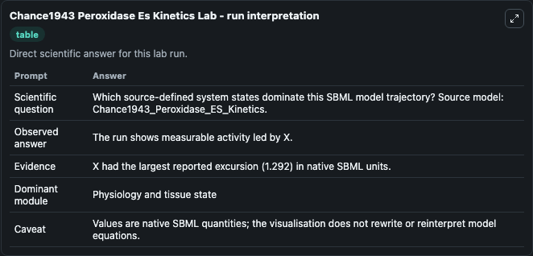
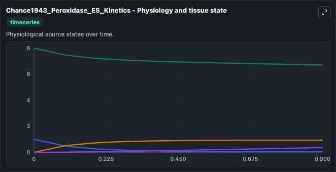
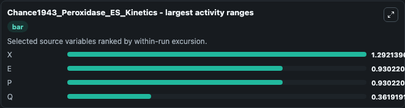
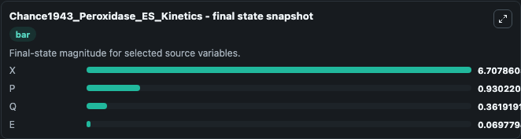
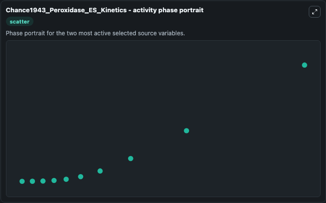

# Chance1943 Peroxidase Es Kinetics

This Biosimulant lab wraps `Chance1943 Peroxidase Es Kinetics` as a runnable systems biology model with a companion visualization module.
Default parameter values are those in the right hand panel of Fig 12. It can be used to explore the configured dynamics and compare scenario outcomes across configurations.

## What You'll See

The lab asks: Which source-defined system states dominate this SBML model trajectory? Source model: Chance1943_Peroxidase_ES_Kinetics. It runs for 1.0 time units with a communication step of 0.1. The run uses the model defaults declared by the curated SBML wrapper. The generated visualizations focus on X, E, Q, and P, combining trajectory, endpoint-comparison, and summary-table views from one completed dark-mode run.

In this captured run, **X** moved from 8.000 to 6.708 across 1.0 simulation windows.


### Output Visualizations



*Summary table for Chance1943 Peroxidase Es Kinetics, reporting the scientific question, observed answer, dominant module, and caveat.*



*Trajectories of X, E, P, and Q across the 1.0 simulation. In this run **P** climbed from 0 to 0.9302 and **X** fell from 8.000 to 6.708 — the largest movements among the focused observables.*



*Largest-excursion ranking of the focused observables — the absolute movement magnitude during the run. Top 3: **X** = 1.292, **E** = 0.9302, **P** = 0.9302, with 1 more observable below.*



*Endpoint snapshot of the focused observables — final values from the captured run. Top 3 by value: **X** = 6.708, **P** = 0.9302, **Q** = 0.3619, with 1 more observable below.*



*Visualization card from the Chance1943 Peroxidase Es Kinetics dark-mode run.*


## Model Context

- Core model: `models/core`
- Visualization model: `models/visualisation`
- Standard: `other`
- Upstream source: `biomodels_ebi:BIOMD0000000283`
- License: `CC0`

## Inputs

| Input | Maps To | Default | Notes |
|---|---|---|---|
| Initial Model State X | `systemsbiology_sbml_chance1943_peroxidase_es_kinetics_biomd0000000283_model.initial_model_state_x` | | Source state initial condition exposed as a model-specific control because no explicit intervention parameter is identifiable. Maps to SBML symbol `X`. |
| Initial Model State E | `systemsbiology_sbml_chance1943_peroxidase_es_kinetics_biomd0000000283_model.initial_model_state_e` | | Source state initial condition exposed as a model-specific control because no explicit intervention parameter is identifiable. Maps to SBML symbol `E`. |
| Initial Model State Q | `systemsbiology_sbml_chance1943_peroxidase_es_kinetics_biomd0000000283_model.initial_model_state_q` | | Source state initial condition exposed as a model-specific control because no explicit intervention parameter is identifiable. Maps to SBML symbol `Q`. |
| Initial Model State P | `systemsbiology_sbml_chance1943_peroxidase_es_kinetics_biomd0000000283_model.initial_model_state_p` | | Source state initial condition exposed as a model-specific control because no explicit intervention parameter is identifiable. Maps to SBML symbol `P`. |

## Outputs

| Output | Maps To | Role |
|---|---|---|
| `state` | `systemsbiology_sbml_chance1943_peroxidase_es_kinetics_biomd0000000283_model.state` | Available to the visualization model and downstream workflows. |
| `summary` | `systemsbiology_sbml_chance1943_peroxidase_es_kinetics_biomd0000000283_model.summary` | Available to the visualization model and downstream workflows. |
| `species_labels` | `systemsbiology_sbml_chance1943_peroxidase_es_kinetics_biomd0000000283_model.species_labels` | Available to the visualization model and downstream workflows. |
| `model_state_x` | `systemsbiology_sbml_chance1943_peroxidase_es_kinetics_biomd0000000283_model.model_state_x` | Available to the visualization model and downstream workflows. |
| `model_state_e` | `systemsbiology_sbml_chance1943_peroxidase_es_kinetics_biomd0000000283_model.model_state_e` | Available to the visualization model and downstream workflows. |
| `model_state_q` | `systemsbiology_sbml_chance1943_peroxidase_es_kinetics_biomd0000000283_model.model_state_q` | Available to the visualization model and downstream workflows. |
| `model_state_p` | `systemsbiology_sbml_chance1943_peroxidase_es_kinetics_biomd0000000283_model.model_state_p` | Available to the visualization model and downstream workflows. |

## Runtime

- Duration: `1.0`
- Communication step: `0.1`

## Running Locally

```bash
biosimulant labs serve
```
