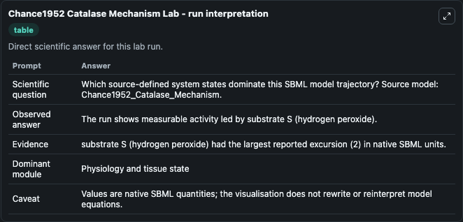
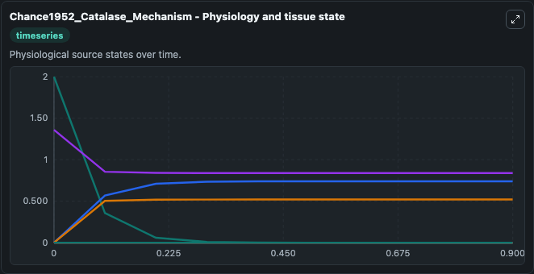
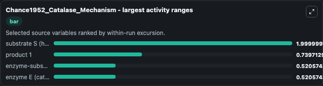
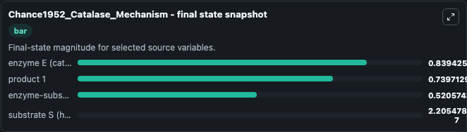
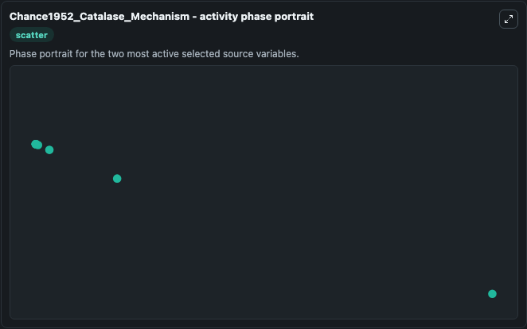

# Chance1952 Catalase Mechanism

This Biosimulant lab wraps `Chance1952 Catalase Mechanism` as a runnable systems biology model with a companion visualization module.
This model is described in the article: The mechanism of catalase action. It can be used to explore the configured dynamics and compare scenario outcomes across configurations.

## What You'll See

The lab asks: Which source-defined system states dominate this SBML model trajectory? Source model: Chance1952_Catalase_Mechanism. It runs for 1.0 time units with a communication step of 0.1. The run uses the model defaults declared by the curated SBML wrapper. The generated visualizations focus on product 2, product 1, substrate S (hydrogen peroxide), enzyme E (catalase), enzyme-substrate complex ES (catalase - hydrogen peroxide), and donor AH2, combining trajectory, endpoint-comparison, and summary-table views from one completed dark-mode run.

In this captured run, **substrate S (hydrogen peroxide)** moved from 2.000 to 2.21e-07 across 1.0 simulation windows.


### Output Visualizations



*Summary table for Chance1952 Catalase Mechanism, reporting the scientific question, observed answer, dominant module, and caveat.*



*Trajectories of substrate S (hydrogen peroxide), product 1, enzyme-substrate complex ES (catalase - hydrogen peroxide), enzyme E (catalase), product 2, and donor AH2 across the 1.0 simulation. In this run **product 1** climbed from 0 to 0.7397 and **substrate S (hydrogen peroxide)** fell from 2.000 to 2.21e-07 — the largest movements among the focused observables.*



*Largest-excursion ranking of the focused observables — the absolute movement magnitude during the run. Top 3: **substrate S (hydrogen peroxide)** = 2.000, **product 1** = 0.7397, **enzyme-substrate complex ES (catalase - hydrogen peroxide)** = 0.5206, with 1 more observable below.*



*Endpoint snapshot of the focused observables — final values from the captured run. Top 3 by value: **enzyme E (catalase)** = 0.8394, **product 1** = 0.7397, **enzyme-substrate complex ES (catalase - hydrogen peroxide)** = 0.5206, with 1 more observable below.*



*Visualization card from the Chance1952 Catalase Mechanism dark-mode run.*


## Model Context

- Core model: `models/core`
- Visualization model: `models/visualisation`
- Standard: `other`
- Upstream source: `biomodels_ebi:BIOMD0000000282`
- License: `CC0`

## Inputs

| Input | Maps To | Default | Notes |
|---|---|---|---|
| Initial Product 2 | `systemsbiology_sbml_chance1952_catalase_mechanism_biomd0000000282_model.initial_product_2` | | Source state initial condition exposed as a model-specific control because no explicit intervention parameter is identifiable. Maps to SBML symbol `p2`. |
| Initial Product 1 | `systemsbiology_sbml_chance1952_catalase_mechanism_biomd0000000282_model.initial_product_1` | | Source state initial condition exposed as a model-specific control because no explicit intervention parameter is identifiable. Maps to SBML symbol `p1`. |
| Initial Substrate S Hydrogen Peroxide | `systemsbiology_sbml_chance1952_catalase_mechanism_biomd0000000282_model.initial_substrate_s_hydrogen_peroxide` | | Source state initial condition exposed as a model-specific control because no explicit intervention parameter is identifiable. Maps to SBML symbol `x`. |
| Initial Enzyme E Catalase | `systemsbiology_sbml_chance1952_catalase_mechanism_biomd0000000282_model.initial_enzyme_e_catalase` | | Source state initial condition exposed as a model-specific control because no explicit intervention parameter is identifiable. Maps to SBML symbol `e`. |
| Initial Enzyme Substrate Complex Es Catalase Hydrogen Peroxide | `systemsbiology_sbml_chance1952_catalase_mechanism_biomd0000000282_model.initial_enzyme_substrate_complex_es_catalase_hydrogen_peroxide` | | Source state initial condition exposed as a model-specific control because no explicit intervention parameter is identifiable. Maps to SBML symbol `p`. |
| Initial Donor AH2 | `systemsbiology_sbml_chance1952_catalase_mechanism_biomd0000000282_model.initial_donor_ah2` | | Source state initial condition exposed as a model-specific control because no explicit intervention parameter is identifiable. Maps to SBML symbol `a`. |

## Outputs

| Output | Maps To | Role |
|---|---|---|
| `state` | `systemsbiology_sbml_chance1952_catalase_mechanism_biomd0000000282_model.state` | Available to the visualization model and downstream workflows. |
| `summary` | `systemsbiology_sbml_chance1952_catalase_mechanism_biomd0000000282_model.summary` | Available to the visualization model and downstream workflows. |
| `species_labels` | `systemsbiology_sbml_chance1952_catalase_mechanism_biomd0000000282_model.species_labels` | Available to the visualization model and downstream workflows. |
| `product_2` | `systemsbiology_sbml_chance1952_catalase_mechanism_biomd0000000282_model.product_2` | Available to the visualization model and downstream workflows. |
| `product_1` | `systemsbiology_sbml_chance1952_catalase_mechanism_biomd0000000282_model.product_1` | Available to the visualization model and downstream workflows. |
| `substrate_s_hydrogen_peroxide` | `systemsbiology_sbml_chance1952_catalase_mechanism_biomd0000000282_model.substrate_s_hydrogen_peroxide` | Available to the visualization model and downstream workflows. |
| `enzyme_e_catalase` | `systemsbiology_sbml_chance1952_catalase_mechanism_biomd0000000282_model.enzyme_e_catalase` | Available to the visualization model and downstream workflows. |
| `enzyme_substrate_complex_es_catalase_hydrogen_peroxide` | `systemsbiology_sbml_chance1952_catalase_mechanism_biomd0000000282_model.enzyme_substrate_complex_es_catalase_hydrogen_peroxide` | Available to the visualization model and downstream workflows. |
| `donor_ah2` | `systemsbiology_sbml_chance1952_catalase_mechanism_biomd0000000282_model.donor_ah2` | Available to the visualization model and downstream workflows. |

## Runtime

- Duration: `1.0`
- Communication step: `0.1`

## Running Locally

```bash
biosimulant labs serve
```
