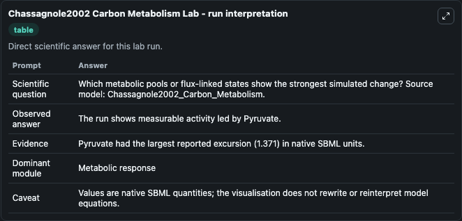
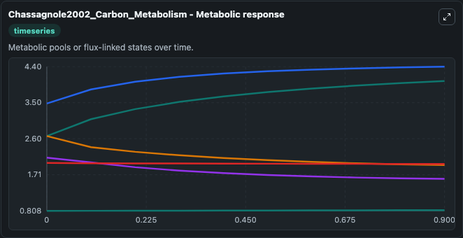
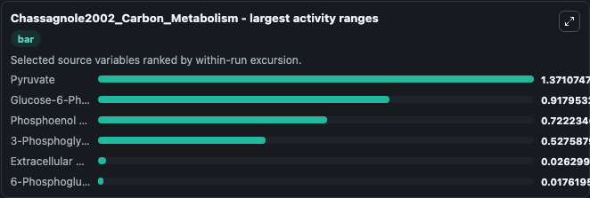
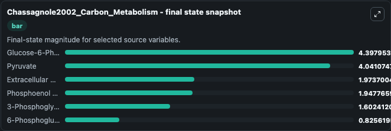
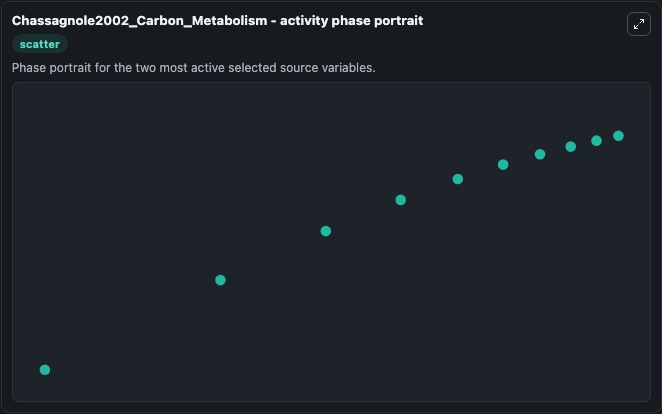

# Chassagnole2002 Carbon Metabolism

This Biosimulant lab wraps `Chassagnole2002 Carbon Metabolism` as a runnable systems biology model with a companion visualization module.
The model reproduces Figures 4,5 and 6 of the publication. It can be used to explore the configured dynamics and compare scenario outcomes across configurations.

## What You'll See

The lab asks: Which metabolic pools or flux-linked states show the strongest simulated change? Source model: Chassagnole2002_Carbon_Metabolism. It runs for 1.0 time units with a communication step of 0.1. The run uses the model defaults declared by the curated SBML wrapper. The generated visualizations focus on Glucose-6-Phosphate, Pyruvate, Phosphoenol pyruvate, 3-Phosphoglycerate, Extracellular Glucose, and 6-Phosphogluconate, combining trajectory, endpoint-comparison, and summary-table views from one completed dark-mode run.

In this captured run, **Pyruvate** moved from 2.670 to 4.041 across 1.0 simulation windows.


### Output Visualizations



*Summary table for Chassagnole2002 Carbon Metabolism, reporting the scientific question, observed answer, dominant module, and caveat.*



*Trajectories of Pyruvate, Glucose-6-Phosphate, Phosphoenol pyruvate, 3-Phosphoglycerate, Extracellular Glucose, and 6-Phosphogluconate across the 1.0 simulation. In this run **Pyruvate** climbed from 2.670 to 4.041 and **Phosphoenol pyruvate** fell from 2.670 to 1.948 — the largest movements among the focused observables.*



*Largest-excursion ranking of the focused observables — the absolute movement magnitude during the run. Top 3: **Pyruvate** = 1.371, **Glucose-6-Phosphate** = 0.9180, **Phosphoenol pyruvate** = 0.7222, with 3 more observables below.*



*Endpoint snapshot of the focused observables — final values from the captured run. Top 3 by value: **Glucose-6-Phosphate** = 4.398, **Pyruvate** = 4.041, **Extracellular Glucose** = 1.974, with 3 more observables below.*



*Visualization card from the Chassagnole2002 Carbon Metabolism dark-mode run.*


## Model Context

- Core model: `models/core`
- Visualization model: `models/visualisation`
- Standard: `other`
- Upstream source: `biomodels_ebi:BIOMD0000000051`
- License: `CC0`

## Inputs

| Input | Maps To | Default | Notes |
|---|---|---|---|
| Cfeed | `systemsbiology_sbml_chassagnole2002_carbon_metabolism_biomd0000000051_model.cfeed` | | Source parameter exposed because its SBML label indicates a boundary, stimulus, dose, ligand, protocol, substrate, or environmental control. Maps to SBML symbol `cfeed`. |

## Outputs

| Output | Maps To | Role |
|---|---|---|
| `state` | `systemsbiology_sbml_chassagnole2002_carbon_metabolism_biomd0000000051_model.state` | Available to the visualization model and downstream workflows. |
| `summary` | `systemsbiology_sbml_chassagnole2002_carbon_metabolism_biomd0000000051_model.summary` | Available to the visualization model and downstream workflows. |
| `species_labels` | `systemsbiology_sbml_chassagnole2002_carbon_metabolism_biomd0000000051_model.species_labels` | Available to the visualization model and downstream workflows. |
| `glucose_6_phosphate` | `systemsbiology_sbml_chassagnole2002_carbon_metabolism_biomd0000000051_model.glucose_6_phosphate` | Available to the visualization model and downstream workflows. |
| `pyruvate` | `systemsbiology_sbml_chassagnole2002_carbon_metabolism_biomd0000000051_model.pyruvate` | Available to the visualization model and downstream workflows. |
| `phosphoenol_pyruvate` | `systemsbiology_sbml_chassagnole2002_carbon_metabolism_biomd0000000051_model.phosphoenol_pyruvate` | Available to the visualization model and downstream workflows. |
| `model_state_3_phosphoglycerate` | `systemsbiology_sbml_chassagnole2002_carbon_metabolism_biomd0000000051_model.model_state_3_phosphoglycerate` | Available to the visualization model and downstream workflows. |
| `extracellular_glucose` | `systemsbiology_sbml_chassagnole2002_carbon_metabolism_biomd0000000051_model.extracellular_glucose` | Available to the visualization model and downstream workflows. |
| `model_state_6_phosphogluconate` | `systemsbiology_sbml_chassagnole2002_carbon_metabolism_biomd0000000051_model.model_state_6_phosphogluconate` | Available to the visualization model and downstream workflows. |

## Runtime

- Duration: `1.0`
- Communication step: `0.1`

## Running Locally

```bash
biosimulant labs serve
```
