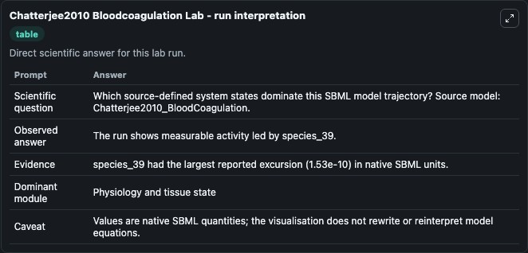
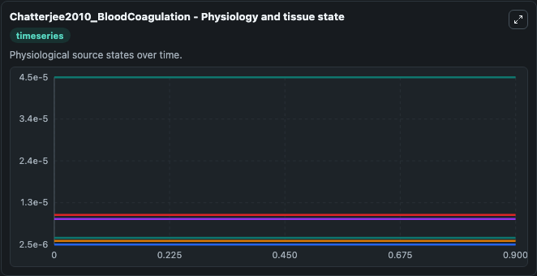
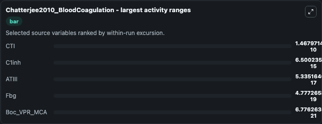
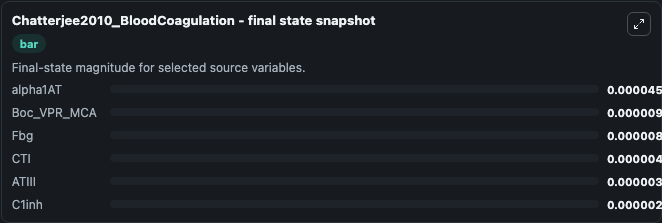
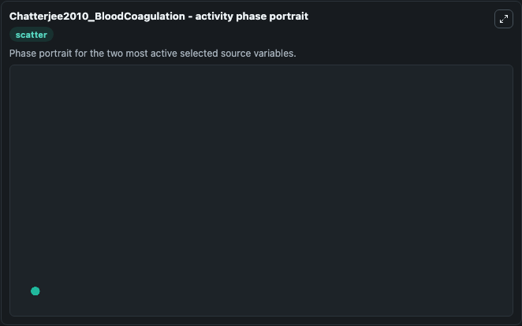

# Chatterjee2010 Bloodcoagulation

This Biosimulant lab wraps `Chatterjee2010 Bloodcoagulation` as a runnable systems biology model with a companion visualization module.
This model originates from BioModels Database: A Database of Annotated Published Models (http://www.ebi.ac.uk/biomodels/). It can be used to explore the configured dynamics and compare scenario outcomes across configurations.

## What You'll See

The lab asks: Which source-defined system states dominate this SBML model trajectory? Source model: Chatterjee2010_BloodCoagulation. It runs for 1.0 time units with a communication step of 0.1. The run uses the model defaults declared by the curated SBML wrapper. The generated visualizations focus on alpha1AT, Boc_VPR_MCA, Fbg, CTI, ATIII, and C1inh, combining trajectory, endpoint-comparison, and summary-table views from one completed dark-mode run.

In this captured run, **CTI** moved from 4.2e-06 to 4.2e-06 across 1.0 simulation windows.


### Output Visualizations



*Summary table for Chatterjee2010 Bloodcoagulation, reporting the scientific question, observed answer, dominant module, and caveat.*



*Trajectories of CTI, C1inh, ATIII, Fbg, Boc_VPR_MCA, and alpha1AT across the 1.0 simulation. In this run **CTI** fell from 4.2e-06 to 4.2e-06 — the largest movements among the focused observables.*



*Largest-excursion ranking of the focused observables — the absolute movement magnitude during the run. Top 3: **CTI** = 1.47e-10, **C1inh** = 6.5e-15, **ATIII** = 5.34e-17, with 2 more observables below.*



*Endpoint snapshot of the focused observables — final values from the captured run. Top 3 by value: **alpha1AT** = 4.5e-05, **Boc_VPR_MCA** = 1e-05, **Fbg** = 9e-06, with 3 more observables below.*



*Visualization card from the Chatterjee2010 Bloodcoagulation dark-mode run.*


## Model Context

- Core model: `models/core`
- Visualization model: `models/visualisation`
- Standard: `other`
- Upstream source: `biomodels_ebi:MODEL1108260014`
- License: `CC0`

## Inputs

| Input | Maps To | Default | Notes |
|---|---|---|---|
| Initial Alpha1 At | `systemsbiology_sbml_chatterjee2010_bloodcoagulation_model1108260014_model.initial_alpha1_at` | | Source state initial condition exposed as a model-specific control because no explicit intervention parameter is identifiable. Maps to SBML symbol `species_57`. |
| Initial Boc Vpr Mca | `systemsbiology_sbml_chatterjee2010_bloodcoagulation_model1108260014_model.initial_boc_vpr_mca` | | Source state initial condition exposed as a model-specific control because no explicit intervention parameter is identifiable. Maps to SBML symbol `species_36`. |
| Initial Model State Fbg | `systemsbiology_sbml_chatterjee2010_bloodcoagulation_model1108260014_model.initial_model_state_fbg` | | Source state initial condition exposed as a model-specific control because no explicit intervention parameter is identifiable. Maps to SBML symbol `species_65`. |
| Initial Model State Cti | `systemsbiology_sbml_chatterjee2010_bloodcoagulation_model1108260014_model.initial_model_state_cti` | | Source state initial condition exposed as a model-specific control because no explicit intervention parameter is identifiable. Maps to SBML symbol `species_47`. |
| Initial Atiii | `systemsbiology_sbml_chatterjee2010_bloodcoagulation_model1108260014_model.initial_atiii` | | Source state initial condition exposed as a model-specific control because no explicit intervention parameter is identifiable. Maps to SBML symbol `species_29`. |
| Initial C1inh | `systemsbiology_sbml_chatterjee2010_bloodcoagulation_model1108260014_model.initial_c1inh` | | Source state initial condition exposed as a model-specific control because no explicit intervention parameter is identifiable. Maps to SBML symbol `species_49`. |

## Outputs

| Output | Maps To | Role |
|---|---|---|
| `state` | `systemsbiology_sbml_chatterjee2010_bloodcoagulation_model1108260014_model.state` | Available to the visualization model and downstream workflows. |
| `summary` | `systemsbiology_sbml_chatterjee2010_bloodcoagulation_model1108260014_model.summary` | Available to the visualization model and downstream workflows. |
| `species_labels` | `systemsbiology_sbml_chatterjee2010_bloodcoagulation_model1108260014_model.species_labels` | Available to the visualization model and downstream workflows. |
| `alpha1_at` | `systemsbiology_sbml_chatterjee2010_bloodcoagulation_model1108260014_model.alpha1_at` | Available to the visualization model and downstream workflows. |
| `boc_vpr_mca` | `systemsbiology_sbml_chatterjee2010_bloodcoagulation_model1108260014_model.boc_vpr_mca` | Available to the visualization model and downstream workflows. |
| `fbg` | `systemsbiology_sbml_chatterjee2010_bloodcoagulation_model1108260014_model.fbg` | Available to the visualization model and downstream workflows. |
| `cti` | `systemsbiology_sbml_chatterjee2010_bloodcoagulation_model1108260014_model.cti` | Available to the visualization model and downstream workflows. |
| `atiii` | `systemsbiology_sbml_chatterjee2010_bloodcoagulation_model1108260014_model.atiii` | Available to the visualization model and downstream workflows. |
| `c1inh` | `systemsbiology_sbml_chatterjee2010_bloodcoagulation_model1108260014_model.c1inh` | Available to the visualization model and downstream workflows. |

## Runtime

- Duration: `1.0`
- Communication step: `0.1`

## Running Locally

```bash
biosimulant labs serve
```
