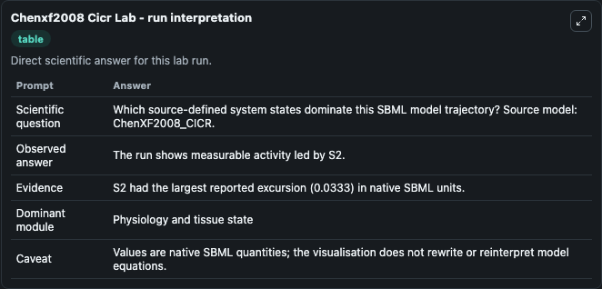
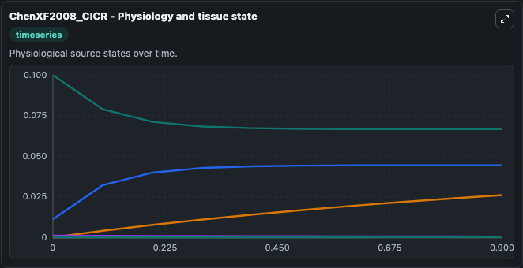
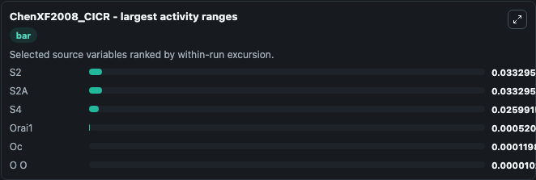
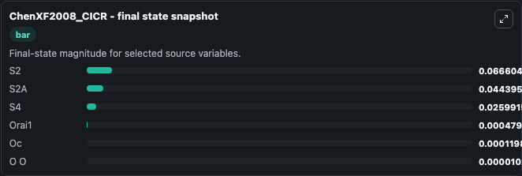
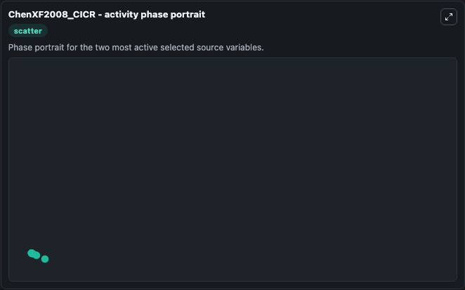

# Chenxf2008 Cicr

This Biosimulant lab wraps `Chenxf2008 Cicr` as a runnable systems biology model with a companion visualization module.
The model reproduces the plots in Figures 1 and 2. It can be used to explore the configured dynamics and compare scenario outcomes across configurations.

## What You'll See

The lab asks: Which source-defined system states dominate this SBML model trajectory? Source model: ChenXF2008_CICR. It runs for 1.0 time units with a communication step of 0.1. The run uses the model defaults declared by the curated SBML wrapper. The generated visualizations focus on S2, S2A, Orai1, S4, Oc, and O O, combining trajectory, endpoint-comparison, and summary-table views from one completed dark-mode run.

In this captured run, **S2** moved from 0.0999 to 0.0666 across 1.0 simulation windows.


### Output Visualizations



*Summary table for Chenxf2008 Cicr, reporting the scientific question, observed answer, dominant module, and caveat.*



*Trajectories of S2, S2A, S4, Orai1, Oc, and O O across the 1.0 simulation. In this run **S2A** climbed from 0.0111 to 0.0444 and **S2** fell from 0.0999 to 0.0666 — the largest movements among the focused observables.*



*Largest-excursion ranking of the focused observables — the absolute movement magnitude during the run. Top 3: **S2** = 0.0333, **S2A** = 0.0333, **S4** = 0.0260, with 3 more observables below.*



*Endpoint snapshot of the focused observables — final values from the captured run. Top 3 by value: **S2** = 0.0666, **S2A** = 0.0444, **S4** = 0.0260, with 3 more observables below.*



*Visualization card from the Chenxf2008 Cicr dark-mode run.*


## Model Context

- Core model: `models/core`
- Visualization model: `models/visualisation`
- Standard: `other`
- Upstream source: `biomodels_ebi:BIOMD0000000202`
- License: `CC0`

## Inputs

| Input | Maps To | Default | Notes |
|---|---|---|---|
| Initial Model State S2 | `systemsbiology_sbml_chenxf2008_cicr_biomd0000000202_model.initial_model_state_s2` | | Source state initial condition exposed as a model-specific control because no explicit intervention parameter is identifiable. Maps to SBML symbol `S2`. |
| Initial S2 A | `systemsbiology_sbml_chenxf2008_cicr_biomd0000000202_model.initial_s2_a` | | Source state initial condition exposed as a model-specific control because no explicit intervention parameter is identifiable. Maps to SBML symbol `S2a`. |
| Initial Orai1 | `systemsbiology_sbml_chenxf2008_cicr_biomd0000000202_model.initial_orai1` | | Source state initial condition exposed as a model-specific control because no explicit intervention parameter is identifiable. Maps to SBML symbol `Orai1`. |
| Initial Model State S4 | `systemsbiology_sbml_chenxf2008_cicr_biomd0000000202_model.initial_model_state_s4` | | Source state initial condition exposed as a model-specific control because no explicit intervention parameter is identifiable. Maps to SBML symbol `S4`. |
| Initial Model State Oc | `systemsbiology_sbml_chenxf2008_cicr_biomd0000000202_model.initial_model_state_oc` | | Source state initial condition exposed as a model-specific control because no explicit intervention parameter is identifiable. Maps to SBML symbol `Oc`. |
| Initial Model State O O | `systemsbiology_sbml_chenxf2008_cicr_biomd0000000202_model.initial_model_state_o_o` | | Source state initial condition exposed as a model-specific control because no explicit intervention parameter is identifiable. Maps to SBML symbol `O_o`. |

## Outputs

| Output | Maps To | Role |
|---|---|---|
| `state` | `systemsbiology_sbml_chenxf2008_cicr_biomd0000000202_model.state` | Available to the visualization model and downstream workflows. |
| `summary` | `systemsbiology_sbml_chenxf2008_cicr_biomd0000000202_model.summary` | Available to the visualization model and downstream workflows. |
| `species_labels` | `systemsbiology_sbml_chenxf2008_cicr_biomd0000000202_model.species_labels` | Available to the visualization model and downstream workflows. |
| `model_state_s2` | `systemsbiology_sbml_chenxf2008_cicr_biomd0000000202_model.model_state_s2` | Available to the visualization model and downstream workflows. |
| `s2_a` | `systemsbiology_sbml_chenxf2008_cicr_biomd0000000202_model.s2_a` | Available to the visualization model and downstream workflows. |
| `orai1` | `systemsbiology_sbml_chenxf2008_cicr_biomd0000000202_model.orai1` | Available to the visualization model and downstream workflows. |
| `model_state_s4` | `systemsbiology_sbml_chenxf2008_cicr_biomd0000000202_model.model_state_s4` | Available to the visualization model and downstream workflows. |
| `model_state_oc` | `systemsbiology_sbml_chenxf2008_cicr_biomd0000000202_model.model_state_oc` | Available to the visualization model and downstream workflows. |
| `o_o` | `systemsbiology_sbml_chenxf2008_cicr_biomd0000000202_model.o_o` | Available to the visualization model and downstream workflows. |

## Runtime

- Duration: `1.0`
- Communication step: `0.1`

## Running Locally

```bash
biosimulant labs serve
```
