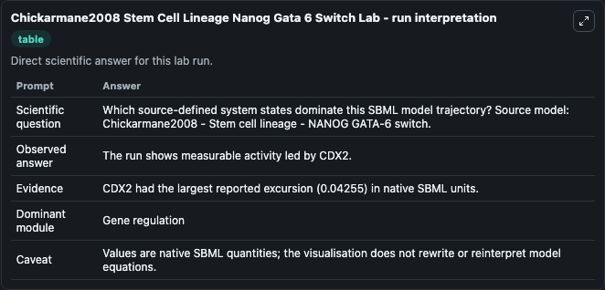
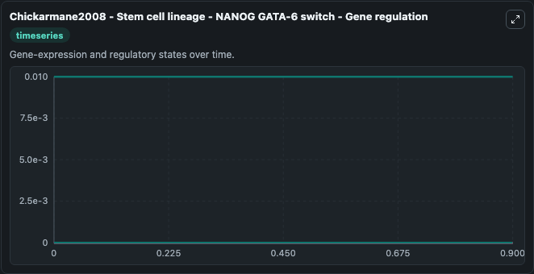
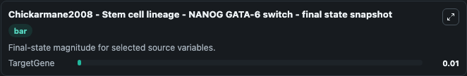

# Chickarmane2008 Stem Cell Lineage Nanog Gata 6 Switch

This Biosimulant lab wraps `Chickarmane2008 Stem Cell Lineage Nanog Gata 6 Switch` as a runnable systems biology model with a companion visualization module.
Chickarmane2008 - Stem cell lineage - NANOG GATA-6 switch In this work, a dynamical model of lineage determination based upon a minimal circuit, as discussed in PMID: 17215298 , which contains the Oct. It can be used to explore the configured dynamics and compare scenario outcomes across configurations.

## What You'll See

The lab asks: Which source-defined system states dominate this SBML model trajectory? Source model: Chickarmane2008 - Stem cell lineage - NANOG GATA-6 switch. It runs for 1.0 time units with a communication step of 0.1. The run uses the model defaults declared by the curated SBML wrapper. The generated visualizations focus on TargetGene, SOX2 Gene, Protein, OCT4 Gene, NANOG Gene, and GCNF Gene, combining trajectory, endpoint-comparison, and summary-table views from one completed dark-mode run.

In this captured run, **TargetGene** moved from 0.0100 to 0.0100 across 1.0 simulation windows.


### Output Visualizations



*Summary table for Chickarmane2008 Stem Cell Lineage Nanog Gata 6 Switch, reporting the scientific question, observed answer, dominant module, and caveat.*



*Trajectories of TargetGene, SOX2 Gene, Protein, OCT4 Gene, NANOG Gene, and GCNF Gene across the 1.0 simulation. In this run TargetGene, SOX2 Gene, Protein, OCT4 Gene stayed near their initial values — no observable moved appreciably.*



*Endpoint snapshot of the focused observables — final values from the captured run. Top 1 by value: **TargetGene** = 0.0100.*


## Model Context

- Core model: `models/core`
- Visualization model: `models/visualisation`
- Standard: `other`
- Upstream source: `biomodels_ebi:BIOMD0000000210`
- License: `CC0`

## Inputs

| Input | Maps To | Default | Notes |
|---|---|---|---|
| Initial Target Gene | `systemsbiology_sbml_chickarmane2008_stem_cell_lineage_nanog_gata_6_s_biomd0000000210_model.initial_target_gene` | | Source state initial condition exposed as a model-specific control because no explicit intervention parameter is identifiable. Maps to SBML symbol `targetGene`. |
| Initial Sox2 Gene | `systemsbiology_sbml_chickarmane2008_stem_cell_lineage_nanog_gata_6_s_biomd0000000210_model.initial_sox2_gene` | | Source state initial condition exposed as a model-specific control because no explicit intervention parameter is identifiable. Maps to SBML symbol `SOX2_Gene`. |
| Initial Protein | `systemsbiology_sbml_chickarmane2008_stem_cell_lineage_nanog_gata_6_s_biomd0000000210_model.initial_protein` | | Source state initial condition exposed as a model-specific control because no explicit intervention parameter is identifiable. Maps to SBML symbol `Protein`. |
| Initial Oct4 Gene | `systemsbiology_sbml_chickarmane2008_stem_cell_lineage_nanog_gata_6_s_biomd0000000210_model.initial_oct4_gene` | | Source state initial condition exposed as a model-specific control because no explicit intervention parameter is identifiable. Maps to SBML symbol `OCT4_Gene`. |
| Initial Nanog Gene | `systemsbiology_sbml_chickarmane2008_stem_cell_lineage_nanog_gata_6_s_biomd0000000210_model.initial_nanog_gene` | | Source state initial condition exposed as a model-specific control because no explicit intervention parameter is identifiable. Maps to SBML symbol `NANOG_Gene`. |
| Initial Gcnf Gene | `systemsbiology_sbml_chickarmane2008_stem_cell_lineage_nanog_gata_6_s_biomd0000000210_model.initial_gcnf_gene` | | Source state initial condition exposed as a model-specific control because no explicit intervention parameter is identifiable. Maps to SBML symbol `GCNF_Gene`. |

## Outputs

| Output | Maps To | Role |
|---|---|---|
| `state` | `systemsbiology_sbml_chickarmane2008_stem_cell_lineage_nanog_gata_6_s_biomd0000000210_model.state` | Available to the visualization model and downstream workflows. |
| `summary` | `systemsbiology_sbml_chickarmane2008_stem_cell_lineage_nanog_gata_6_s_biomd0000000210_model.summary` | Available to the visualization model and downstream workflows. |
| `species_labels` | `systemsbiology_sbml_chickarmane2008_stem_cell_lineage_nanog_gata_6_s_biomd0000000210_model.species_labels` | Available to the visualization model and downstream workflows. |
| `target_gene` | `systemsbiology_sbml_chickarmane2008_stem_cell_lineage_nanog_gata_6_s_biomd0000000210_model.target_gene` | Available to the visualization model and downstream workflows. |
| `sox2_gene` | `systemsbiology_sbml_chickarmane2008_stem_cell_lineage_nanog_gata_6_s_biomd0000000210_model.sox2_gene` | Available to the visualization model and downstream workflows. |
| `protein` | `systemsbiology_sbml_chickarmane2008_stem_cell_lineage_nanog_gata_6_s_biomd0000000210_model.protein` | Available to the visualization model and downstream workflows. |
| `oct4_gene` | `systemsbiology_sbml_chickarmane2008_stem_cell_lineage_nanog_gata_6_s_biomd0000000210_model.oct4_gene` | Available to the visualization model and downstream workflows. |
| `nanog_gene` | `systemsbiology_sbml_chickarmane2008_stem_cell_lineage_nanog_gata_6_s_biomd0000000210_model.nanog_gene` | Available to the visualization model and downstream workflows. |
| `gcnf_gene` | `systemsbiology_sbml_chickarmane2008_stem_cell_lineage_nanog_gata_6_s_biomd0000000210_model.gcnf_gene` | Available to the visualization model and downstream workflows. |

## Runtime

- Duration: `1.0`
- Communication step: `0.1`

## Running Locally

```bash
biosimulant labs serve
```
