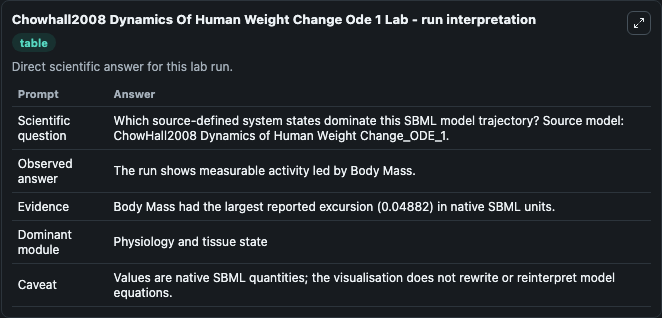
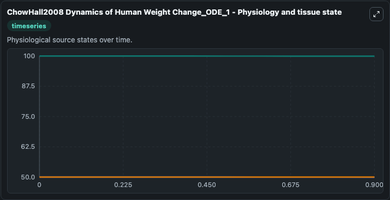
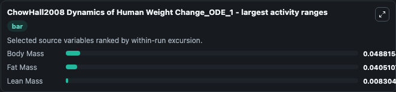
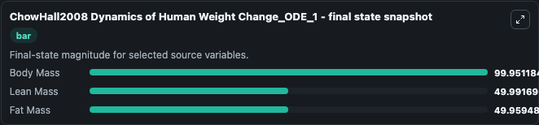
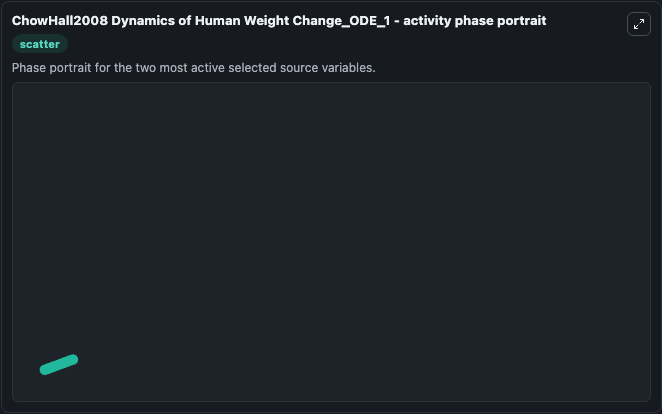

# Chowhall2008 Dynamics Of Human Weight Change Ode 1

This Biosimulant lab wraps `Chowhall2008 Dynamics Of Human Weight Change Ode 1` as a runnable systems biology model with a companion visualization module.
This ODE model is a representation of the two compartment macronutrient partition model that Chow and Hall outlined in their 2008 publication. It can be used to explore the configured dynamics and compare scenario outcomes across configurations.

## What You'll See

The lab asks: Which source-defined system states dominate this SBML model trajectory? Source model: ChowHall2008 Dynamics of Human Weight Change_ODE_1. It runs for 1.0 time units with a communication step of 0.1. The run uses the model defaults declared by the curated SBML wrapper. The generated visualizations focus on Body Mass, Lean Mass, and Fat Mass, combining trajectory, endpoint-comparison, and summary-table views from one completed dark-mode run.

In this captured run, **Body Mass** moved from 100.0 to 99.951 across 1.0 simulation windows.


### Output Visualizations



*Summary table for Chowhall2008 Dynamics Of Human Weight Change Ode 1, reporting the scientific question, observed answer, dominant module, and caveat.*



*Trajectories of Body Mass, Fat Mass, and Lean Mass across the 1.0 simulation. In this run **Body Mass** fell from 100.0 to 99.951 — the largest movements among the focused observables.*



*Largest-excursion ranking of the focused observables — the absolute movement magnitude during the run. Top 3: **Body Mass** = 0.0488, **Fat Mass** = 0.0405, **Lean Mass** = 0.0083.*



*Endpoint snapshot of the focused observables — final values from the captured run. Top 3 by value: **Body Mass** = 99.951, **Lean Mass** = 49.992, **Fat Mass** = 49.959.*



*Visualization card from the Chowhall2008 Dynamics Of Human Weight Change Ode 1 dark-mode run.*


## Model Context

- Core model: `models/core`
- Visualization model: `models/visualisation`
- Standard: `other`
- Upstream source: `biomodels_ebi:BIOMD0000000901`
- License: `CC0`

## Inputs

| Input | Maps To | Default | Notes |
|---|---|---|---|
| Initial Body Mass | `systemsbiology_sbml_chowhall2008_dynamics_of_human_weight_change_ode_biomd0000000901_model.initial_body_mass` | | Source state initial condition exposed as a model-specific control because no explicit intervention parameter is identifiable. Maps to SBML symbol `Body_Mass`. |
| Initial Lean Mass | `systemsbiology_sbml_chowhall2008_dynamics_of_human_weight_change_ode_biomd0000000901_model.initial_lean_mass` | | Source state initial condition exposed as a model-specific control because no explicit intervention parameter is identifiable. Maps to SBML symbol `Lean_Mass`. |
| Initial Fat Mass | `systemsbiology_sbml_chowhall2008_dynamics_of_human_weight_change_ode_biomd0000000901_model.initial_fat_mass` | | Source state initial condition exposed as a model-specific control because no explicit intervention parameter is identifiable. Maps to SBML symbol `Fat_Mass`. |

## Outputs

| Output | Maps To | Role |
|---|---|---|
| `state` | `systemsbiology_sbml_chowhall2008_dynamics_of_human_weight_change_ode_biomd0000000901_model.state` | Available to the visualization model and downstream workflows. |
| `summary` | `systemsbiology_sbml_chowhall2008_dynamics_of_human_weight_change_ode_biomd0000000901_model.summary` | Available to the visualization model and downstream workflows. |
| `species_labels` | `systemsbiology_sbml_chowhall2008_dynamics_of_human_weight_change_ode_biomd0000000901_model.species_labels` | Available to the visualization model and downstream workflows. |
| `body_mass` | `systemsbiology_sbml_chowhall2008_dynamics_of_human_weight_change_ode_biomd0000000901_model.body_mass` | Available to the visualization model and downstream workflows. |
| `lean_mass` | `systemsbiology_sbml_chowhall2008_dynamics_of_human_weight_change_ode_biomd0000000901_model.lean_mass` | Available to the visualization model and downstream workflows. |
| `fat_mass` | `systemsbiology_sbml_chowhall2008_dynamics_of_human_weight_change_ode_biomd0000000901_model.fat_mass` | Available to the visualization model and downstream workflows. |

## Runtime

- Duration: `1.0`
- Communication step: `0.1`

## Running Locally

```bash
biosimulant labs serve
```
