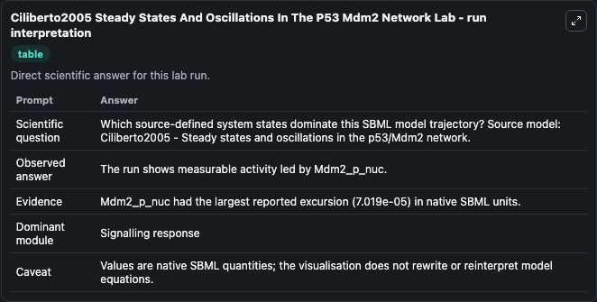
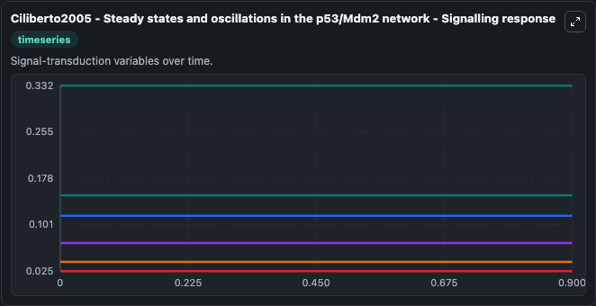
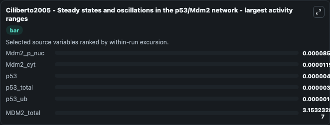
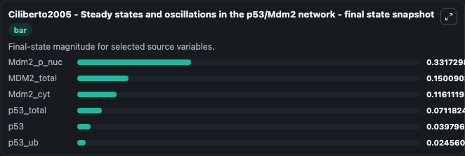
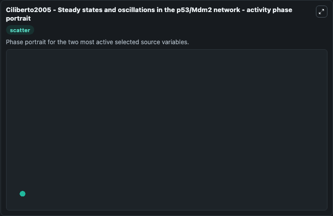

# Ciliberto2005 Steady States And Oscillations In The P53 Mdm2 Network

This Biosimulant lab wraps `Ciliberto2005 Steady States And Oscillations In The P53 Mdm2 Network` as a runnable systems biology model with a companion visualization module.
Its a mathematial model studying steady state and oscialltions in p53-MDM2 network triggered by IR induced DNA Damage. It can be used to explore the configured dynamics and compare scenario outcomes across configurations.

## What You'll See

The lab asks: Which source-defined system states dominate this SBML model trajectory? Source model: Ciliberto2005 - Steady states and oscillations in the p53/Mdm2 network. It runs for 1.0 time units with a communication step of 0.1. The run uses the model defaults declared by the curated SBML wrapper. The generated visualizations focus on Mdm2_p_nuc, MDM2_total, Mdm2_cyt, p53_total, p53, and p53_ub, combining trajectory, endpoint-comparison, and summary-table views from one completed dark-mode run.

In this captured run, **Mdm2_p_nuc** moved from 0.3318 to 0.3317 across 1.0 simulation windows.


### Output Visualizations



*Trajectories of Mdm2_p_nuc, Mdm2_cyt, p53, p53_total, p53_ub, and MDM2_total across the 1.0 simulation. In this run **Mdm2_cyt** climbed from 0.1161 to 0.1161 and **Mdm2_p_nuc** fell from 0.3318 to 0.3317 — the largest movements among the focused observables.*



*Trajectories of Mdm2_p_nuc, Mdm2_cyt, p53, p53_total, p53_ub, and MDM2_total across the 1.0 simulation. In this run **Mdm2_cyt** climbed from 0.1161 to 0.1161 and **Mdm2_p_nuc** fell from 0.3318 to 0.3317 — the largest movements among the focused observables.*



*Trajectories of Mdm2_p_nuc, Mdm2_cyt, p53, p53_total, p53_ub, and MDM2_total across the 1.0 simulation. In this run **Mdm2_cyt** climbed from 0.1161 to 0.1161 and **Mdm2_p_nuc** fell from 0.3318 to 0.3317 — the largest movements among the focused observables.*



*Trajectories of Mdm2_p_nuc, Mdm2_cyt, p53, p53_total, p53_ub, and MDM2_total across the 1.0 simulation. In this run **Mdm2_cyt** climbed from 0.1161 to 0.1161 and **Mdm2_p_nuc** fell from 0.3318 to 0.3317 — the largest movements among the focused observables.*



*Trajectories of Mdm2_p_nuc, Mdm2_cyt, p53, p53_total, p53_ub, and MDM2_total across the 1.0 simulation. In this run **Mdm2_cyt** climbed from 0.1161 to 0.1161 and **Mdm2_p_nuc** fell from 0.3318 to 0.3317 — the largest movements among the focused observables.*


## Model Context

- Core model: `models/core`
- Visualization model: `models/visualisation`
- Standard: `other`
- Upstream source: `biomodels_ebi:BIOMD0000001006`
- License: `CC0`

## Inputs

| Input | Maps To | Default | Notes |
|---|---|---|---|
| Initial Mdm2 P Nuc | `systemsbiology_sbml_ciliberto2005_steady_states_and_oscillations_in_biomd0000001006_model.initial_mdm2_p_nuc` | | Source state initial condition exposed as a model-specific control because no explicit intervention parameter is identifiable. Maps to SBML symbol `Mdm2_p_nuc`. |
| Initial Mdm2 Total | `systemsbiology_sbml_ciliberto2005_steady_states_and_oscillations_in_biomd0000001006_model.initial_mdm2_total` | | Source state initial condition exposed as a model-specific control because no explicit intervention parameter is identifiable. Maps to SBML symbol `MDM2_total`. |
| Initial Mdm2 Cyt | `systemsbiology_sbml_ciliberto2005_steady_states_and_oscillations_in_biomd0000001006_model.initial_mdm2_cyt` | | Source state initial condition exposed as a model-specific control because no explicit intervention parameter is identifiable. Maps to SBML symbol `Mdm2_cyt`. |
| Initial P53 Total | `systemsbiology_sbml_ciliberto2005_steady_states_and_oscillations_in_biomd0000001006_model.initial_p53_total` | | Source state initial condition exposed as a model-specific control because no explicit intervention parameter is identifiable. Maps to SBML symbol `p53_total`. |
| Initial Model State P53 | `systemsbiology_sbml_ciliberto2005_steady_states_and_oscillations_in_biomd0000001006_model.initial_model_state_p53` | | Source state initial condition exposed as a model-specific control because no explicit intervention parameter is identifiable. Maps to SBML symbol `p53`. |
| Initial P53 Ub | `systemsbiology_sbml_ciliberto2005_steady_states_and_oscillations_in_biomd0000001006_model.initial_p53_ub` | | Source state initial condition exposed as a model-specific control because no explicit intervention parameter is identifiable. Maps to SBML symbol `p53_ub`. |

## Outputs

| Output | Maps To | Role |
|---|---|---|
| `state` | `systemsbiology_sbml_ciliberto2005_steady_states_and_oscillations_in_biomd0000001006_model.state` | Available to the visualization model and downstream workflows. |
| `summary` | `systemsbiology_sbml_ciliberto2005_steady_states_and_oscillations_in_biomd0000001006_model.summary` | Available to the visualization model and downstream workflows. |
| `species_labels` | `systemsbiology_sbml_ciliberto2005_steady_states_and_oscillations_in_biomd0000001006_model.species_labels` | Available to the visualization model and downstream workflows. |
| `mdm2_p_nuc` | `systemsbiology_sbml_ciliberto2005_steady_states_and_oscillations_in_biomd0000001006_model.mdm2_p_nuc` | Available to the visualization model and downstream workflows. |
| `mdm2_total` | `systemsbiology_sbml_ciliberto2005_steady_states_and_oscillations_in_biomd0000001006_model.mdm2_total` | Available to the visualization model and downstream workflows. |
| `mdm2_cyt` | `systemsbiology_sbml_ciliberto2005_steady_states_and_oscillations_in_biomd0000001006_model.mdm2_cyt` | Available to the visualization model and downstream workflows. |
| `p53_total` | `systemsbiology_sbml_ciliberto2005_steady_states_and_oscillations_in_biomd0000001006_model.p53_total` | Available to the visualization model and downstream workflows. |
| `p53` | `systemsbiology_sbml_ciliberto2005_steady_states_and_oscillations_in_biomd0000001006_model.p53` | Available to the visualization model and downstream workflows. |
| `p53_ub` | `systemsbiology_sbml_ciliberto2005_steady_states_and_oscillations_in_biomd0000001006_model.p53_ub` | Available to the visualization model and downstream workflows. |

## Runtime

- Duration: `1.0`
- Communication step: `0.1`

## Running Locally

```bash
biosimulant labs serve
```
