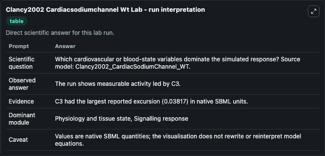
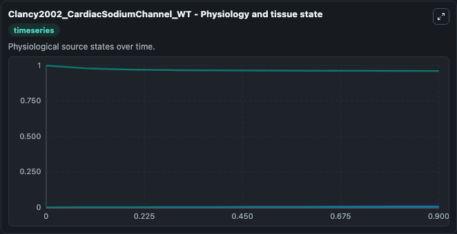
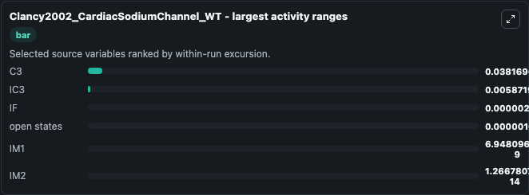
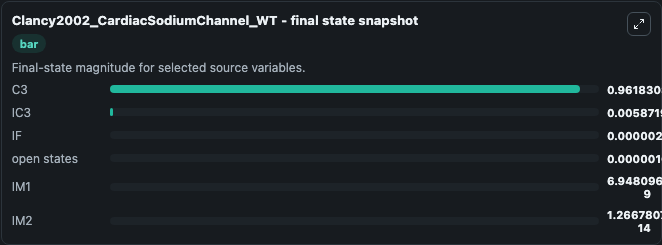
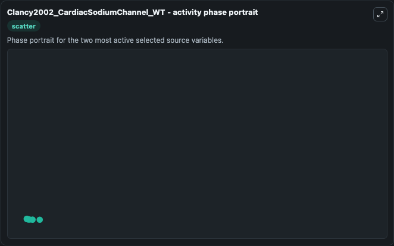

# Clancy2002 Cardiacsodiumchannel Wt

This Biosimulant lab wraps `Clancy2002 Cardiacsodiumchannel Wt` as a runnable systems biology model with a companion visualization module.
The model is according to the paper Na+ Channel Mutation That Causes Both Brugada and Long-QT Syndrome Phenotypes: A Simulation Study of Mechanism Original model comes from ModelDB with accession numb. It can be used to explore the configured dynamics and compare scenario outcomes across configurations.

## What You'll See

The lab asks: Which cardiovascular or blood-state variables dominate the simulated response? Source model: Clancy2002_CardiacSodiumChannel_WT. It runs for 1.0 time units with a communication step of 0.1. The run uses the model defaults declared by the curated SBML wrapper. The generated visualizations focus on open states, C3, IM2, IM1, IF, and IC3, combining trajectory, endpoint-comparison, and summary-table views from one completed dark-mode run.

In this captured run, **C3** moved from 1.000 to 0.9618 across 1.0 simulation windows.


### Output Visualizations



*Summary table for Clancy2002 Cardiacsodiumchannel Wt, reporting the scientific question, observed answer, dominant module, and caveat.*



*Trajectories of C3, IC3, IF, open states, IM1, and IM2 across the 1.0 simulation. In this run **IC3** climbed from 0 to 0.00587 and **C3** fell from 1.000 to 0.9618 — the largest movements among the focused observables.*



*Largest-excursion ranking of the focused observables — the absolute movement magnitude during the run. Top 3: **C3** = 0.0382, **IC3** = 0.00587, **IF** = 2.62e-06, with 3 more observables below.*



*Endpoint snapshot of the focused observables — final values from the captured run. Top 3 by value: **C3** = 0.9618, **IC3** = 0.00587, **IF** = 2.62e-06, with 3 more observables below.*



*Visualization card from the Clancy2002 Cardiacsodiumchannel Wt dark-mode run.*


## Model Context

- Core model: `models/core`
- Visualization model: `models/visualisation`
- Standard: `other`
- Upstream source: `biomodels_ebi:BIOMD0000000126`
- License: `CC0`

## Inputs

| Input | Maps To | Default | Notes |
|---|---|---|---|
| Initial Open States | `systemsbiology_sbml_clancy2002_cardiacsodiumchannel_wt_biomd0000000126_model.initial_open_states` | | Source state initial condition exposed as a model-specific control because no explicit intervention parameter is identifiable. Maps to SBML symbol `O`. |
| Initial Model State C3 | `systemsbiology_sbml_clancy2002_cardiacsodiumchannel_wt_biomd0000000126_model.initial_model_state_c3` | | Source state initial condition exposed as a model-specific control because no explicit intervention parameter is identifiable. Maps to SBML symbol `C3`. |
| Initial Model State IM2 | `systemsbiology_sbml_clancy2002_cardiacsodiumchannel_wt_biomd0000000126_model.initial_model_state_im2` | | Source state initial condition exposed as a model-specific control because no explicit intervention parameter is identifiable. Maps to SBML symbol `IM2`. |
| Initial Model State IM1 | `systemsbiology_sbml_clancy2002_cardiacsodiumchannel_wt_biomd0000000126_model.initial_model_state_im1` | | Source state initial condition exposed as a model-specific control because no explicit intervention parameter is identifiable. Maps to SBML symbol `IM1`. |
| Initial If Value | `systemsbiology_sbml_clancy2002_cardiacsodiumchannel_wt_biomd0000000126_model.initial_if_value` | | Source state initial condition exposed as a model-specific control because no explicit intervention parameter is identifiable. Maps to SBML symbol `IF`. |
| Initial Model State IC3 | `systemsbiology_sbml_clancy2002_cardiacsodiumchannel_wt_biomd0000000126_model.initial_model_state_ic3` | | Source state initial condition exposed as a model-specific control because no explicit intervention parameter is identifiable. Maps to SBML symbol `IC3`. |

## Outputs

| Output | Maps To | Role |
|---|---|---|
| `state` | `systemsbiology_sbml_clancy2002_cardiacsodiumchannel_wt_biomd0000000126_model.state` | Available to the visualization model and downstream workflows. |
| `summary` | `systemsbiology_sbml_clancy2002_cardiacsodiumchannel_wt_biomd0000000126_model.summary` | Available to the visualization model and downstream workflows. |
| `species_labels` | `systemsbiology_sbml_clancy2002_cardiacsodiumchannel_wt_biomd0000000126_model.species_labels` | Available to the visualization model and downstream workflows. |
| `open_states` | `systemsbiology_sbml_clancy2002_cardiacsodiumchannel_wt_biomd0000000126_model.open_states` | Available to the visualization model and downstream workflows. |
| `model_state_c3` | `systemsbiology_sbml_clancy2002_cardiacsodiumchannel_wt_biomd0000000126_model.model_state_c3` | Available to the visualization model and downstream workflows. |
| `im2` | `systemsbiology_sbml_clancy2002_cardiacsodiumchannel_wt_biomd0000000126_model.im2` | Available to the visualization model and downstream workflows. |
| `im1` | `systemsbiology_sbml_clancy2002_cardiacsodiumchannel_wt_biomd0000000126_model.im1` | Available to the visualization model and downstream workflows. |
| `if_value` | `systemsbiology_sbml_clancy2002_cardiacsodiumchannel_wt_biomd0000000126_model.if_value` | Available to the visualization model and downstream workflows. |
| `ic3` | `systemsbiology_sbml_clancy2002_cardiacsodiumchannel_wt_biomd0000000126_model.ic3` | Available to the visualization model and downstream workflows. |

## Runtime

- Duration: `1.0`
- Communication step: `0.1`

## Running Locally

```bash
biosimulant labs serve
```
