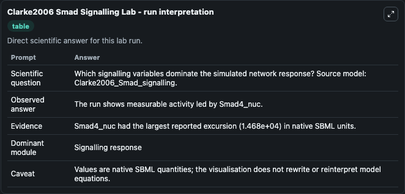
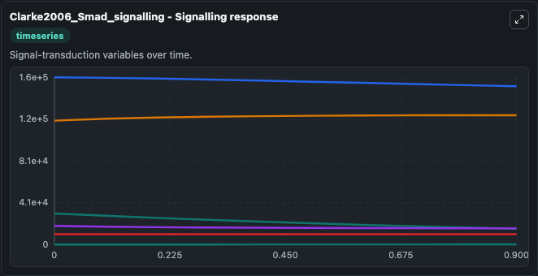
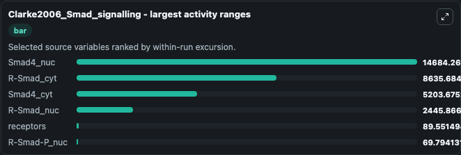
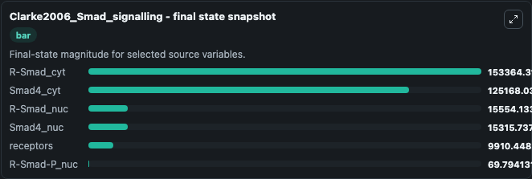
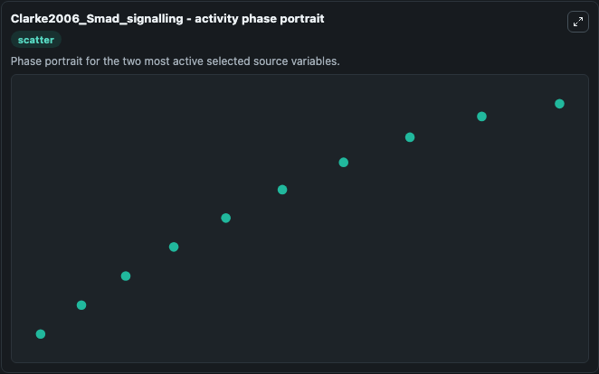

# Clarke2006 Smad Signalling

This Biosimulant lab wraps `Clarke2006 Smad Signalling` as a runnable systems biology model with a companion visualization module.
The model reproduces the temporal evolution of four variables depicted in Fig 2a. It can be used to explore the configured dynamics and compare scenario outcomes across configurations.

## What You'll See

The lab asks: Which signalling variables dominate the simulated network response? Source model: Clarke2006_Smad_signalling. It runs for 1.0 time units with a communication step of 0.1. The run uses the model defaults declared by the curated SBML wrapper. The generated visualizations focus on R-Smad_cyt, Smad4_cyt, Smad4_nuc, R-Smad_nuc, receptors, and R-Smad-P_nuc, combining trajectory, endpoint-comparison, and summary-table views from one completed dark-mode run.

In this captured run, **Smad4_nuc** moved from 3e+04 to 1.53e+04 across 1.0 simulation windows.


### Output Visualizations



*Summary table for Clarke2006 Smad Signalling, reporting the scientific question, observed answer, dominant module, and caveat.*



*Trajectories of Smad4_nuc, R-Smad_cyt, Smad4_cyt, R-Smad_nuc, receptors, and R-Smad-P_nuc across the 1.0 simulation. In this run **Smad4_cyt** climbed from 1.2e+05 to 1.25e+05 and **Smad4_nuc** fell from 3e+04 to 1.53e+04 — the largest movements among the focused observables.*



*Largest-excursion ranking of the focused observables — the absolute movement magnitude during the run. Top 3: **Smad4_nuc** = 1.47e+04, **R-Smad_cyt** = 8635.7, **Smad4_cyt** = 5203.7, with 3 more observables below.*



*Endpoint snapshot of the focused observables — final values from the captured run. Top 3 by value: **R-Smad_cyt** = 1.53e+05, **Smad4_cyt** = 1.25e+05, **R-Smad_nuc** = 1.56e+04, with 3 more observables below.*



*Visualization card from the Clarke2006 Smad Signalling dark-mode run.*


## Model Context

- Core model: `models/core`
- Visualization model: `models/visualisation`
- Standard: `other`
- Upstream source: `biomodels_ebi:BIOMD0000000112`
- License: `CC0`

## Inputs

| Input | Maps To | Default | Notes |
|---|---|---|---|
| Initial R Smad Cyt | `systemsbiology_sbml_clarke2006_smad_signalling_biomd0000000112_model.initial_r_smad_cyt` | | Source state initial condition exposed as a model-specific control because no explicit intervention parameter is identifiable. Maps to SBML symbol `R_smad_cyt`. |
| Initial Smad4 Cyt | `systemsbiology_sbml_clarke2006_smad_signalling_biomd0000000112_model.initial_smad4_cyt` | | Source state initial condition exposed as a model-specific control because no explicit intervention parameter is identifiable. Maps to SBML symbol `smad4_cyt`. |
| Initial Smad4 Nuc | `systemsbiology_sbml_clarke2006_smad_signalling_biomd0000000112_model.initial_smad4_nuc` | | Source state initial condition exposed as a model-specific control because no explicit intervention parameter is identifiable. Maps to SBML symbol `smad4_nuc`. |
| Initial R Smad Nuc | `systemsbiology_sbml_clarke2006_smad_signalling_biomd0000000112_model.initial_r_smad_nuc` | | Source state initial condition exposed as a model-specific control because no explicit intervention parameter is identifiable. Maps to SBML symbol `R_smad_nuc`. |
| Initial Receptors | `systemsbiology_sbml_clarke2006_smad_signalling_biomd0000000112_model.initial_receptors` | | Source state initial condition exposed as a model-specific control because no explicit intervention parameter is identifiable. Maps to SBML symbol `receptor`. |
| Initial R Smad P Nuc | `systemsbiology_sbml_clarke2006_smad_signalling_biomd0000000112_model.initial_r_smad_p_nuc` | | Source state initial condition exposed as a model-specific control because no explicit intervention parameter is identifiable. Maps to SBML symbol `R_smad_P_nuc`. |

## Outputs

| Output | Maps To | Role |
|---|---|---|
| `state` | `systemsbiology_sbml_clarke2006_smad_signalling_biomd0000000112_model.state` | Available to the visualization model and downstream workflows. |
| `summary` | `systemsbiology_sbml_clarke2006_smad_signalling_biomd0000000112_model.summary` | Available to the visualization model and downstream workflows. |
| `species_labels` | `systemsbiology_sbml_clarke2006_smad_signalling_biomd0000000112_model.species_labels` | Available to the visualization model and downstream workflows. |
| `r_smad_cyt` | `systemsbiology_sbml_clarke2006_smad_signalling_biomd0000000112_model.r_smad_cyt` | Available to the visualization model and downstream workflows. |
| `smad4_cyt` | `systemsbiology_sbml_clarke2006_smad_signalling_biomd0000000112_model.smad4_cyt` | Available to the visualization model and downstream workflows. |
| `smad4_nuc` | `systemsbiology_sbml_clarke2006_smad_signalling_biomd0000000112_model.smad4_nuc` | Available to the visualization model and downstream workflows. |
| `r_smad_nuc` | `systemsbiology_sbml_clarke2006_smad_signalling_biomd0000000112_model.r_smad_nuc` | Available to the visualization model and downstream workflows. |
| `receptors` | `systemsbiology_sbml_clarke2006_smad_signalling_biomd0000000112_model.receptors` | Available to the visualization model and downstream workflows. |
| `r_smad_p_nuc` | `systemsbiology_sbml_clarke2006_smad_signalling_biomd0000000112_model.r_smad_p_nuc` | Available to the visualization model and downstream workflows. |

## Runtime

- Duration: `1.0`
- Communication step: `0.1`

## Running Locally

```bash
biosimulant labs serve
```
