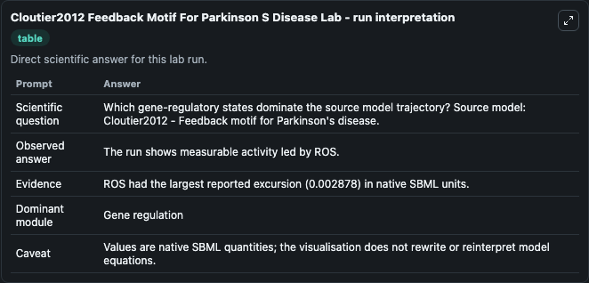
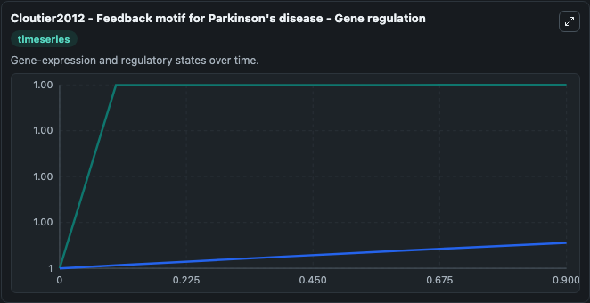
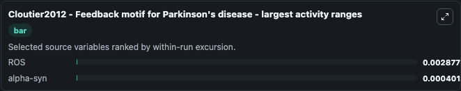
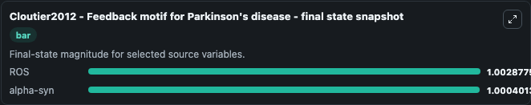
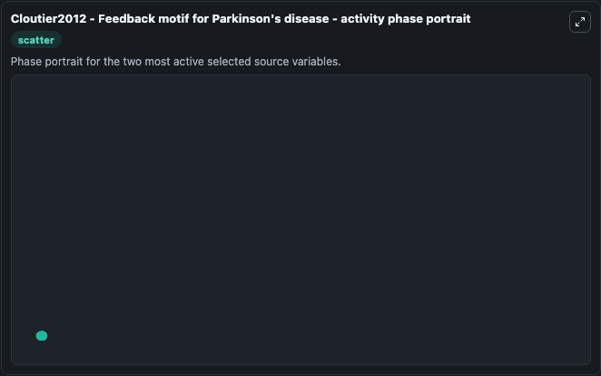

# Cloutier2012 Feedback Motif For Parkinson S Disease

This Biosimulant lab wraps `Cloutier2012 Feedback Motif For Parkinson S Disease` as a runnable systems biology model with a companion visualization module.
Cloutier2012 - Feedback motif for Parkinson'sdisease This model is described in the article: Feedback motif for the pathogenesis of Parkinson's disease. It can be used to explore the configured dynamics and compare scenario outcomes across configurations.

## What You'll See

The lab asks: Which gene-regulatory states dominate the source model trajectory? Source model: Cloutier2012 - Feedback motif for Parkinson's disease. It runs for 1.0 time units with a communication step of 0.1. The run uses the model defaults declared by the curated SBML wrapper. The generated visualizations focus on alpha-syn, and ROS, combining trajectory, endpoint-comparison, and summary-table views from one completed dark-mode run.

In this captured run, **ROS** moved from 1.000 to 1.003 across 1.0 simulation windows.


### Output Visualizations



*Summary table for Cloutier2012 Feedback Motif For Parkinson S Disease, reporting the scientific question, observed answer, dominant module, and caveat.*



*Trajectories of ROS, and alpha-syn across the 1.0 simulation. In this run **ROS** climbed from 1.000 to 1.003 — the largest movements among the focused observables.*



*Largest-excursion ranking of the focused observables — the absolute movement magnitude during the run. Top 2: **ROS** = 0.00288, **alpha-syn** = 0.000401.*



*Endpoint snapshot of the focused observables — final values from the captured run. Top 2 by value: **ROS** = 1.003, **alpha-syn** = 1.000.*



*Visualization card from the Cloutier2012 Feedback Motif For Parkinson S Disease dark-mode run.*


## Model Context

- Core model: `models/core`
- Visualization model: `models/visualisation`
- Standard: `other`
- Upstream source: `biomodels_ebi:BIOMD0000000558`
- License: `CC0`

## Inputs

| Input | Maps To | Default | Notes |
|---|---|---|---|
| Initial Alpha Syn | `systemsbiology_sbml_cloutier2012_feedback_motif_for_parkinson_s_dise_biomd0000000558_model.initial_alpha_syn` | | Source state initial condition exposed as a model-specific control because no explicit intervention parameter is identifiable. Maps to SBML symbol `alpha_syn`. |
| Initial Model State Ros | `systemsbiology_sbml_cloutier2012_feedback_motif_for_parkinson_s_dise_biomd0000000558_model.initial_model_state_ros` | | Source state initial condition exposed as a model-specific control because no explicit intervention parameter is identifiable. Maps to SBML symbol `ROS`. |

## Outputs

| Output | Maps To | Role |
|---|---|---|
| `state` | `systemsbiology_sbml_cloutier2012_feedback_motif_for_parkinson_s_dise_biomd0000000558_model.state` | Available to the visualization model and downstream workflows. |
| `summary` | `systemsbiology_sbml_cloutier2012_feedback_motif_for_parkinson_s_dise_biomd0000000558_model.summary` | Available to the visualization model and downstream workflows. |
| `species_labels` | `systemsbiology_sbml_cloutier2012_feedback_motif_for_parkinson_s_dise_biomd0000000558_model.species_labels` | Available to the visualization model and downstream workflows. |
| `alpha_syn` | `systemsbiology_sbml_cloutier2012_feedback_motif_for_parkinson_s_dise_biomd0000000558_model.alpha_syn` | Available to the visualization model and downstream workflows. |
| `ros` | `systemsbiology_sbml_cloutier2012_feedback_motif_for_parkinson_s_dise_biomd0000000558_model.ros` | Available to the visualization model and downstream workflows. |

## Runtime

- Duration: `1.0`
- Communication step: `0.1`

## Running Locally

```bash
biosimulant labs serve
```
