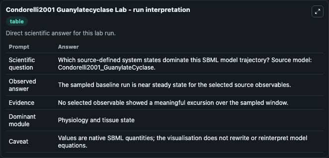
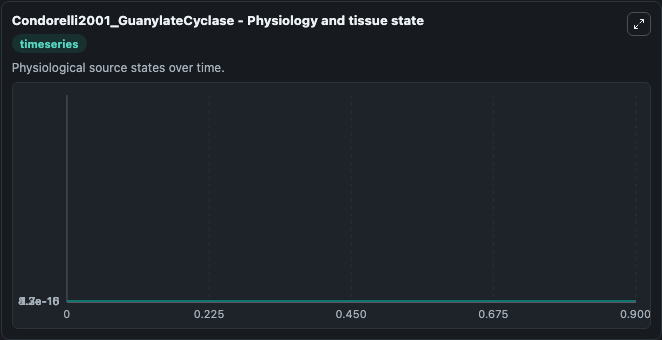
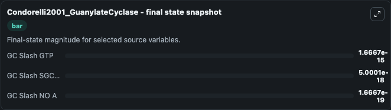

# Condorelli2001 Guanylatecyclase

This Biosimulant lab wraps `Condorelli2001 Guanylatecyclase` as a runnable systems biology model with a companion visualization module.
This model features the observations of the referenced publication. It can be used to explore the configured dynamics and compare scenario outcomes across configurations.

## What You'll See

The lab asks: Which source-defined system states dominate this SBML model trajectory? Source model: Condorelli2001_GuanylateCyclase. It runs for 1.0 time units with a communication step of 0.1. The run uses the model defaults declared by the curated SBML wrapper. The generated visualizations focus on GC Slash GTP, GC Slash SGC Basal, GC Slash NO A, GC Slash NO SGCpart Act, GC Slash NO SGCfull Act, and GC Slash NO, combining trajectory, endpoint-comparison, and summary-table views from one completed dark-mode run.

In this captured run, **GC Slash GTP** moved from 1.67e-15 to 1.67e-15 across 1.0 simulation windows.


### Output Visualizations



*Summary table for Condorelli2001 Guanylatecyclase, reporting the scientific question, observed answer, dominant module, and caveat.*



*Trajectories of GC Slash GTP, GC Slash SGC Basal, GC Slash NO A, GC Slash NO SGCpart Act, GC Slash NO SGCfull Act, and GC Slash NO across the 1.0 simulation. In this run GC Slash GTP, GC Slash SGC Basal, GC Slash NO A, GC Slash NO SGCpart Act stayed near their initial values — no observable moved appreciably.*



*Endpoint snapshot of the focused observables — final values from the captured run. Top 3 by value: **GC Slash GTP** = 1.67e-15, **GC Slash SGC Basal** = 5e-18, **GC Slash NO A** = 1.67e-19.*


## Model Context

- Core model: `models/core`
- Visualization model: `models/visualisation`
- Standard: `other`
- Upstream source: `biomodels_ebi:MODEL4780441670`
- License: `CC0`

## Inputs

| Input | Maps To | Default | Notes |
|---|---|---|---|
| Initial Gc Slash Gtp | `systemsbiology_sbml_condorelli2001_guanylatecyclase_model4780441670_model.initial_gc_slash_gtp` | | Source state initial condition exposed as a model-specific control because no explicit intervention parameter is identifiable. Maps to SBML symbol `GC_slash_GTP`. |
| Initial Gc Slash Sgc Basal | `systemsbiology_sbml_condorelli2001_guanylatecyclase_model4780441670_model.initial_gc_slash_sgc_basal` | | Source state initial condition exposed as a model-specific control because no explicit intervention parameter is identifiable. Maps to SBML symbol `GC_slash_sGC_basal`. |
| Initial Gc Slash No A | `systemsbiology_sbml_condorelli2001_guanylatecyclase_model4780441670_model.initial_gc_slash_no_a` | | Source state initial condition exposed as a model-specific control because no explicit intervention parameter is identifiable. Maps to SBML symbol `GC_slash_NO_a`. |
| Initial Gc Slash No Sg Cpart Act | `systemsbiology_sbml_condorelli2001_guanylatecyclase_model4780441670_model.initial_gc_slash_no_sg_cpart_act` | | Source state initial condition exposed as a model-specific control because no explicit intervention parameter is identifiable. Maps to SBML symbol `GC_slash_NO_sGCpart_act`. |
| Initial Gc Slash No Sg Cfull Act | `systemsbiology_sbml_condorelli2001_guanylatecyclase_model4780441670_model.initial_gc_slash_no_sg_cfull_act` | | Source state initial condition exposed as a model-specific control because no explicit intervention parameter is identifiable. Maps to SBML symbol `GC_slash_NO_sGCfull_act`. |
| Initial Gc Slash No | `systemsbiology_sbml_condorelli2001_guanylatecyclase_model4780441670_model.initial_gc_slash_no` | | Source state initial condition exposed as a model-specific control because no explicit intervention parameter is identifiable. Maps to SBML symbol `GC_slash_NO`. |

## Outputs

| Output | Maps To | Role |
|---|---|---|
| `state` | `systemsbiology_sbml_condorelli2001_guanylatecyclase_model4780441670_model.state` | Available to the visualization model and downstream workflows. |
| `summary` | `systemsbiology_sbml_condorelli2001_guanylatecyclase_model4780441670_model.summary` | Available to the visualization model and downstream workflows. |
| `species_labels` | `systemsbiology_sbml_condorelli2001_guanylatecyclase_model4780441670_model.species_labels` | Available to the visualization model and downstream workflows. |
| `gc_slash_gtp` | `systemsbiology_sbml_condorelli2001_guanylatecyclase_model4780441670_model.gc_slash_gtp` | Available to the visualization model and downstream workflows. |
| `gc_slash_sgc_basal` | `systemsbiology_sbml_condorelli2001_guanylatecyclase_model4780441670_model.gc_slash_sgc_basal` | Available to the visualization model and downstream workflows. |
| `gc_slash_no_a` | `systemsbiology_sbml_condorelli2001_guanylatecyclase_model4780441670_model.gc_slash_no_a` | Available to the visualization model and downstream workflows. |
| `gc_slash_no_sg_cpart_act` | `systemsbiology_sbml_condorelli2001_guanylatecyclase_model4780441670_model.gc_slash_no_sg_cpart_act` | Available to the visualization model and downstream workflows. |
| `gc_slash_no_sg_cfull_act` | `systemsbiology_sbml_condorelli2001_guanylatecyclase_model4780441670_model.gc_slash_no_sg_cfull_act` | Available to the visualization model and downstream workflows. |
| `gc_slash_no` | `systemsbiology_sbml_condorelli2001_guanylatecyclase_model4780441670_model.gc_slash_no` | Available to the visualization model and downstream workflows. |

## Runtime

- Duration: `1.0`
- Communication step: `0.1`

## Running Locally

```bash
biosimulant labs serve
```
