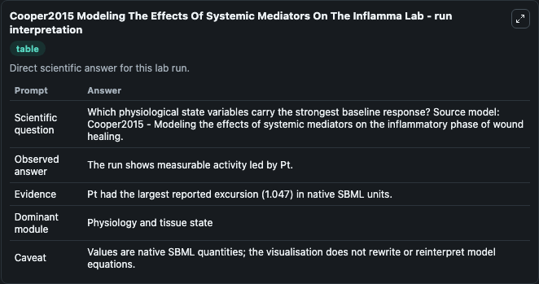
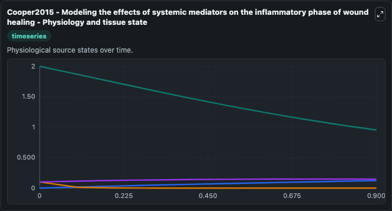
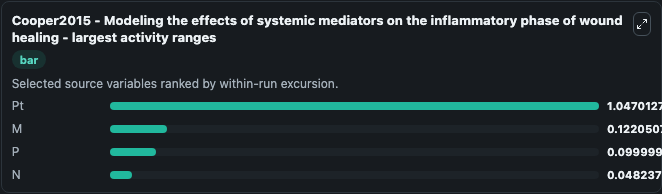
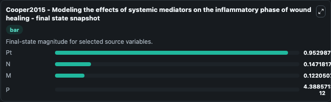
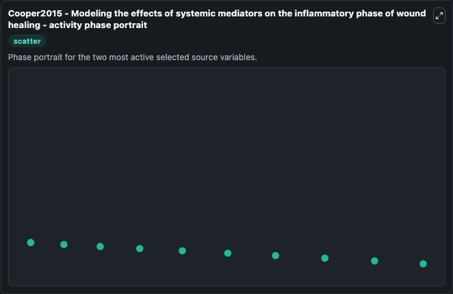

# Cooper2015 Modeling The Effects Of Systemic Mediators On The Inflamma

This Biosimulant lab wraps `Cooper2015 Modeling The Effects Of Systemic Mediators On The Inflamma` as a runnable systems biology model with a companion visualization module.
This is an ordinary differential equation-based mathematical model describing the inflammatory phase of the wound healing response. It can be used to explore the configured dynamics and compare scenario outcomes across configurations.

## What You'll See

The lab asks: Which physiological state variables carry the strongest baseline response? Source model: Cooper2015 - Modeling the effects of systemic mediators on the inflammatory phase of wound healing. It runs for 1.0 time units with a communication step of 0.1. The run uses the model defaults declared by the curated SBML wrapper. The generated visualizations focus on Pt, P, N, and M, combining trajectory, endpoint-comparison, and summary-table views from one completed dark-mode run.

In this captured run, **Pt** moved from 2.000 to 0.9530 across 1.0 simulation windows.


### Output Visualizations



*Summary table for Cooper2015 Modeling The Effects Of Systemic Mediators On The Inflamma, reporting the scientific question, observed answer, dominant module, and caveat.*



*Trajectories of Pt, M, P, and N across the 1.0 simulation. In this run **M** climbed from 0 to 0.1221 and **Pt** fell from 2.000 to 0.9530 — the largest movements among the focused observables.*



*Largest-excursion ranking of the focused observables — the absolute movement magnitude during the run. Top 3: **Pt** = 1.047, **M** = 0.1221, **P** = 0.1000, with 1 more observable below.*



*Endpoint snapshot of the focused observables — final values from the captured run. Top 3 by value: **Pt** = 0.9530, **N** = 0.1472, **M** = 0.1221, with 1 more observable below.*



*Visualization card from the Cooper2015 Modeling The Effects Of Systemic Mediators On The Inflamma dark-mode run.*


## Model Context

- Core model: `models/core`
- Visualization model: `models/visualisation`
- Standard: `other`
- Upstream source: `biomodels_ebi:BIOMD0000000855`
- License: `CC0`

## Inputs

| Input | Maps To | Default | Notes |
|---|---|---|---|
| Initial Model State Pt | `systemsbiology_sbml_cooper2015_modeling_the_effects_of_systemic_medi_biomd0000000855_model.initial_model_state_pt` | | Source state initial condition exposed as a model-specific control because no explicit intervention parameter is identifiable. Maps to SBML symbol `Pt`. |
| Initial Model State P | `systemsbiology_sbml_cooper2015_modeling_the_effects_of_systemic_medi_biomd0000000855_model.initial_model_state_p` | | Source state initial condition exposed as a model-specific control because no explicit intervention parameter is identifiable. Maps to SBML symbol `P`. |
| Initial Model State N | `systemsbiology_sbml_cooper2015_modeling_the_effects_of_systemic_medi_biomd0000000855_model.initial_model_state_n` | | Source state initial condition exposed as a model-specific control because no explicit intervention parameter is identifiable. Maps to SBML symbol `N`. |
| Initial Model State M | `systemsbiology_sbml_cooper2015_modeling_the_effects_of_systemic_medi_biomd0000000855_model.initial_model_state_m` | | Source state initial condition exposed as a model-specific control because no explicit intervention parameter is identifiable. Maps to SBML symbol `M`. |

## Outputs

| Output | Maps To | Role |
|---|---|---|
| `state` | `systemsbiology_sbml_cooper2015_modeling_the_effects_of_systemic_medi_biomd0000000855_model.state` | Available to the visualization model and downstream workflows. |
| `summary` | `systemsbiology_sbml_cooper2015_modeling_the_effects_of_systemic_medi_biomd0000000855_model.summary` | Available to the visualization model and downstream workflows. |
| `species_labels` | `systemsbiology_sbml_cooper2015_modeling_the_effects_of_systemic_medi_biomd0000000855_model.species_labels` | Available to the visualization model and downstream workflows. |
| `model_state_pt` | `systemsbiology_sbml_cooper2015_modeling_the_effects_of_systemic_medi_biomd0000000855_model.model_state_pt` | Available to the visualization model and downstream workflows. |
| `model_state_p` | `systemsbiology_sbml_cooper2015_modeling_the_effects_of_systemic_medi_biomd0000000855_model.model_state_p` | Available to the visualization model and downstream workflows. |
| `model_state_n` | `systemsbiology_sbml_cooper2015_modeling_the_effects_of_systemic_medi_biomd0000000855_model.model_state_n` | Available to the visualization model and downstream workflows. |
| `model_state_m` | `systemsbiology_sbml_cooper2015_modeling_the_effects_of_systemic_medi_biomd0000000855_model.model_state_m` | Available to the visualization model and downstream workflows. |

## Runtime

- Duration: `1.0`
- Communication step: `0.1`

## Running Locally

```bash
biosimulant labs serve
```
