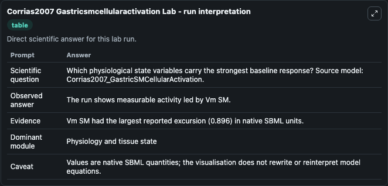
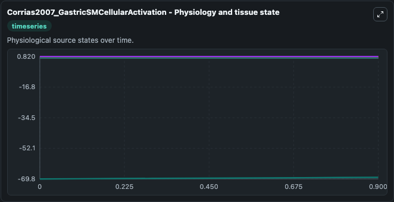
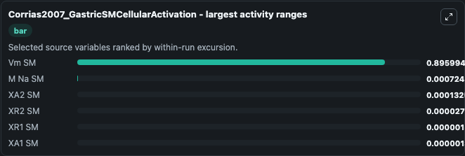
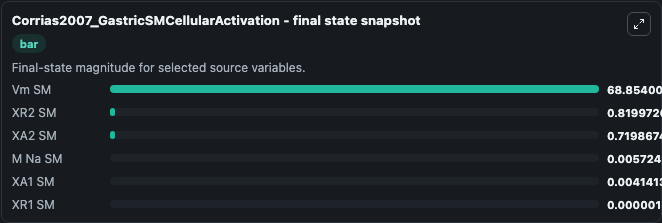
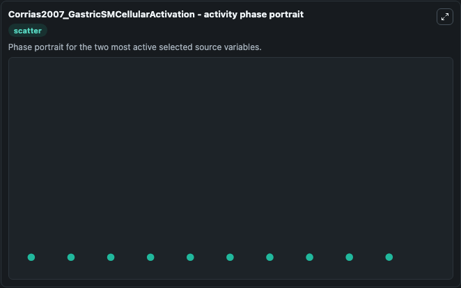

# Corrias2007 Gastricsmcellularactivation

This Biosimulant lab wraps `Corrias2007 Gastricsmcellularactivation` as a runnable systems biology model with a companion visualization module.
This a model from the article: A quantitative model of gastric smooth muscle cellular activation. It can be used to explore the configured dynamics and compare scenario outcomes across configurations.

## What You'll See

The lab asks: Which physiological state variables carry the strongest baseline response? Source model: Corrias2007_GastricSMCellularActivation. It runs for 1.0 time units with a communication step of 0.1. The run uses the model defaults declared by the curated SBML wrapper. The generated visualizations focus on XR2 SM, XR1 SM, XA2 SM, XA1 SM, Vm SM, and M Na SM, combining trajectory, endpoint-comparison, and summary-table views from one completed dark-mode run.

In this captured run, **Vm SM** moved from -69.750 to -68.854 across 1.0 simulation windows.


### Output Visualizations



*Summary table for Corrias2007 Gastricsmcellularactivation, reporting the scientific question, observed answer, dominant module, and caveat.*



*Trajectories of Vm SM, M Na SM, XA2 SM, XR2 SM, XR1 SM, and XA1 SM across the 1.0 simulation. In this run **Vm SM** climbed from -69.750 to -68.854 and **XA2 SM** fell from 0.7200 to 0.7199 — the largest movements among the focused observables.*



*Largest-excursion ranking of the focused observables — the absolute movement magnitude during the run. Top 3: **Vm SM** = 0.8960, **M Na SM** = 0.000724, **XA2 SM** = 0.000133, with 3 more observables below.*



*Endpoint snapshot of the focused observables — final values from the captured run. Top 3 by value: **Vm SM** = 68.854, **XR2 SM** = 0.8200, **XA2 SM** = 0.7199, with 3 more observables below.*



*Visualization card from the Corrias2007 Gastricsmcellularactivation dark-mode run.*


## Model Context

- Core model: `models/core`
- Visualization model: `models/visualisation`
- Standard: `other`
- Upstream source: `biomodels_ebi:MODEL0913145131`
- License: `CC0`

## Inputs

| Input | Maps To | Default | Notes |
|---|---|---|---|
| T Icc Stimulus | `systemsbiology_sbml_corrias2007_gastricsmcellularactivation_model0913145131_model.t_icc_stimulus` | | Source parameter exposed because its SBML label indicates a boundary, stimulus, dose, ligand, protocol, substrate, or environmental control. Maps to SBML symbol `t_ICC_stimulus`. |

## Outputs

| Output | Maps To | Role |
|---|---|---|
| `state` | `systemsbiology_sbml_corrias2007_gastricsmcellularactivation_model0913145131_model.state` | Available to the visualization model and downstream workflows. |
| `summary` | `systemsbiology_sbml_corrias2007_gastricsmcellularactivation_model0913145131_model.summary` | Available to the visualization model and downstream workflows. |
| `species_labels` | `systemsbiology_sbml_corrias2007_gastricsmcellularactivation_model0913145131_model.species_labels` | Available to the visualization model and downstream workflows. |
| `xr2_sm` | `systemsbiology_sbml_corrias2007_gastricsmcellularactivation_model0913145131_model.xr2_sm` | Available to the visualization model and downstream workflows. |
| `xr1_sm` | `systemsbiology_sbml_corrias2007_gastricsmcellularactivation_model0913145131_model.xr1_sm` | Available to the visualization model and downstream workflows. |
| `xa2_sm` | `systemsbiology_sbml_corrias2007_gastricsmcellularactivation_model0913145131_model.xa2_sm` | Available to the visualization model and downstream workflows. |
| `xa1_sm` | `systemsbiology_sbml_corrias2007_gastricsmcellularactivation_model0913145131_model.xa1_sm` | Available to the visualization model and downstream workflows. |
| `vm_sm` | `systemsbiology_sbml_corrias2007_gastricsmcellularactivation_model0913145131_model.vm_sm` | Available to the visualization model and downstream workflows. |
| `m_na_sm` | `systemsbiology_sbml_corrias2007_gastricsmcellularactivation_model0913145131_model.m_na_sm` | Available to the visualization model and downstream workflows. |

## Runtime

- Duration: `1.0`
- Communication step: `0.1`

## Running Locally

```bash
biosimulant labs serve
```
