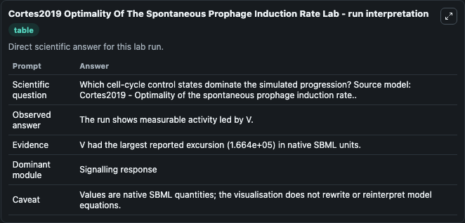
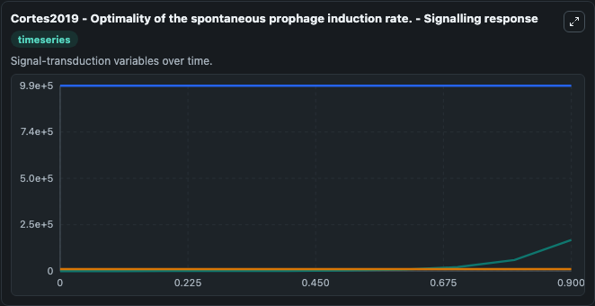
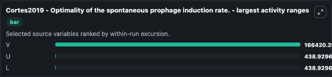
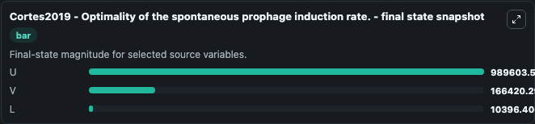
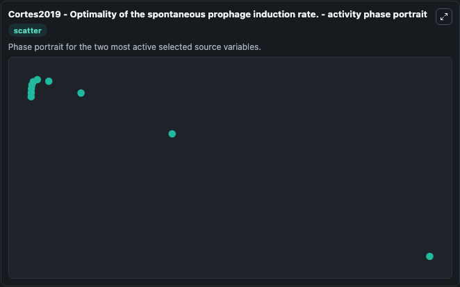

# Cortes2019 Optimality Of The Spontaneous Prophage Induction Rate

This Biosimulant lab wraps `Cortes2019 Optimality Of The Spontaneous Prophage Induction Rate` as a runnable systems biology model with a companion visualization module.
Optimality of the spontaneous prophage induction rate.Cortes MG1, Krog J2, Balázsi G3.1 Department of Applied Mathematics and Statistics, Stony Brook University, Stony Brook, NY 11794, USA.2 The Louis. It can be used to explore the configured dynamics and compare scenario outcomes across configurations.

## What You'll See

The lab asks: Which cell-cycle control states dominate the simulated progression? Source model: Cortes2019 - Optimality of the spontaneous prophage induction rate.. It runs for 1.0 time units with a communication step of 0.1. The run uses the model defaults declared by the curated SBML wrapper. The generated visualizations focus on U, L, and V, combining trajectory, endpoint-comparison, and summary-table views from one completed dark-mode run.

In this captured run, **V** moved from 0 to 1.66e+05 across 1.0 simulation windows.


### Output Visualizations



*Summary table for Cortes2019 Optimality Of The Spontaneous Prophage Induction Rate, reporting the scientific question, observed answer, dominant module, and caveat.*



*Trajectories of V, U, and L across the 1.0 simulation. In this run **V** climbed from 0 to 1.66e+05 and **U** fell from 9.9e+05 to 9.9e+05 — the largest movements among the focused observables.*



*Largest-excursion ranking of the focused observables — the absolute movement magnitude during the run. Top 3: **V** = 1.66e+05, **U** = 438.9, **L** = 438.9.*



*Trajectories of V, U, and L across the 1.0 simulation. In this run **V** climbed from 0 to 1.66e+05 and **U** fell from 9.9e+05 to 9.9e+05 — the largest movements among the focused observables.*



*Visualization card from the Cortes2019 Optimality Of The Spontaneous Prophage Induction Rate dark-mode run.*


## Model Context

- Core model: `models/core`
- Visualization model: `models/visualisation`
- Standard: `other`
- Upstream source: `biomodels_ebi:BIOMD0000000884`
- License: `CC0`

## Inputs

| Input | Maps To | Default | Notes |
|---|---|---|---|
| Initial Model State U | `systemsbiology_sbml_cortes2019_optimality_of_the_spontaneous_prophag_biomd0000000884_model.initial_model_state_u` | | Source state initial condition exposed as a model-specific control because no explicit intervention parameter is identifiable. Maps to SBML symbol `U`. |
| Initial Model State L | `systemsbiology_sbml_cortes2019_optimality_of_the_spontaneous_prophag_biomd0000000884_model.initial_model_state_l` | | Source state initial condition exposed as a model-specific control because no explicit intervention parameter is identifiable. Maps to SBML symbol `L`. |
| Initial Model State V | `systemsbiology_sbml_cortes2019_optimality_of_the_spontaneous_prophag_biomd0000000884_model.initial_model_state_v` | | Source state initial condition exposed as a model-specific control because no explicit intervention parameter is identifiable. Maps to SBML symbol `V`. |

## Outputs

| Output | Maps To | Role |
|---|---|---|
| `state` | `systemsbiology_sbml_cortes2019_optimality_of_the_spontaneous_prophag_biomd0000000884_model.state` | Available to the visualization model and downstream workflows. |
| `summary` | `systemsbiology_sbml_cortes2019_optimality_of_the_spontaneous_prophag_biomd0000000884_model.summary` | Available to the visualization model and downstream workflows. |
| `species_labels` | `systemsbiology_sbml_cortes2019_optimality_of_the_spontaneous_prophag_biomd0000000884_model.species_labels` | Available to the visualization model and downstream workflows. |
| `model_state_u` | `systemsbiology_sbml_cortes2019_optimality_of_the_spontaneous_prophag_biomd0000000884_model.model_state_u` | Available to the visualization model and downstream workflows. |
| `model_state_l` | `systemsbiology_sbml_cortes2019_optimality_of_the_spontaneous_prophag_biomd0000000884_model.model_state_l` | Available to the visualization model and downstream workflows. |
| `model_state_v` | `systemsbiology_sbml_cortes2019_optimality_of_the_spontaneous_prophag_biomd0000000884_model.model_state_v` | Available to the visualization model and downstream workflows. |

## Runtime

- Duration: `1.0`
- Communication step: `0.1`

## Running Locally

```bash
biosimulant labs serve
```
