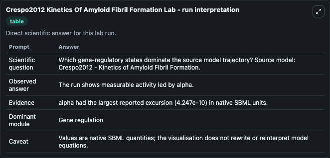
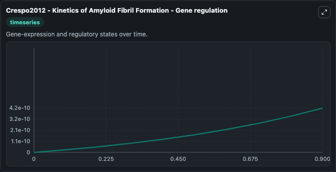
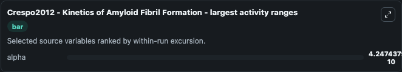
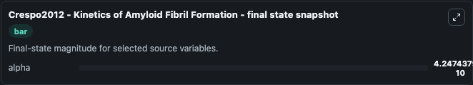

# Crespo2012 Kinetics Of Amyloid Fibril Formation

This Biosimulant lab wraps `Crespo2012 Kinetics Of Amyloid Fibril Formation` as a runnable systems biology model with a companion visualization module.
Crespo2012 - Kinetics of Amyloid FibrilFormation This model is described in the article: A generic crystallization-like model that describes the kinetics of amyloid fibril formation. It can be used to explore the configured dynamics and compare scenario outcomes across configurations.

## What You'll See

The lab asks: Which gene-regulatory states dominate the source model trajectory? Source model: Crespo2012 - Kinetics of Amyloid Fibril Formation. It runs for 1.0 time units with a communication step of 0.1. The run uses the model defaults declared by the curated SBML wrapper. The generated visualizations focus on alpha, combining trajectory, endpoint-comparison, and summary-table views from one completed dark-mode run.

In this captured run, **alpha** moved from 0 to 4.25e-10 across 1.0 simulation windows.


### Output Visualizations



*Summary table for Crespo2012 Kinetics Of Amyloid Fibril Formation, reporting the scientific question, observed answer, dominant module, and caveat.*



*Trajectories of alpha across the 1.0 simulation. In this run **alpha** climbed from 0 to 4.25e-10 — the largest movements among the focused observables.*



*Largest-excursion ranking of the focused observables — the absolute movement magnitude during the run. Top 1: **alpha** = 4.25e-10.*



*Endpoint snapshot of the focused observables — final values from the captured run. Top 1 by value: **alpha** = 4.25e-10.*


## Model Context

- Core model: `models/core`
- Visualization model: `models/visualisation`
- Standard: `other`
- Upstream source: `biomodels_ebi:BIOMD0000000531`
- License: `CC0`

## Inputs

| Input | Maps To | Default | Notes |
|---|---|---|---|
| Initial Alpha | `systemsbiology_sbml_crespo2012_kinetics_of_amyloid_fibril_formation_biomd0000000531_model.initial_alpha` | | Source state initial condition exposed as a model-specific control because no explicit intervention parameter is identifiable. Maps to SBML symbol `alpha`. |

## Outputs

| Output | Maps To | Role |
|---|---|---|
| `state` | `systemsbiology_sbml_crespo2012_kinetics_of_amyloid_fibril_formation_biomd0000000531_model.state` | Available to the visualization model and downstream workflows. |
| `summary` | `systemsbiology_sbml_crespo2012_kinetics_of_amyloid_fibril_formation_biomd0000000531_model.summary` | Available to the visualization model and downstream workflows. |
| `species_labels` | `systemsbiology_sbml_crespo2012_kinetics_of_amyloid_fibril_formation_biomd0000000531_model.species_labels` | Available to the visualization model and downstream workflows. |
| `alpha` | `systemsbiology_sbml_crespo2012_kinetics_of_amyloid_fibril_formation_biomd0000000531_model.alpha` | Available to the visualization model and downstream workflows. |

## Runtime

- Duration: `1.0`
- Communication step: `0.1`

## Running Locally

```bash
biosimulant labs serve
```
