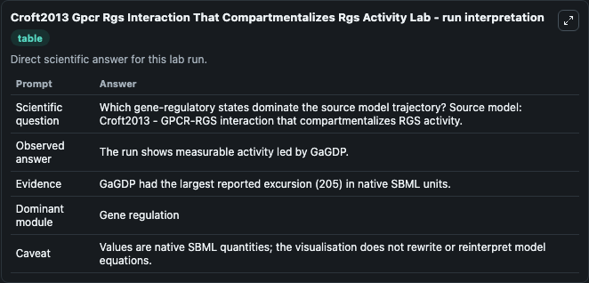
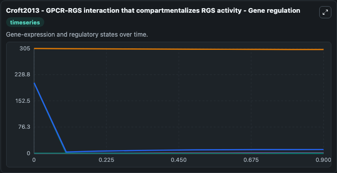
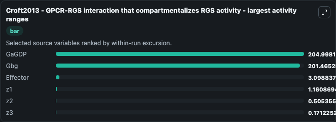
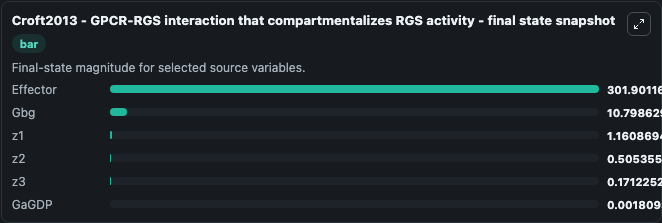
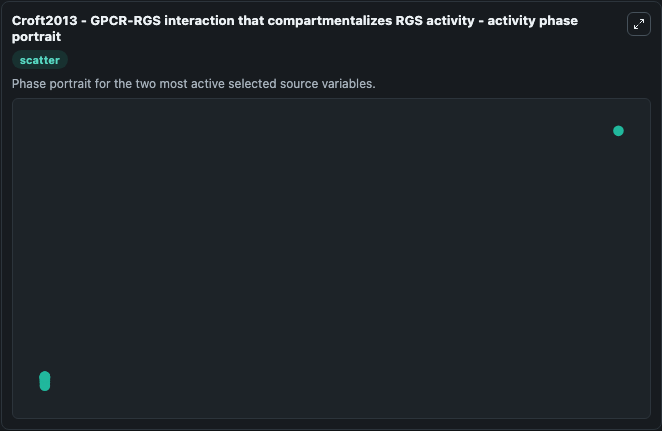

# Croft2013 Gpcr Rgs Interaction That Compartmentalizes Rgs Activity

This Biosimulant lab wraps `Croft2013 Gpcr Rgs Interaction That Compartmentalizes Rgs Activity` as a runnable systems biology model with a companion visualization module.
Croft2013 - GPCR-RGS interaction that compartmentalizes RGS activity Through modelling studies, the classic quaternary complex (ligand-GPCR-G-RGS) has been extended to include an additional layer of r. It can be used to explore the configured dynamics and compare scenario outcomes across configurations.

## What You'll See

The lab asks: Which gene-regulatory states dominate the source model trajectory? Source model: Croft2013 - GPCR-RGS interaction that compartmentalizes RGS activity. It runs for 1.0 time units with a communication step of 0.1. The run uses the model defaults declared by the curated SBML wrapper. The generated visualizations focus on z3, z2, z1, Effector, Gbg, and GaGDP, combining trajectory, endpoint-comparison, and summary-table views from one completed dark-mode run.

In this captured run, **GaGDP** moved from 205.0 to 0.00181 across 1.0 simulation windows.


### Output Visualizations



*Summary table for Croft2013 Gpcr Rgs Interaction That Compartmentalizes Rgs Activity, reporting the scientific question, observed answer, dominant module, and caveat.*



*Trajectories of GaGDP, Gbg, Effector, z1, z2, and z3 across the 1.0 simulation. In this run **z1** climbed from 0 to 1.161 and **GaGDP** fell from 205.0 to 0.00181 — the largest movements among the focused observables.*



*Largest-excursion ranking of the focused observables — the absolute movement magnitude during the run. Top 3: **GaGDP** = 205.0, **Gbg** = 201.5, **Effector** = 3.099, with 3 more observables below.*



*Trajectories of GaGDP, Gbg, Effector, z1, z2, and z3 across the 1.0 simulation. In this run **z1** climbed from 0 to 1.161 and **GaGDP** fell from 205.0 to 0.00181 — the largest movements among the focused observables.*



*Visualization card from the Croft2013 Gpcr Rgs Interaction That Compartmentalizes Rgs Activity dark-mode run.*


## Model Context

- Core model: `models/core`
- Visualization model: `models/visualisation`
- Standard: `other`
- Upstream source: `biomodels_ebi:BIOMD0000000479`
- License: `CC0`

## Inputs

| Input | Maps To | Default | Notes |
|---|---|---|---|
| Ligand Conc | `systemsbiology_sbml_croft2013_gpcr_rgs_interaction_that_compartmenta_biomd0000000479_model.ligand_conc` | | Source parameter exposed because its SBML label indicates a boundary, stimulus, dose, ligand, protocol, substrate, or environmental control. Maps to SBML symbol `Ligand_conc`. |

## Outputs

| Output | Maps To | Role |
|---|---|---|
| `state` | `systemsbiology_sbml_croft2013_gpcr_rgs_interaction_that_compartmenta_biomd0000000479_model.state` | Available to the visualization model and downstream workflows. |
| `summary` | `systemsbiology_sbml_croft2013_gpcr_rgs_interaction_that_compartmenta_biomd0000000479_model.summary` | Available to the visualization model and downstream workflows. |
| `species_labels` | `systemsbiology_sbml_croft2013_gpcr_rgs_interaction_that_compartmenta_biomd0000000479_model.species_labels` | Available to the visualization model and downstream workflows. |
| `model_state_z3` | `systemsbiology_sbml_croft2013_gpcr_rgs_interaction_that_compartmenta_biomd0000000479_model.model_state_z3` | Available to the visualization model and downstream workflows. |
| `model_state_z2` | `systemsbiology_sbml_croft2013_gpcr_rgs_interaction_that_compartmenta_biomd0000000479_model.model_state_z2` | Available to the visualization model and downstream workflows. |
| `model_state_z1` | `systemsbiology_sbml_croft2013_gpcr_rgs_interaction_that_compartmenta_biomd0000000479_model.model_state_z1` | Available to the visualization model and downstream workflows. |
| `effector` | `systemsbiology_sbml_croft2013_gpcr_rgs_interaction_that_compartmenta_biomd0000000479_model.effector` | Available to the visualization model and downstream workflows. |
| `gbg` | `systemsbiology_sbml_croft2013_gpcr_rgs_interaction_that_compartmenta_biomd0000000479_model.gbg` | Available to the visualization model and downstream workflows. |
| `ga_gdp` | `systemsbiology_sbml_croft2013_gpcr_rgs_interaction_that_compartmenta_biomd0000000479_model.ga_gdp` | Available to the visualization model and downstream workflows. |

## Runtime

- Duration: `1.0`
- Communication step: `0.1`

## Running Locally

```bash
biosimulant labs serve
```
