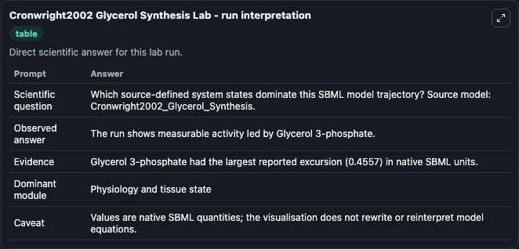
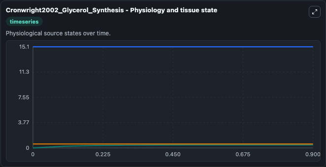
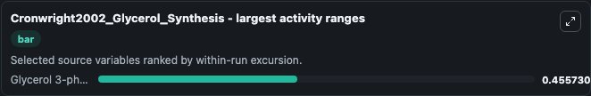
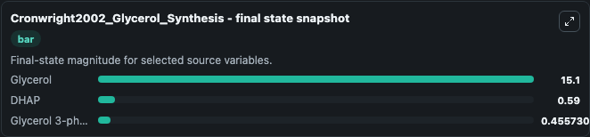

# Cronwright2002 Glycerol Synthesis

This Biosimulant lab wraps `Cronwright2002 Glycerol Synthesis` as a runnable systems biology model with a companion visualization module.
. It can be used to explore the configured dynamics and compare scenario outcomes across configurations.

## What You'll See

The lab asks: Which source-defined system states dominate this SBML model trajectory? Source model: Cronwright2002_Glycerol_Synthesis. It runs for 1.0 time units with a communication step of 0.1. The run uses the model defaults declared by the curated SBML wrapper. The generated visualizations focus on Glycerol, Glycerol 3-phosphate, and DHAP, combining trajectory, endpoint-comparison, and summary-table views from one completed dark-mode run.

In this captured run, **Glycerol 3-phosphate** moved from 0 to 0.4557 across 1.0 simulation windows.


### Output Visualizations



*Summary table for Cronwright2002 Glycerol Synthesis, reporting the scientific question, observed answer, dominant module, and caveat.*



*Trajectories of Glycerol 3-phosphate, Glycerol, and DHAP across the 1.0 simulation. In this run **Glycerol 3-phosphate** climbed from 0 to 0.4557 — the largest movements among the focused observables.*



*Largest-excursion ranking of the focused observables — the absolute movement magnitude during the run. Top 1: **Glycerol 3-phosphate** = 0.4557.*



*Endpoint snapshot of the focused observables — final values from the captured run. Top 3 by value: **Glycerol** = 15.100, **DHAP** = 0.5900, **Glycerol 3-phosphate** = 0.4557.*


## Model Context

- Core model: `models/core`
- Visualization model: `models/visualisation`
- Standard: `other`
- Upstream source: `biomodels_ebi:BIOMD0000000076`
- License: `CC0`

## Inputs

| Input | Maps To | Default | Notes |
|---|---|---|---|
| Initial Glycerol | `systemsbiology_sbml_cronwright2002_glycerol_synthesis_biomd0000000076_model.initial_glycerol` | | Source state initial condition exposed as a model-specific control because no explicit intervention parameter is identifiable. Maps to SBML symbol `Gly`. |
| Initial Glycerol 3 Phosphate | `systemsbiology_sbml_cronwright2002_glycerol_synthesis_biomd0000000076_model.initial_glycerol_3_phosphate` | | Source state initial condition exposed as a model-specific control because no explicit intervention parameter is identifiable. Maps to SBML symbol `G3P`. |
| Initial Dhap | `systemsbiology_sbml_cronwright2002_glycerol_synthesis_biomd0000000076_model.initial_dhap` | | Source state initial condition exposed as a model-specific control because no explicit intervention parameter is identifiable. Maps to SBML symbol `DHAP`. |

## Outputs

| Output | Maps To | Role |
|---|---|---|
| `state` | `systemsbiology_sbml_cronwright2002_glycerol_synthesis_biomd0000000076_model.state` | Available to the visualization model and downstream workflows. |
| `summary` | `systemsbiology_sbml_cronwright2002_glycerol_synthesis_biomd0000000076_model.summary` | Available to the visualization model and downstream workflows. |
| `species_labels` | `systemsbiology_sbml_cronwright2002_glycerol_synthesis_biomd0000000076_model.species_labels` | Available to the visualization model and downstream workflows. |
| `glycerol` | `systemsbiology_sbml_cronwright2002_glycerol_synthesis_biomd0000000076_model.glycerol` | Available to the visualization model and downstream workflows. |
| `glycerol_3_phosphate` | `systemsbiology_sbml_cronwright2002_glycerol_synthesis_biomd0000000076_model.glycerol_3_phosphate` | Available to the visualization model and downstream workflows. |
| `dhap` | `systemsbiology_sbml_cronwright2002_glycerol_synthesis_biomd0000000076_model.dhap` | Available to the visualization model and downstream workflows. |

## Runtime

- Duration: `1.0`
- Communication step: `0.1`

## Running Locally

```bash
biosimulant labs serve
```
