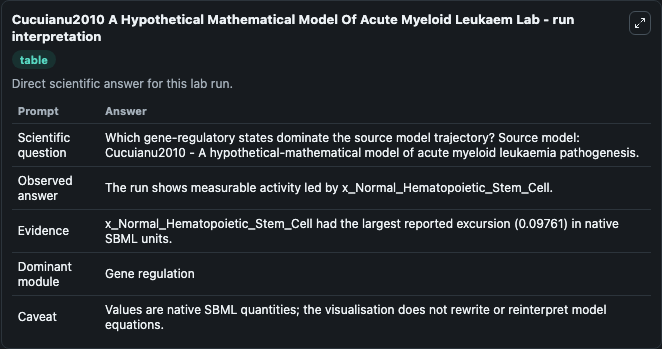
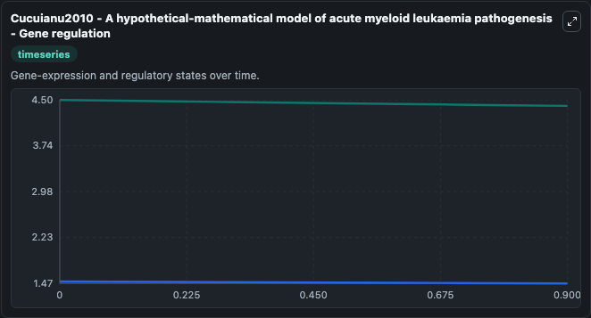
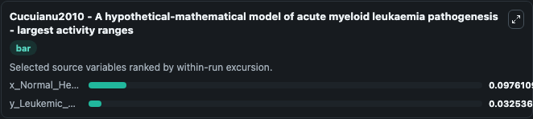
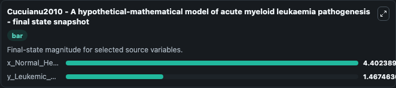
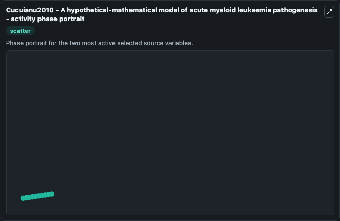

# Cucuianu2010 A Hypothetical Mathematical Model Of Acute Myeloid Leukaem

This Biosimulant lab wraps `Cucuianu2010 A Hypothetical Mathematical Model Of Acute Myeloid Leukaem` as a runnable systems biology model with a companion visualization module.
This is a simple mathematical model describing the growth and removal of normal and leukemic haematopoietic stem cell populations and the role of these cellular processes in generating monoclonal leuk. It can be used to explore the configured dynamics and compare scenario outcomes across configurations.

## What You'll See

The lab asks: Which gene-regulatory states dominate the source model trajectory? Source model: Cucuianu2010 - A hypothetical-mathematical model of acute myeloid leukaemia pathogenesis. It runs for 1.0 time units with a communication step of 0.1. The run uses the model defaults declared by the curated SBML wrapper. The generated visualizations focus on y_Leukemic_Cell, and x_Normal_Hematopoietic_Stem_Cell, combining trajectory, endpoint-comparison, and summary-table views from one completed dark-mode run.

In this captured run, **x_Normal_Hematopoietic_Stem_Cell** moved from 4.500 to 4.402 across 1.0 simulation windows.


### Output Visualizations



*Summary table for Cucuianu2010 A Hypothetical Mathematical Model Of Acute Myeloid Leukaem, reporting the scientific question, observed answer, dominant module, and caveat.*



*Trajectories of x_Normal_Hematopoietic_Stem_Cell, and y_Leukemic_Cell across the 1.0 simulation. In this run **x_Normal_Hematopoietic_Stem_Cell** fell from 4.500 to 4.402 — the largest movements among the focused observables.*



*Largest-excursion ranking of the focused observables — the absolute movement magnitude during the run. Top 2: **x_Normal_Hematopoietic_Stem_Cell** = 0.0976, **y_Leukemic_Cell** = 0.0325.*



*Endpoint snapshot of the focused observables — final values from the captured run. Top 2 by value: **x_Normal_Hematopoietic_Stem_Cell** = 4.402, **y_Leukemic_Cell** = 1.467.*



*Visualization card from the Cucuianu2010 A Hypothetical Mathematical Model Of Acute Myeloid Leukaem dark-mode run.*


## Model Context

- Core model: `models/core`
- Visualization model: `models/visualisation`
- Standard: `other`
- Upstream source: `biomodels_ebi:BIOMD0000000799`
- License: `CC0`

## Inputs

| Input | Maps To | Default | Notes |
|---|---|---|---|
| Initial Y Leukemic Cell | `systemsbiology_sbml_cucuianu2010_a_hypothetical_mathematical_model_o_biomd0000000799_model.initial_y_leukemic_cell` | | Source state initial condition exposed as a model-specific control because no explicit intervention parameter is identifiable. Maps to SBML symbol `y_Leukemic_Cell`. |
| Initial X Normal Hematopoietic Stem Cell | `systemsbiology_sbml_cucuianu2010_a_hypothetical_mathematical_model_o_biomd0000000799_model.initial_x_normal_hematopoietic_stem_cell` | | Source state initial condition exposed as a model-specific control because no explicit intervention parameter is identifiable. Maps to SBML symbol `x_Normal_Hematopoietic_Stem_Cell`. |

## Outputs

| Output | Maps To | Role |
|---|---|---|
| `state` | `systemsbiology_sbml_cucuianu2010_a_hypothetical_mathematical_model_o_biomd0000000799_model.state` | Available to the visualization model and downstream workflows. |
| `summary` | `systemsbiology_sbml_cucuianu2010_a_hypothetical_mathematical_model_o_biomd0000000799_model.summary` | Available to the visualization model and downstream workflows. |
| `species_labels` | `systemsbiology_sbml_cucuianu2010_a_hypothetical_mathematical_model_o_biomd0000000799_model.species_labels` | Available to the visualization model and downstream workflows. |
| `y_leukemic_cell` | `systemsbiology_sbml_cucuianu2010_a_hypothetical_mathematical_model_o_biomd0000000799_model.y_leukemic_cell` | Available to the visualization model and downstream workflows. |
| `x_normal_hematopoietic_stem_cell` | `systemsbiology_sbml_cucuianu2010_a_hypothetical_mathematical_model_o_biomd0000000799_model.x_normal_hematopoietic_stem_cell` | Available to the visualization model and downstream workflows. |

## Runtime

- Duration: `1.0`
- Communication step: `0.1`

## Running Locally

```bash
biosimulant labs serve
```
