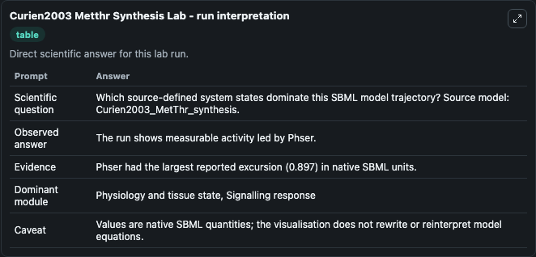
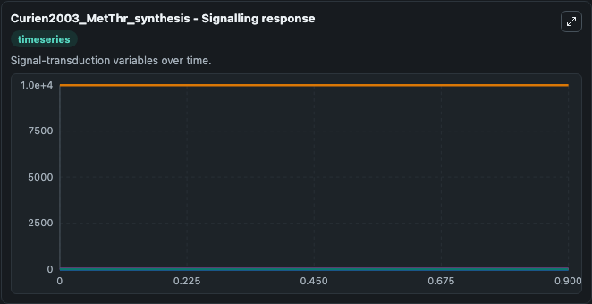
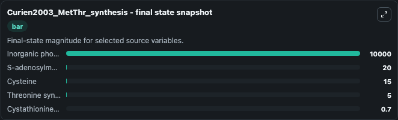

# Curien2003 Metthr Synthesis

This Biosimulant lab wraps `Curien2003 Metthr Synthesis` as a runnable systems biology model with a companion visualization module.
This a model from the article: A kinetic model of the branch-point between the methionine and threonine biosynthesis pathways in Arabidopsis thaliana. It can be used to explore the configured dynamics and compare scenario outcomes across configurations.

## What You'll See

The lab asks: Which source-defined system states dominate this SBML model trajectory? Source model: Curien2003_MetThr_synthesis. It runs for 1.0 time units with a communication step of 0.1. The run uses the model defaults declared by the curated SBML wrapper. The generated visualizations focus on Cystathionine gamma-synthase, Cystathionine, Inorganic phosphate, S-adenosylmethionine, Cysteine, and Threonine synthase, combining trajectory, endpoint-comparison, and summary-table views from one completed dark-mode run.

In this captured run, **Cystathionine gamma-synthase** moved from 0.7000 to 0.7000 across 1.0 simulation windows.


### Output Visualizations



*Summary table for Curien2003 Metthr Synthesis, reporting the scientific question, observed answer, dominant module, and caveat.*



*Trajectories of Cystathionine gamma-synthase, Cystathionine, Inorganic phosphate, S-adenosylmethionine, Cysteine, and Threonine synthase across the 1.0 simulation. In this run Cystathionine gamma-synthase, Cystathionine, Inorganic phosphate, S-adenosylmethionine stayed near their initial values — no observable moved appreciably.*



*Endpoint snapshot of the focused observables — final values from the captured run. Top 3 by value: **Inorganic phosphate** = 1e+04, **S-adenosylmethionine** = 20.000, **Cysteine** = 15.000, with 2 more observables below.*


## Model Context

- Core model: `models/core`
- Visualization model: `models/visualisation`
- Standard: `other`
- Upstream source: `biomodels_ebi:BIOMD0000000068`
- License: `CC0`

## Inputs

| Input | Maps To | Default | Notes |
|---|---|---|---|
| Initial Cystathionine Gamma Synthase | `systemsbiology_sbml_curien2003_metthr_synthesis_biomd0000000068_model.initial_cystathionine_gamma_synthase` | | Source state initial condition exposed as a model-specific control because no explicit intervention parameter is identifiable. Maps to SBML symbol `CGS`. |
| Initial Cystathionine | `systemsbiology_sbml_curien2003_metthr_synthesis_biomd0000000068_model.initial_cystathionine` | | Source state initial condition exposed as a model-specific control because no explicit intervention parameter is identifiable. Maps to SBML symbol `Cystathionine`. |
| Initial Inorganic Phosphate | `systemsbiology_sbml_curien2003_metthr_synthesis_biomd0000000068_model.initial_inorganic_phosphate` | | Source state initial condition exposed as a model-specific control because no explicit intervention parameter is identifiable. Maps to SBML symbol `Phi`. |
| Initial S Adenosylmethionine | `systemsbiology_sbml_curien2003_metthr_synthesis_biomd0000000068_model.initial_s_adenosylmethionine` | | Source state initial condition exposed as a model-specific control because no explicit intervention parameter is identifiable. Maps to SBML symbol `AdoMet`. |
| Initial Cysteine | `systemsbiology_sbml_curien2003_metthr_synthesis_biomd0000000068_model.initial_cysteine` | | Source state initial condition exposed as a model-specific control because no explicit intervention parameter is identifiable. Maps to SBML symbol `Cys`. |
| Initial Threonine Synthase | `systemsbiology_sbml_curien2003_metthr_synthesis_biomd0000000068_model.initial_threonine_synthase` | | Source state initial condition exposed as a model-specific control because no explicit intervention parameter is identifiable. Maps to SBML symbol `TS`. |

## Outputs

| Output | Maps To | Role |
|---|---|---|
| `state` | `systemsbiology_sbml_curien2003_metthr_synthesis_biomd0000000068_model.state` | Available to the visualization model and downstream workflows. |
| `summary` | `systemsbiology_sbml_curien2003_metthr_synthesis_biomd0000000068_model.summary` | Available to the visualization model and downstream workflows. |
| `species_labels` | `systemsbiology_sbml_curien2003_metthr_synthesis_biomd0000000068_model.species_labels` | Available to the visualization model and downstream workflows. |
| `cystathionine_gamma_synthase` | `systemsbiology_sbml_curien2003_metthr_synthesis_biomd0000000068_model.cystathionine_gamma_synthase` | Available to the visualization model and downstream workflows. |
| `cystathionine` | `systemsbiology_sbml_curien2003_metthr_synthesis_biomd0000000068_model.cystathionine` | Available to the visualization model and downstream workflows. |
| `inorganic_phosphate` | `systemsbiology_sbml_curien2003_metthr_synthesis_biomd0000000068_model.inorganic_phosphate` | Available to the visualization model and downstream workflows. |
| `s_adenosylmethionine` | `systemsbiology_sbml_curien2003_metthr_synthesis_biomd0000000068_model.s_adenosylmethionine` | Available to the visualization model and downstream workflows. |
| `cysteine` | `systemsbiology_sbml_curien2003_metthr_synthesis_biomd0000000068_model.cysteine` | Available to the visualization model and downstream workflows. |
| `threonine_synthase` | `systemsbiology_sbml_curien2003_metthr_synthesis_biomd0000000068_model.threonine_synthase` | Available to the visualization model and downstream workflows. |

## Runtime

- Duration: `1.0`
- Communication step: `0.1`

## Running Locally

```bash
biosimulant labs serve
```
