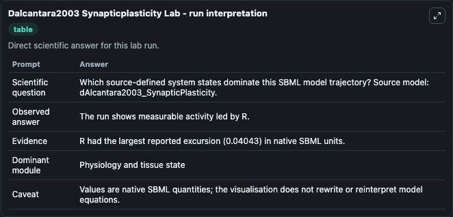
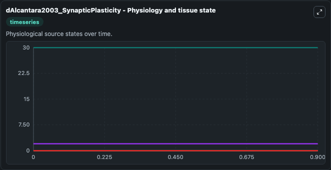
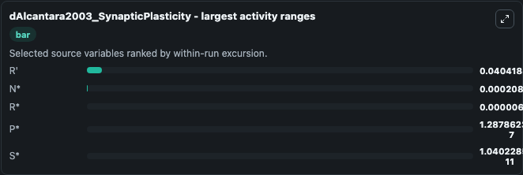
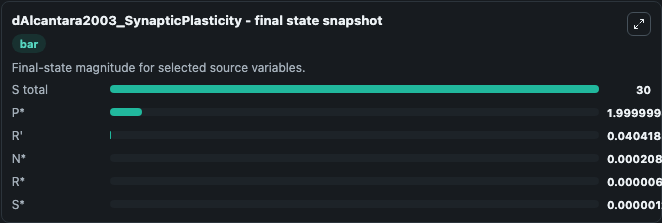
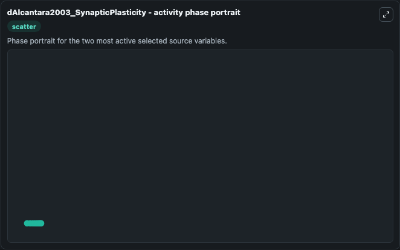

# Dalcantara2003 Synapticplasticity

This Biosimulant lab wraps `Dalcantara2003 Synapticplasticity` as a runnable systems biology model with a companion visualization module.
This model originates from BioModels Database: A Database of Annotated Published Models (http://www.ebi.ac.uk/biomodels/). It can be used to explore the configured dynamics and compare scenario outcomes across configurations.

## What You'll See

The lab asks: Which source-defined system states dominate this SBML model trajectory? Source model: dAlcantara2003_SynapticPlasticity. It runs for 1.0 time units with a communication step of 0.1. The run uses the model defaults declared by the curated SBML wrapper. The generated visualizations focus on S total, P*, S*, R*, R', and N*, combining trajectory, endpoint-comparison, and summary-table views from one completed dark-mode run.

In this captured run, **R'** moved from 0 to 0.0404 across 1.0 simulation windows.


### Output Visualizations



*Summary table for Dalcantara2003 Synapticplasticity, reporting the scientific question, observed answer, dominant module, and caveat.*



*Trajectories of R', N*, R*, P*, S*, and S total across the 1.0 simulation. In this run **R'** climbed from 0 to 0.0404 and **P*** fell from 2.000 to 2.000 — the largest movements among the focused observables.*



*Largest-excursion ranking of the focused observables — the absolute movement magnitude during the run. Top 3: **R'** = 0.0404, **N*** = 0.000208, **R*** = 6.84e-06, with 2 more observables below.*



*Endpoint snapshot of the focused observables — final values from the captured run. Top 3 by value: **S total** = 30.000, **P*** = 2.000, **R'** = 0.0404, with 3 more observables below.*



*Visualization card from the Dalcantara2003 Synapticplasticity dark-mode run.*


## Model Context

- Core model: `models/core`
- Visualization model: `models/visualisation`
- Standard: `other`
- Upstream source: `biomodels_ebi:MODEL8938094216`
- License: `CC0`

## Inputs

| Input | Maps To | Default | Notes |
|---|---|---|---|
| Initial S Total | `systemsbiology_sbml_dalcantara2003_synapticplasticity_model8938094216_model.initial_s_total` | | Source state initial condition exposed as a model-specific control because no explicit intervention parameter is identifiable. Maps to SBML symbol `Stotal`. |
| Initial Model State P | `systemsbiology_sbml_dalcantara2003_synapticplasticity_model8938094216_model.initial_model_state_p` | | Source state initial condition exposed as a model-specific control because no explicit intervention parameter is identifiable. Maps to SBML symbol `Pstar`. |
| Initial Model State S | `systemsbiology_sbml_dalcantara2003_synapticplasticity_model8938094216_model.initial_model_state_s` | | Source state initial condition exposed as a model-specific control because no explicit intervention parameter is identifiable. Maps to SBML symbol `Sstar`. |
| Initial Model State R | `systemsbiology_sbml_dalcantara2003_synapticplasticity_model8938094216_model.initial_model_state_r` | | Source state initial condition exposed as a model-specific control because no explicit intervention parameter is identifiable. Maps to SBML symbol `Rstar`. |
| Initial Model State R 2 | `systemsbiology_sbml_dalcantara2003_synapticplasticity_model8938094216_model.initial_model_state_r_2` | | Source state initial condition exposed as a model-specific control because no explicit intervention parameter is identifiable. Maps to SBML symbol `Rprime`. |
| Initial Model State N | `systemsbiology_sbml_dalcantara2003_synapticplasticity_model8938094216_model.initial_model_state_n` | | Source state initial condition exposed as a model-specific control because no explicit intervention parameter is identifiable. Maps to SBML symbol `Nstar`. |

## Outputs

| Output | Maps To | Role |
|---|---|---|
| `state` | `systemsbiology_sbml_dalcantara2003_synapticplasticity_model8938094216_model.state` | Available to the visualization model and downstream workflows. |
| `summary` | `systemsbiology_sbml_dalcantara2003_synapticplasticity_model8938094216_model.summary` | Available to the visualization model and downstream workflows. |
| `species_labels` | `systemsbiology_sbml_dalcantara2003_synapticplasticity_model8938094216_model.species_labels` | Available to the visualization model and downstream workflows. |
| `s_total` | `systemsbiology_sbml_dalcantara2003_synapticplasticity_model8938094216_model.s_total` | Available to the visualization model and downstream workflows. |
| `model_state_p` | `systemsbiology_sbml_dalcantara2003_synapticplasticity_model8938094216_model.model_state_p` | Available to the visualization model and downstream workflows. |
| `model_state_s` | `systemsbiology_sbml_dalcantara2003_synapticplasticity_model8938094216_model.model_state_s` | Available to the visualization model and downstream workflows. |
| `model_state_r` | `systemsbiology_sbml_dalcantara2003_synapticplasticity_model8938094216_model.model_state_r` | Available to the visualization model and downstream workflows. |
| `model_state_r_2` | `systemsbiology_sbml_dalcantara2003_synapticplasticity_model8938094216_model.model_state_r_2` | Available to the visualization model and downstream workflows. |
| `model_state_n` | `systemsbiology_sbml_dalcantara2003_synapticplasticity_model8938094216_model.model_state_n` | Available to the visualization model and downstream workflows. |

## Runtime

- Duration: `1.0`
- Communication step: `0.1`

## Running Locally

```bash
biosimulant labs serve
```
