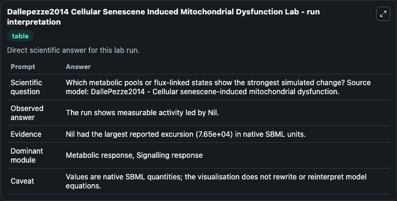
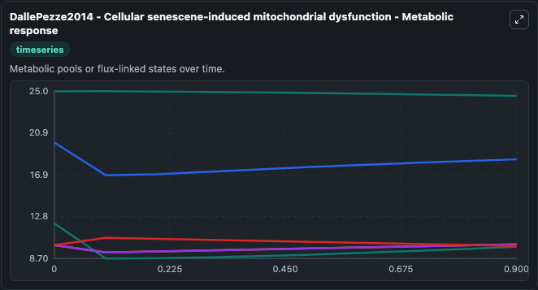
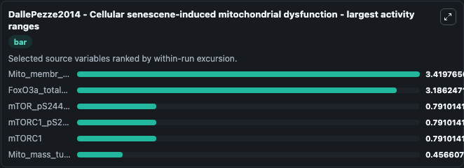
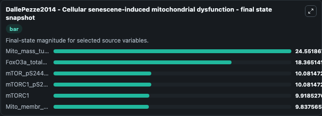
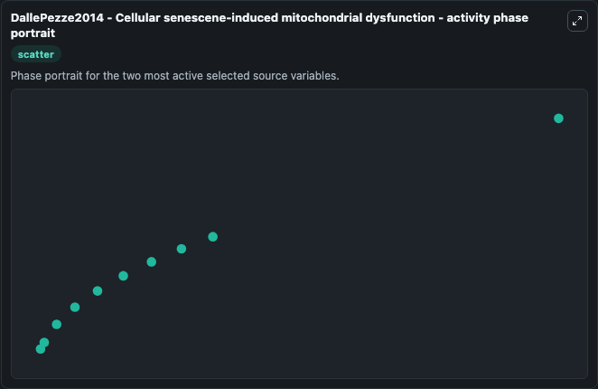

# Dallepezze2014 Cellular Senescene Induced Mitochondrial Dysfunction

This Biosimulant lab wraps `Dallepezze2014 Cellular Senescene Induced Mitochondrial Dysfunction` as a runnable systems biology model with a companion visualization module.
DallePazze2014 - Cellular senescene-inducedmitochondrial dysfunction This model is described in the article: Dynamic modelling of pathways to cellular senescence reveals strategies for targeted interv. It can be used to explore the configured dynamics and compare scenario outcomes across configurations.

## What You'll See

The lab asks: Which metabolic pools or flux-linked states show the strongest simulated change? Source model: DallePezze2014 - Cellular senescene-induced mitochondrial dysfunction. It runs for 1.0 time units with a communication step of 0.1. The run uses the model defaults declared by the curated SBML wrapper. The generated visualizations focus on mTOR_pS2448_obs, mTORC1_pS2448, mTORC1, Mito_mass_turnover, FoxO3a_total_obs, and Mito_membr_pot_new, combining trajectory, endpoint-comparison, and summary-table views from one completed dark-mode run.

In this captured run, **Mito_membr_pot_new** moved from 12.120 to 9.838 across 1.0 simulation windows.


### Output Visualizations



*Summary table for Dallepezze2014 Cellular Senescene Induced Mitochondrial Dysfunction, reporting the scientific question, observed answer, dominant module, and caveat.*



*Trajectories of Mito_membr_pot_new, FoxO3a_total_obs, mTOR_pS2448_obs, mTORC1_pS2448, mTORC1, and Mito_mass_turnover across the 1.0 simulation. In this run **mTOR_pS2448_obs** climbed from 10.000 to 10.081 and **Mito_membr_pot_new** fell from 12.120 to 9.838 — the largest movements among the focused observables.*



*Largest-excursion ranking of the focused observables — the absolute movement magnitude during the run. Top 3: **Mito_membr_pot_new** = 3.420, **FoxO3a_total_obs** = 3.186, **mTOR_pS2448_obs** = 0.7910, with 3 more observables below.*



*Trajectories of Mito_membr_pot_new, FoxO3a_total_obs, mTOR_pS2448_obs, mTORC1_pS2448, mTORC1, and Mito_mass_turnover across the 1.0 simulation. In this run **mTOR_pS2448_obs** climbed from 10.000 to 10.081 and **Mito_membr_pot_new** fell from 12.120 to 9.838 — the largest movements among the focused observables.*



*Visualization card from the Dallepezze2014 Cellular Senescene Induced Mitochondrial Dysfunction dark-mode run.*


## Model Context

- Core model: `models/core`
- Visualization model: `models/visualisation`
- Standard: `other`
- Upstream source: `biomodels_ebi:BIOMD0000000582`
- License: `CC0`

## Inputs

| Input | Maps To | Default | Notes |
|---|---|---|---|
| Akt S473 Phos By Insulin | `systemsbiology_sbml_dallepezze2014_cellular_senescene_induced_mitoch_biomd0000000582_model.akt_s473_phos_by_insulin` | | Source parameter exposed because its SBML label indicates a boundary, stimulus, dose, ligand, protocol, substrate, or environmental control. Maps to SBML symbol `Akt_S473_phos_by_insulin`. |

## Outputs

| Output | Maps To | Role |
|---|---|---|
| `state` | `systemsbiology_sbml_dallepezze2014_cellular_senescene_induced_mitoch_biomd0000000582_model.state` | Available to the visualization model and downstream workflows. |
| `summary` | `systemsbiology_sbml_dallepezze2014_cellular_senescene_induced_mitoch_biomd0000000582_model.summary` | Available to the visualization model and downstream workflows. |
| `species_labels` | `systemsbiology_sbml_dallepezze2014_cellular_senescene_induced_mitoch_biomd0000000582_model.species_labels` | Available to the visualization model and downstream workflows. |
| `m_tor_p_s2448_obs` | `systemsbiology_sbml_dallepezze2014_cellular_senescene_induced_mitoch_biomd0000000582_model.m_tor_p_s2448_obs` | Available to the visualization model and downstream workflows. |
| `m_torc1_p_s2448` | `systemsbiology_sbml_dallepezze2014_cellular_senescene_induced_mitoch_biomd0000000582_model.m_torc1_p_s2448` | Available to the visualization model and downstream workflows. |
| `m_torc1` | `systemsbiology_sbml_dallepezze2014_cellular_senescene_induced_mitoch_biomd0000000582_model.m_torc1` | Available to the visualization model and downstream workflows. |
| `mito_mass_turnover` | `systemsbiology_sbml_dallepezze2014_cellular_senescene_induced_mitoch_biomd0000000582_model.mito_mass_turnover` | Available to the visualization model and downstream workflows. |
| `fox_o3a_total_obs` | `systemsbiology_sbml_dallepezze2014_cellular_senescene_induced_mitoch_biomd0000000582_model.fox_o3a_total_obs` | Available to the visualization model and downstream workflows. |
| `mito_membr_pot_new` | `systemsbiology_sbml_dallepezze2014_cellular_senescene_induced_mitoch_biomd0000000582_model.mito_membr_pot_new` | Available to the visualization model and downstream workflows. |

## Runtime

- Duration: `1.0`
- Communication step: `0.1`

## Running Locally

```bash
biosimulant labs serve
```
