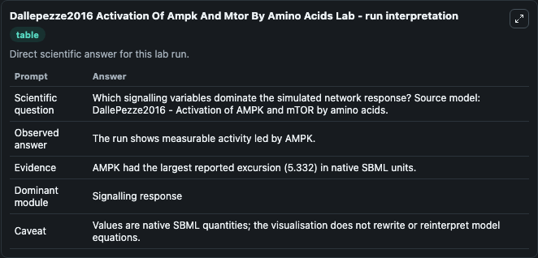
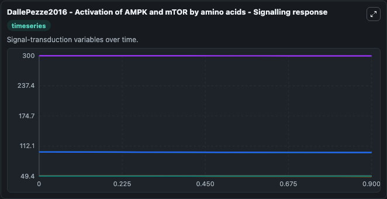
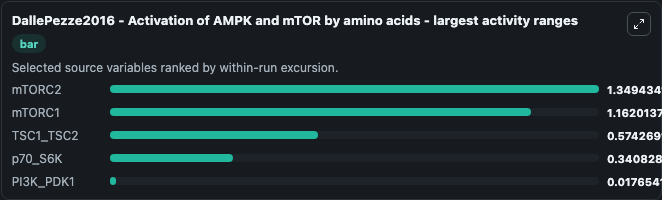
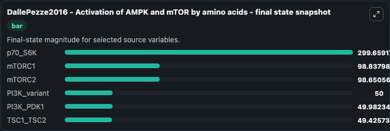
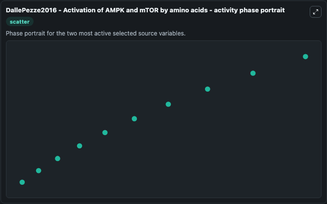

# Dallepezze2016 Activation Of Ampk And Mtor By Amino Acids

This Biosimulant lab wraps `Dallepezze2016 Activation Of Ampk And Mtor By Amino Acids` as a runnable systems biology model with a companion visualization module.
DallePezze2016 - Activation of AMPK and mTORby amino acids (Model 3) This model is as described in the Supplementary Software 3 of the reference publication: SBML model similar to Model S2, but includ. It can be used to explore the configured dynamics and compare scenario outcomes across configurations.

## What You'll See

The lab asks: Which signalling variables dominate the simulated network response? Source model: DallePezze2016 - Activation of AMPK and mTOR by amino acids. It runs for 1.0 time units with a communication step of 0.1. The run uses the model defaults declared by the curated SBML wrapper. The generated visualizations focus on p70_S6K, mTORC2, mTORC1, TSC1_TSC2, PI3K_variant, and PI3K_PDK1, combining trajectory, endpoint-comparison, and summary-table views from one completed dark-mode run.

In this captured run, **mTORC2** moved from 100.0 to 98.651 across 1.0 simulation windows.


### Output Visualizations



*Summary table for Dallepezze2016 Activation Of Ampk And Mtor By Amino Acids, reporting the scientific question, observed answer, dominant module, and caveat.*



*Trajectories of mTORC2, mTORC1, TSC1_TSC2, p70_S6K, PI3K_PDK1, and PI3K_variant across the 1.0 simulation. In this run **mTORC2** fell from 100.0 to 98.651 — the largest movements among the focused observables.*



*Largest-excursion ranking of the focused observables — the absolute movement magnitude during the run. Top 3: **mTORC2** = 1.349, **mTORC1** = 1.162, **TSC1_TSC2** = 0.5743, with 2 more observables below.*



*Endpoint snapshot of the focused observables — final values from the captured run. Top 3 by value: **p70_S6K** = 299.7, **mTORC1** = 98.838, **mTORC2** = 98.651, with 3 more observables below.*



*Visualization card from the Dallepezze2016 Activation Of Ampk And Mtor By Amino Acids dark-mode run.*


## Model Context

- Core model: `models/core`
- Visualization model: `models/visualisation`
- Standard: `other`
- Upstream source: `biomodels_ebi:BIOMD0000000640`
- License: `CC0`

## Inputs

| Input | Maps To | Default | Notes |
|---|---|---|---|
| Ir Beta Phos By Insulin | `systemsbiology_sbml_dallepezze2016_activation_of_ampk_and_mtor_by_am_biomd0000000640_model.ir_beta_phos_by_insulin` | | Source parameter exposed because its SBML label indicates a boundary, stimulus, dose, ligand, protocol, substrate, or environmental control. Maps to SBML symbol `IR_beta_phos_by_Insulin`. |

## Outputs

| Output | Maps To | Role |
|---|---|---|
| `state` | `systemsbiology_sbml_dallepezze2016_activation_of_ampk_and_mtor_by_am_biomd0000000640_model.state` | Available to the visualization model and downstream workflows. |
| `summary` | `systemsbiology_sbml_dallepezze2016_activation_of_ampk_and_mtor_by_am_biomd0000000640_model.summary` | Available to the visualization model and downstream workflows. |
| `species_labels` | `systemsbiology_sbml_dallepezze2016_activation_of_ampk_and_mtor_by_am_biomd0000000640_model.species_labels` | Available to the visualization model and downstream workflows. |
| `p70_s6_k` | `systemsbiology_sbml_dallepezze2016_activation_of_ampk_and_mtor_by_am_biomd0000000640_model.p70_s6_k` | Available to the visualization model and downstream workflows. |
| `m_torc2` | `systemsbiology_sbml_dallepezze2016_activation_of_ampk_and_mtor_by_am_biomd0000000640_model.m_torc2` | Available to the visualization model and downstream workflows. |
| `m_torc1` | `systemsbiology_sbml_dallepezze2016_activation_of_ampk_and_mtor_by_am_biomd0000000640_model.m_torc1` | Available to the visualization model and downstream workflows. |
| `tsc1_tsc2` | `systemsbiology_sbml_dallepezze2016_activation_of_ampk_and_mtor_by_am_biomd0000000640_model.tsc1_tsc2` | Available to the visualization model and downstream workflows. |
| `pi3_k_variant` | `systemsbiology_sbml_dallepezze2016_activation_of_ampk_and_mtor_by_am_biomd0000000640_model.pi3_k_variant` | Available to the visualization model and downstream workflows. |
| `pi3_k_pdk1` | `systemsbiology_sbml_dallepezze2016_activation_of_ampk_and_mtor_by_am_biomd0000000640_model.pi3_k_pdk1` | Available to the visualization model and downstream workflows. |

## Runtime

- Duration: `1.0`
- Communication step: `0.1`

## Running Locally

```bash
biosimulant labs serve
```
