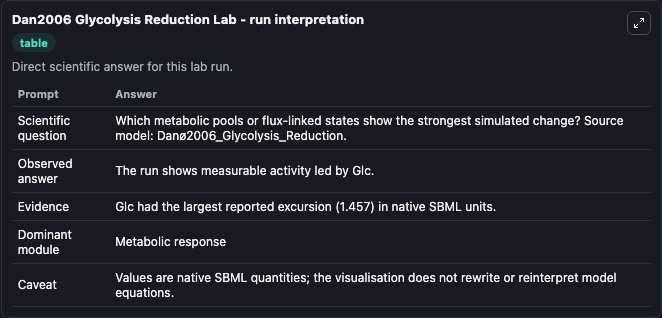
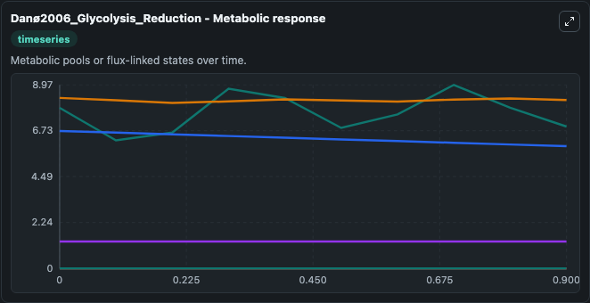
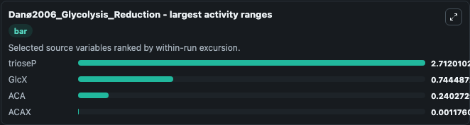
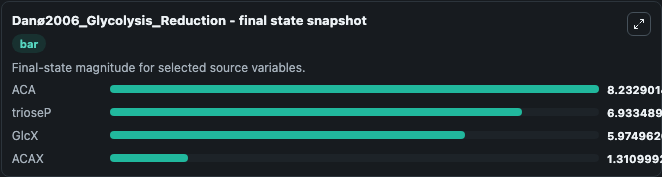
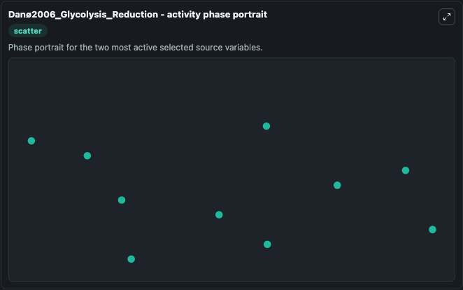

# Dan2006 Glycolysis Reduction

This Biosimulant lab wraps `Dan2006 Glycolysis Reduction` as a runnable systems biology model with a companion visualization module.
This model originates from BioModels Database: A Database of Annotated Published Models. It can be used to explore the configured dynamics and compare scenario outcomes across configurations.

## What You'll See

The lab asks: Which metabolic pools or flux-linked states show the strongest simulated change? Source model: Danø2006_Glycolysis_Reduction. It runs for 1.0 time units with a communication step of 0.1. The run uses the model defaults declared by the curated SBML wrapper. The generated visualizations focus on ACA, ACAX, trioseP, source, sink, and GlcX, combining trajectory, endpoint-comparison, and summary-table views from one completed dark-mode run.

In this captured run, **trioseP** moved from 7.847 to 6.933 across 1.0 simulation windows.


### Output Visualizations



*Summary table for Dan2006 Glycolysis Reduction, reporting the scientific question, observed answer, dominant module, and caveat.*



*Trajectories of trioseP, GlcX, ACA, ACAX, source, and sink across the 1.0 simulation. In this run **trioseP** fell from 7.847 to 6.933 — the largest movements among the focused observables.*



*Largest-excursion ranking of the focused observables — the absolute movement magnitude during the run. Top 3: **trioseP** = 2.712, **GlcX** = 0.7445, **ACA** = 0.2403, with 1 more observable below.*



*Endpoint snapshot of the focused observables — final values from the captured run. Top 3 by value: **ACA** = 8.233, **trioseP** = 6.933, **GlcX** = 5.975, with 1 more observable below.*



*Visualization card from the Dan2006 Glycolysis Reduction dark-mode run.*


## Model Context

- Core model: `models/core`
- Visualization model: `models/visualisation`
- Standard: `other`
- Upstream source: `biomodels_ebi:MODEL5952308332`
- License: `CC0`

## Inputs

| Input | Maps To | Default | Notes |
|---|---|---|---|
| Initial Model State Aca | `systemsbiology_sbml_dan_2006_glycolysis_reduction_model5952308332_model.initial_model_state_aca` | | Source state initial condition exposed as a model-specific control because no explicit intervention parameter is identifiable. Maps to SBML symbol `ACA`. |
| Initial Acax | `systemsbiology_sbml_dan_2006_glycolysis_reduction_model5952308332_model.initial_acax` | | Source state initial condition exposed as a model-specific control because no explicit intervention parameter is identifiable. Maps to SBML symbol `ACAX`. |
| Initial Triose P | `systemsbiology_sbml_dan_2006_glycolysis_reduction_model5952308332_model.initial_triose_p` | | Source state initial condition exposed as a model-specific control because no explicit intervention parameter is identifiable. Maps to SBML symbol `trioseP`. |
| Initial Source | `systemsbiology_sbml_dan_2006_glycolysis_reduction_model5952308332_model.initial_source` | | Source state initial condition exposed as a model-specific control because no explicit intervention parameter is identifiable. Maps to SBML symbol `source`. |
| Initial Sink | `systemsbiology_sbml_dan_2006_glycolysis_reduction_model5952308332_model.initial_sink` | | Source state initial condition exposed as a model-specific control because no explicit intervention parameter is identifiable. Maps to SBML symbol `sink`. |
| Initial Glc X | `systemsbiology_sbml_dan_2006_glycolysis_reduction_model5952308332_model.initial_glc_x` | | Source state initial condition exposed as a model-specific control because no explicit intervention parameter is identifiable. Maps to SBML symbol `GlcX`. |

## Outputs

| Output | Maps To | Role |
|---|---|---|
| `state` | `systemsbiology_sbml_dan_2006_glycolysis_reduction_model5952308332_model.state` | Available to the visualization model and downstream workflows. |
| `summary` | `systemsbiology_sbml_dan_2006_glycolysis_reduction_model5952308332_model.summary` | Available to the visualization model and downstream workflows. |
| `species_labels` | `systemsbiology_sbml_dan_2006_glycolysis_reduction_model5952308332_model.species_labels` | Available to the visualization model and downstream workflows. |
| `aca` | `systemsbiology_sbml_dan_2006_glycolysis_reduction_model5952308332_model.aca` | Available to the visualization model and downstream workflows. |
| `acax` | `systemsbiology_sbml_dan_2006_glycolysis_reduction_model5952308332_model.acax` | Available to the visualization model and downstream workflows. |
| `triose_p` | `systemsbiology_sbml_dan_2006_glycolysis_reduction_model5952308332_model.triose_p` | Available to the visualization model and downstream workflows. |
| `source` | `systemsbiology_sbml_dan_2006_glycolysis_reduction_model5952308332_model.source` | Available to the visualization model and downstream workflows. |
| `sink` | `systemsbiology_sbml_dan_2006_glycolysis_reduction_model5952308332_model.sink` | Available to the visualization model and downstream workflows. |
| `glc_x` | `systemsbiology_sbml_dan_2006_glycolysis_reduction_model5952308332_model.glc_x` | Available to the visualization model and downstream workflows. |

## Runtime

- Duration: `1.0`
- Communication step: `0.1`

## Running Locally

```bash
biosimulant labs serve
```
