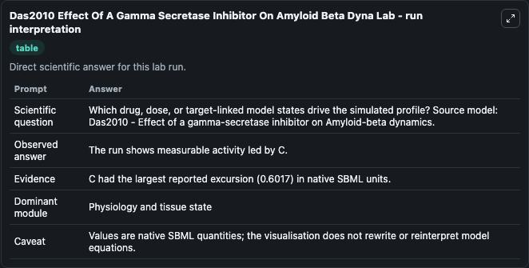
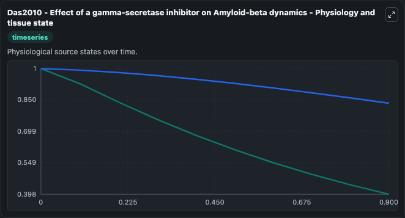
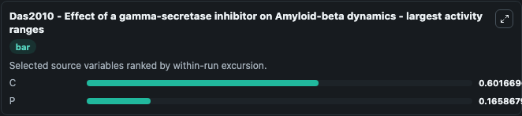
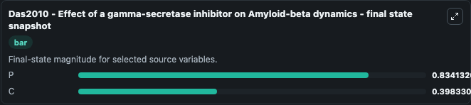
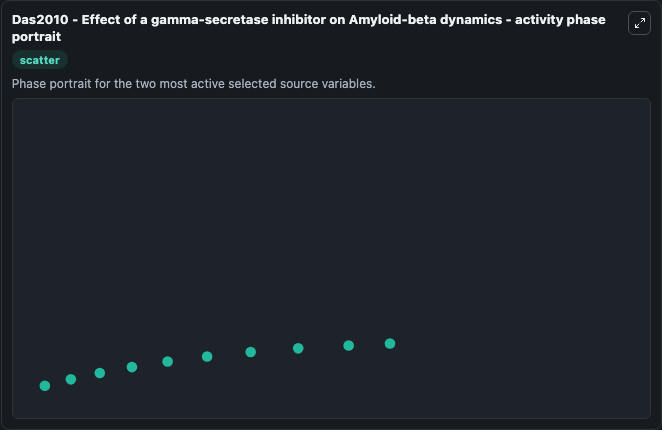

# Das2010 Effect Of A Gamma Secretase Inhibitor On Amyloid Beta Dyna

This Biosimulant lab wraps `Das2010 Effect Of A Gamma Secretase Inhibitor On Amyloid Beta Dyna` as a runnable systems biology model with a companion visualization module.
Das2010 - Effect of a gamma-secretaseinhibitor on Amyloid-beta dynamics This model is described in the article: Modeling effect of a ?-secretase inhibitor on amyloid-? It can be used to explore systems biology das2010 effect of a gamma dynamics and compare simulation behavior across conditions. It can be used to explore the configured dynamics and compare scenario outcomes across configurations.

## What You'll See

The lab asks: Which drug, dose, or target-linked model states drive the simulated profile? Source model: Das2010 - Effect of a gamma-secretase inhibitor on Amyloid-beta dynamics. It runs for 1.0 time units with a communication step of 0.1. The run uses the model defaults declared by the curated SBML wrapper. The generated visualizations focus on P, and C, combining trajectory, endpoint-comparison, and summary-table views from one completed dark-mode run.

In this captured run, **C** moved from 1.000 to 0.3983 across 1.0 simulation windows.


### Output Visualizations



*Summary table for Das2010 Effect Of A Gamma Secretase Inhibitor On Amyloid Beta Dyna, reporting the scientific question, observed answer, dominant module, and caveat.*



*Trajectories of C, and P across the 1.0 simulation. In this run **C** fell from 1.000 to 0.3983 — the largest movements among the focused observables.*



*Largest-excursion ranking of the focused observables — the absolute movement magnitude during the run. Top 2: **C** = 0.6017, **P** = 0.1659.*



*Endpoint snapshot of the focused observables — final values from the captured run. Top 2 by value: **P** = 0.8341, **C** = 0.3983.*



*Visualization card from the Das2010 Effect Of A Gamma Secretase Inhibitor On Amyloid Beta Dyna dark-mode run.*


## Model Context

- Core model: `models/core`
- Visualization model: `models/visualisation`
- Standard: `other`
- Upstream source: `biomodels_ebi:BIOMD0000000551`
- License: `CC0`

## Inputs

| Input | Maps To | Default | Notes |
|---|---|---|---|
| Initial Model State P | `systemsbiology_sbml_das2010_effect_of_a_gamma_secretase_inhibitor_on_biomd0000000551_model.initial_model_state_p` | | Source state initial condition exposed as a model-specific control because no explicit intervention parameter is identifiable. Maps to SBML symbol `P`. |
| Initial Model State C | `systemsbiology_sbml_das2010_effect_of_a_gamma_secretase_inhibitor_on_biomd0000000551_model.initial_model_state_c` | | Source state initial condition exposed as a model-specific control because no explicit intervention parameter is identifiable. Maps to SBML symbol `C`. |

## Outputs

| Output | Maps To | Role |
|---|---|---|
| `state` | `systemsbiology_sbml_das2010_effect_of_a_gamma_secretase_inhibitor_on_biomd0000000551_model.state` | Available to the visualization model and downstream workflows. |
| `summary` | `systemsbiology_sbml_das2010_effect_of_a_gamma_secretase_inhibitor_on_biomd0000000551_model.summary` | Available to the visualization model and downstream workflows. |
| `species_labels` | `systemsbiology_sbml_das2010_effect_of_a_gamma_secretase_inhibitor_on_biomd0000000551_model.species_labels` | Available to the visualization model and downstream workflows. |
| `model_state_p` | `systemsbiology_sbml_das2010_effect_of_a_gamma_secretase_inhibitor_on_biomd0000000551_model.model_state_p` | Available to the visualization model and downstream workflows. |
| `model_state_c` | `systemsbiology_sbml_das2010_effect_of_a_gamma_secretase_inhibitor_on_biomd0000000551_model.model_state_c` | Available to the visualization model and downstream workflows. |

## Runtime

- Duration: `1.0`
- Communication step: `0.1`

## Running Locally

```bash
biosimulant labs serve
```
