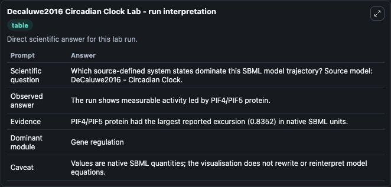
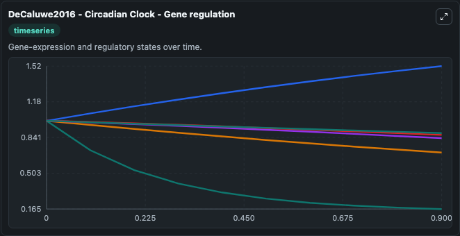
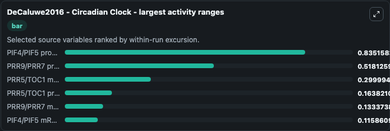
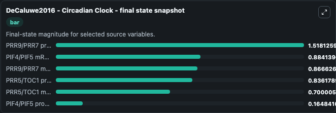
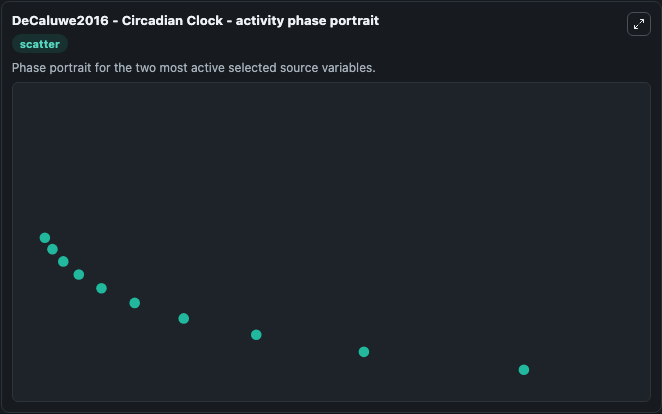

# Decaluwe2016 Circadian Clock

This Biosimulant lab wraps `Decaluwe2016 Circadian Clock` as a runnable systems biology model with a companion visualization module.
DeCaluwé2016 - Circadian Clock This model is described in the article: A Compact Model for the Complex Plant Circadian Clock. It can be used to explore the configured dynamics and compare scenario outcomes across configurations.

## What You'll See

The lab asks: Which source-defined system states dominate this SBML model trajectory? Source model: DeCaluwe2016 - Circadian Clock. It runs for 1.0 time units with a communication step of 0.1. The run uses the model defaults declared by the curated SBML wrapper. The generated visualizations focus on PRR9/PRR7 protein, PRR9/PRR7 mRNA, PRR5/TOC1 protein, PRR5/TOC1 mRNA, PIF4/PIF5 protein, and PIF4/PIF5 mRNA, combining trajectory, endpoint-comparison, and summary-table views from one completed dark-mode run.

In this captured run, **PIF4/PIF5 protein** moved from 1.000 to 0.1648 across 1.0 simulation windows.


### Output Visualizations



*Summary table for Decaluwe2016 Circadian Clock, reporting the scientific question, observed answer, dominant module, and caveat.*



*Trajectories of PIF4/PIF5 protein, PRR9/PRR7 protein, PRR5/TOC1 mRNA, PRR5/TOC1 protein, PRR9/PRR7 mRNA, and PIF4/PIF5 mRNA across the 1.0 simulation. In this run **PRR9/PRR7 protein** climbed from 1.000 to 1.518 and **PIF4/PIF5 protein** fell from 1.000 to 0.1648 — the largest movements among the focused observables.*



*Largest-excursion ranking of the focused observables — the absolute movement magnitude during the run. Top 3: **PIF4/PIF5 protein** = 0.8352, **PRR9/PRR7 protein** = 0.5181, **PRR5/TOC1 mRNA** = 0.3000, with 3 more observables below.*



*Endpoint snapshot of the focused observables — final values from the captured run. Top 3 by value: **PRR9/PRR7 protein** = 1.518, **PIF4/PIF5 mRNA** = 0.8841, **PRR9/PRR7 mRNA** = 0.8666, with 3 more observables below.*



*Visualization card from the Decaluwe2016 Circadian Clock dark-mode run.*


## Model Context

- Core model: `models/core`
- Visualization model: `models/visualisation`
- Standard: `other`
- Upstream source: `biomodels_ebi:BIOMD0000000631`
- License: `CC0`

## Inputs

| Input | Maps To | Default | Notes |
|---|---|---|---|
| Initial Prr9 Prr7 Protein | `systemsbiology_sbml_decaluwe2016_circadian_clock_biomd0000000631_model.initial_prr9_prr7_protein` | | Source state initial condition exposed as a model-specific control because no explicit intervention parameter is identifiable. Maps to SBML symbol `P97_p`. |
| Initial Prr9 Prr7 MRNA | `systemsbiology_sbml_decaluwe2016_circadian_clock_biomd0000000631_model.initial_prr9_prr7_mrna` | | Source state initial condition exposed as a model-specific control because no explicit intervention parameter is identifiable. Maps to SBML symbol `P97_m`. |
| Initial Prr5 Toc1 Protein | `systemsbiology_sbml_decaluwe2016_circadian_clock_biomd0000000631_model.initial_prr5_toc1_protein` | | Source state initial condition exposed as a model-specific control because no explicit intervention parameter is identifiable. Maps to SBML symbol `P51_p`. |
| Initial Prr5 Toc1 MRNA | `systemsbiology_sbml_decaluwe2016_circadian_clock_biomd0000000631_model.initial_prr5_toc1_mrna` | | Source state initial condition exposed as a model-specific control because no explicit intervention parameter is identifiable. Maps to SBML symbol `P51_m`. |
| Initial Pif4 Pif5 Protein | `systemsbiology_sbml_decaluwe2016_circadian_clock_biomd0000000631_model.initial_pif4_pif5_protein` | | Source state initial condition exposed as a model-specific control because no explicit intervention parameter is identifiable. Maps to SBML symbol `PIF_p`. |
| Initial Pif4 Pif5 MRNA | `systemsbiology_sbml_decaluwe2016_circadian_clock_biomd0000000631_model.initial_pif4_pif5_mrna` | | Source state initial condition exposed as a model-specific control because no explicit intervention parameter is identifiable. Maps to SBML symbol `PIF_m`. |

## Outputs

| Output | Maps To | Role |
|---|---|---|
| `state` | `systemsbiology_sbml_decaluwe2016_circadian_clock_biomd0000000631_model.state` | Available to the visualization model and downstream workflows. |
| `summary` | `systemsbiology_sbml_decaluwe2016_circadian_clock_biomd0000000631_model.summary` | Available to the visualization model and downstream workflows. |
| `species_labels` | `systemsbiology_sbml_decaluwe2016_circadian_clock_biomd0000000631_model.species_labels` | Available to the visualization model and downstream workflows. |
| `prr9_prr7_protein` | `systemsbiology_sbml_decaluwe2016_circadian_clock_biomd0000000631_model.prr9_prr7_protein` | Available to the visualization model and downstream workflows. |
| `prr9_prr7_mrna` | `systemsbiology_sbml_decaluwe2016_circadian_clock_biomd0000000631_model.prr9_prr7_mrna` | Available to the visualization model and downstream workflows. |
| `prr5_toc1_protein` | `systemsbiology_sbml_decaluwe2016_circadian_clock_biomd0000000631_model.prr5_toc1_protein` | Available to the visualization model and downstream workflows. |
| `prr5_toc1_mrna` | `systemsbiology_sbml_decaluwe2016_circadian_clock_biomd0000000631_model.prr5_toc1_mrna` | Available to the visualization model and downstream workflows. |
| `pif4_pif5_protein` | `systemsbiology_sbml_decaluwe2016_circadian_clock_biomd0000000631_model.pif4_pif5_protein` | Available to the visualization model and downstream workflows. |
| `pif4_pif5_mrna` | `systemsbiology_sbml_decaluwe2016_circadian_clock_biomd0000000631_model.pif4_pif5_mrna` | Available to the visualization model and downstream workflows. |

## Runtime

- Duration: `1.0`
- Communication step: `0.1`

## Running Locally

```bash
biosimulant labs serve
```
