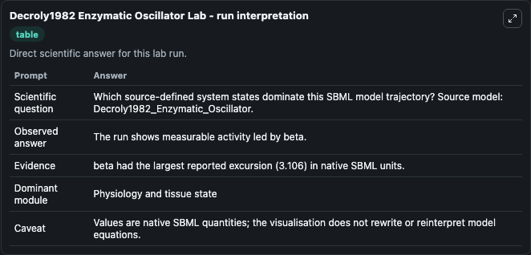
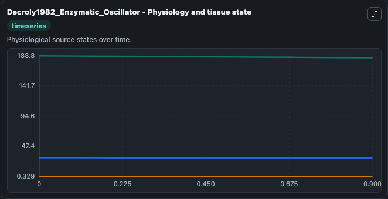
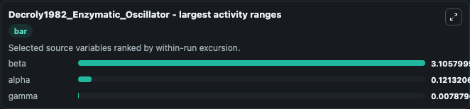
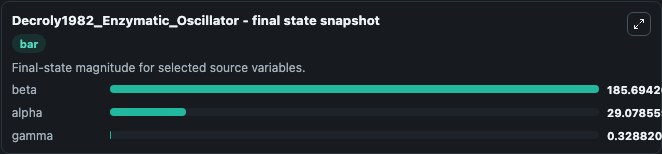
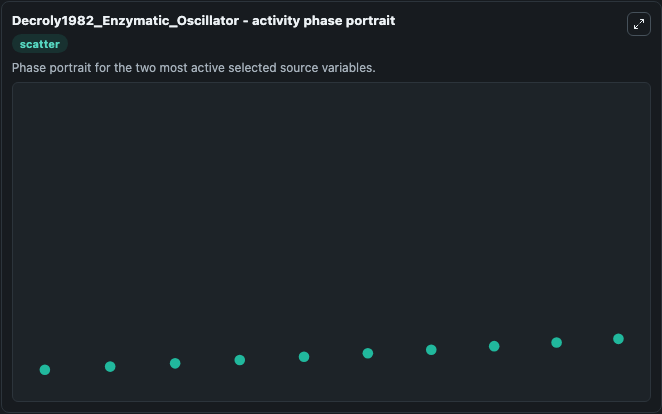

# Decroly1982 Enzymatic Oscillator

This Biosimulant lab wraps `Decroly1982 Enzymatic Oscillator` as a runnable systems biology model with a companion visualization module.
This is the scaled model described in the article: Birhythmicity, chaos, and other patterns of temporal self-organization in a multiply regulated biochemical system Olivier Decroly, Albert Goldbeter,. It can be used to explore the configured dynamics and compare scenario outcomes across configurations.

## What You'll See

The lab asks: Which source-defined system states dominate this SBML model trajectory? Source model: Decroly1982_Enzymatic_Oscillator. It runs for 1.0 time units with a communication step of 0.1. The run uses the model defaults declared by the curated SBML wrapper. The generated visualizations focus on beta, alpha, and gamma, combining trajectory, endpoint-comparison, and summary-table views from one completed dark-mode run.

In this captured run, **beta** moved from 188.8 to 185.7 across 1.0 simulation windows.


### Output Visualizations



*Summary table for Decroly1982 Enzymatic Oscillator, reporting the scientific question, observed answer, dominant module, and caveat.*



*Trajectories of beta, alpha, and gamma across the 1.0 simulation. In this run **beta** fell from 188.8 to 185.7 — the largest movements among the focused observables.*



*Largest-excursion ranking of the focused observables — the absolute movement magnitude during the run. Top 3: **beta** = 3.106, **alpha** = 0.1213, **gamma** = 0.00788.*



*Endpoint snapshot of the focused observables — final values from the captured run. Top 3 by value: **beta** = 185.7, **alpha** = 29.079, **gamma** = 0.3288.*



*Visualization card from the Decroly1982 Enzymatic Oscillator dark-mode run.*


## Model Context

- Core model: `models/core`
- Visualization model: `models/visualisation`
- Standard: `other`
- Upstream source: `biomodels_ebi:BIOMD0000000319`
- License: `CC0`

## Inputs

| Input | Maps To | Default | Notes |
|---|---|---|---|
| Initial Beta | `systemsbiology_sbml_decroly1982_enzymatic_oscillator_biomd0000000319_model.initial_beta` | | Source state initial condition exposed as a model-specific control because no explicit intervention parameter is identifiable. Maps to SBML symbol `beta`. |
| Initial Alpha | `systemsbiology_sbml_decroly1982_enzymatic_oscillator_biomd0000000319_model.initial_alpha` | | Source state initial condition exposed as a model-specific control because no explicit intervention parameter is identifiable. Maps to SBML symbol `alpha`. |
| Initial Gamma | `systemsbiology_sbml_decroly1982_enzymatic_oscillator_biomd0000000319_model.initial_gamma` | | Source state initial condition exposed as a model-specific control because no explicit intervention parameter is identifiable. Maps to SBML symbol `gamma`. |

## Outputs

| Output | Maps To | Role |
|---|---|---|
| `state` | `systemsbiology_sbml_decroly1982_enzymatic_oscillator_biomd0000000319_model.state` | Available to the visualization model and downstream workflows. |
| `summary` | `systemsbiology_sbml_decroly1982_enzymatic_oscillator_biomd0000000319_model.summary` | Available to the visualization model and downstream workflows. |
| `species_labels` | `systemsbiology_sbml_decroly1982_enzymatic_oscillator_biomd0000000319_model.species_labels` | Available to the visualization model and downstream workflows. |
| `beta` | `systemsbiology_sbml_decroly1982_enzymatic_oscillator_biomd0000000319_model.beta` | Available to the visualization model and downstream workflows. |
| `alpha` | `systemsbiology_sbml_decroly1982_enzymatic_oscillator_biomd0000000319_model.alpha` | Available to the visualization model and downstream workflows. |
| `gamma` | `systemsbiology_sbml_decroly1982_enzymatic_oscillator_biomd0000000319_model.gamma` | Available to the visualization model and downstream workflows. |

## Runtime

- Duration: `1.0`
- Communication step: `0.1`

## Running Locally

```bash
biosimulant labs serve
```
