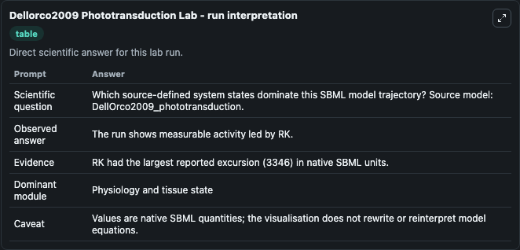
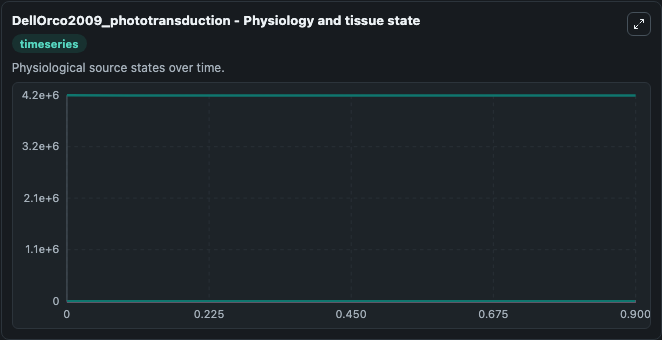
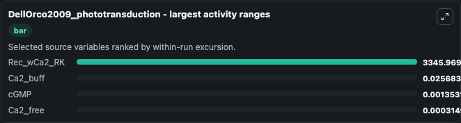
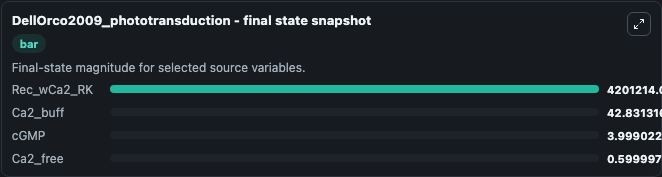
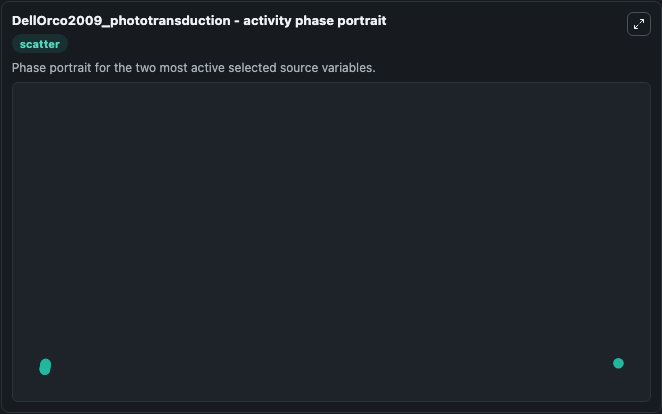

# Dellorco2009 Phototransduction

This Biosimulant lab wraps `Dellorco2009 Phototransduction` as a runnable systems biology model with a companion visualization module.
This a model from the article: Network-level analysis of light adaptation in rod cells under normal and altered conditions. It can be used to explore the configured dynamics and compare scenario outcomes across configurations.

## What You'll See

The lab asks: Which source-defined system states dominate this SBML model trajectory? Source model: DellOrco2009_phototransduction. It runs for 1.0 time units with a communication step of 0.1. The run uses the model defaults declared by the curated SBML wrapper. The generated visualizations focus on Rec_wCa2_RK, Ca2_buff, cGMP, Ca2_free, RGS_PDE_a_Ga_GTP, and R6_RKpre, combining trajectory, endpoint-comparison, and summary-table views from one completed dark-mode run.

In this captured run, **Rec_wCa2_RK** moved from 4.2e+06 to 4.2e+06 across 1.0 simulation windows.


### Output Visualizations



*Summary table for Dellorco2009 Phototransduction, reporting the scientific question, observed answer, dominant module, and caveat.*



*Trajectories of Rec_wCa2_RK, Ca2_buff, cGMP, Ca2_free, RGS_PDE_a_Ga_GTP, and R6_RKpre across the 1.0 simulation. In this run **Rec_wCa2_RK** fell from 4.2e+06 to 4.2e+06 — the largest movements among the focused observables.*



*Largest-excursion ranking of the focused observables — the absolute movement magnitude during the run. Top 3: **Rec_wCa2_RK** = 3346.0, **Ca2_buff** = 0.0257, **cGMP** = 0.00135, with 1 more observable below.*



*Endpoint snapshot of the focused observables — final values from the captured run. Top 3 by value: **Rec_wCa2_RK** = 4.2e+06, **Ca2_buff** = 42.831, **cGMP** = 3.999, with 1 more observable below.*



*Visualization card from the Dellorco2009 Phototransduction dark-mode run.*


## Model Context

- Core model: `models/core`
- Visualization model: `models/visualisation`
- Standard: `other`
- Upstream source: `biomodels_ebi:BIOMD0000000326`
- License: `CC0`

## Inputs

| Input | Maps To | Default | Notes |
|---|---|---|---|
| Otherstimulus | `systemsbiology_sbml_dellorco2009_phototransduction_biomd0000000326_model.otherstimulus` | | Source parameter exposed because its SBML label indicates a boundary, stimulus, dose, ligand, protocol, substrate, or environmental control. Maps to SBML symbol `otherstimulus`. |

## Outputs

| Output | Maps To | Role |
|---|---|---|
| `state` | `systemsbiology_sbml_dellorco2009_phototransduction_biomd0000000326_model.state` | Available to the visualization model and downstream workflows. |
| `summary` | `systemsbiology_sbml_dellorco2009_phototransduction_biomd0000000326_model.summary` | Available to the visualization model and downstream workflows. |
| `species_labels` | `systemsbiology_sbml_dellorco2009_phototransduction_biomd0000000326_model.species_labels` | Available to the visualization model and downstream workflows. |
| `rec_w_ca2_rk` | `systemsbiology_sbml_dellorco2009_phototransduction_biomd0000000326_model.rec_w_ca2_rk` | Available to the visualization model and downstream workflows. |
| `ca2_buff` | `systemsbiology_sbml_dellorco2009_phototransduction_biomd0000000326_model.ca2_buff` | Available to the visualization model and downstream workflows. |
| `c_gmp` | `systemsbiology_sbml_dellorco2009_phototransduction_biomd0000000326_model.c_gmp` | Available to the visualization model and downstream workflows. |
| `ca2_free` | `systemsbiology_sbml_dellorco2009_phototransduction_biomd0000000326_model.ca2_free` | Available to the visualization model and downstream workflows. |
| `rgs_pde_a_ga_gtp` | `systemsbiology_sbml_dellorco2009_phototransduction_biomd0000000326_model.rgs_pde_a_ga_gtp` | Available to the visualization model and downstream workflows. |
| `r6_r_kpre` | `systemsbiology_sbml_dellorco2009_phototransduction_biomd0000000326_model.r6_r_kpre` | Available to the visualization model and downstream workflows. |

## Runtime

- Duration: `1.0`
- Communication step: `0.1`

## Running Locally

```bash
biosimulant labs serve
```
