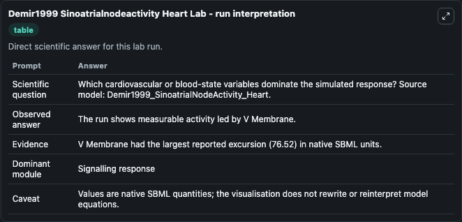
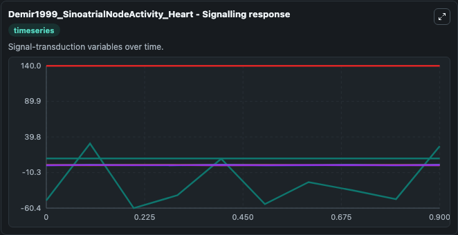
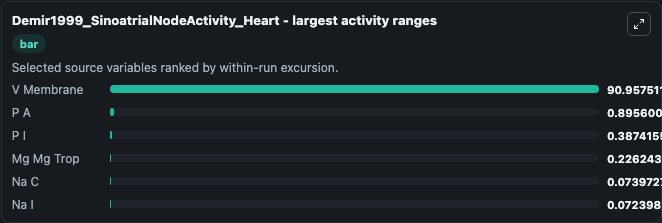
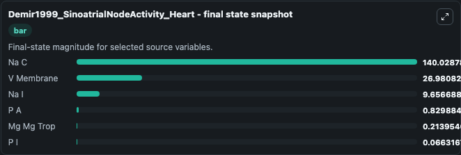
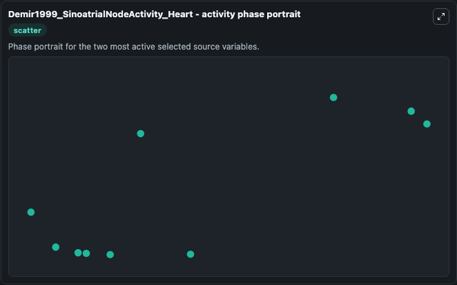

# Demir1999 Sinoatrialnodeactivity Heart

This Biosimulant lab wraps `Demir1999 Sinoatrialnodeactivity Heart` as a runnable systems biology model with a companion visualization module.
This a model from the article: Parasympathetic modulation of sinoatrial node pacemaker activity in rabbitheart: a unifying model. It can be used to explore the configured dynamics and compare scenario outcomes across configurations.

## What You'll See

The lab asks: Which cardiovascular or blood-state variables dominate the simulated response? Source model: Demir1999_SinoatrialNodeActivity_Heart. It runs for 1.0 time units with a communication step of 0.1. The run uses the model defaults declared by the curated SBML wrapper. The generated visualizations focus on V Membrane, P I, P A, Na I, Na C, and Mg Mg Trop, combining trajectory, endpoint-comparison, and summary-table views from one completed dark-mode run.

In this captured run, **V Membrane** moved from -49.541 to 26.981 across 1.0 simulation windows.


### Output Visualizations



*Summary table for Demir1999 Sinoatrialnodeactivity Heart, reporting the scientific question, observed answer, dominant module, and caveat.*



*Trajectories of V Membrane, P A, P I, Mg Mg Trop, Na C, and Na I across the 1.0 simulation. In this run **V Membrane** climbed from -49.541 to 26.981 and **P I** fell from 0.3778 to 0.0663 — the largest movements among the focused observables.*



*Largest-excursion ranking of the focused observables — the absolute movement magnitude during the run. Top 3: **V Membrane** = 90.958, **P A** = 0.8956, **P I** = 0.3874, with 3 more observables below.*



*Endpoint snapshot of the focused observables — final values from the captured run. Top 3 by value: **Na C** = 140.0, **V Membrane** = 26.981, **Na I** = 9.657, with 3 more observables below.*



*Visualization card from the Demir1999 Sinoatrialnodeactivity Heart dark-mode run.*


## Model Context

- Core model: `models/core`
- Visualization model: `models/visualisation`
- Standard: `other`
- Upstream source: `biomodels_ebi:MODEL0912940495`
- License: `CC0`

## Inputs

| Input | Maps To | Default | Notes |
|---|---|---|---|
| Initial V Membrane | `systemsbiology_sbml_demir1999_sinoatrialnodeactivity_heart_model0912940495_model.initial_v_membrane` | | Source state initial condition exposed as a model-specific control because no explicit intervention parameter is identifiable. Maps to SBML symbol `V_membrane`. |
| Initial Model State P I | `systemsbiology_sbml_demir1999_sinoatrialnodeactivity_heart_model0912940495_model.initial_model_state_p_i` | | Source state initial condition exposed as a model-specific control because no explicit intervention parameter is identifiable. Maps to SBML symbol `P_i`. |
| Initial Model State P A | `systemsbiology_sbml_demir1999_sinoatrialnodeactivity_heart_model0912940495_model.initial_model_state_p_a` | | Source state initial condition exposed as a model-specific control because no explicit intervention parameter is identifiable. Maps to SBML symbol `P_a`. |
| Initial Na I | `systemsbiology_sbml_demir1999_sinoatrialnodeactivity_heart_model0912940495_model.initial_na_i` | | Source state initial condition exposed as a model-specific control because no explicit intervention parameter is identifiable. Maps to SBML symbol `Na_i`. |
| Initial Na C | `systemsbiology_sbml_demir1999_sinoatrialnodeactivity_heart_model0912940495_model.initial_na_c` | | Source state initial condition exposed as a model-specific control because no explicit intervention parameter is identifiable. Maps to SBML symbol `Na_c`. |
| Initial Mg Mg Trop | `systemsbiology_sbml_demir1999_sinoatrialnodeactivity_heart_model0912940495_model.initial_mg_mg_trop` | | Source state initial condition exposed as a model-specific control because no explicit intervention parameter is identifiable. Maps to SBML symbol `Mg_Mg_Trop`. |

## Outputs

| Output | Maps To | Role |
|---|---|---|
| `state` | `systemsbiology_sbml_demir1999_sinoatrialnodeactivity_heart_model0912940495_model.state` | Available to the visualization model and downstream workflows. |
| `summary` | `systemsbiology_sbml_demir1999_sinoatrialnodeactivity_heart_model0912940495_model.summary` | Available to the visualization model and downstream workflows. |
| `species_labels` | `systemsbiology_sbml_demir1999_sinoatrialnodeactivity_heart_model0912940495_model.species_labels` | Available to the visualization model and downstream workflows. |
| `v_membrane` | `systemsbiology_sbml_demir1999_sinoatrialnodeactivity_heart_model0912940495_model.v_membrane` | Available to the visualization model and downstream workflows. |
| `p_i` | `systemsbiology_sbml_demir1999_sinoatrialnodeactivity_heart_model0912940495_model.p_i` | Available to the visualization model and downstream workflows. |
| `p_a` | `systemsbiology_sbml_demir1999_sinoatrialnodeactivity_heart_model0912940495_model.p_a` | Available to the visualization model and downstream workflows. |
| `na_i` | `systemsbiology_sbml_demir1999_sinoatrialnodeactivity_heart_model0912940495_model.na_i` | Available to the visualization model and downstream workflows. |
| `na_c` | `systemsbiology_sbml_demir1999_sinoatrialnodeactivity_heart_model0912940495_model.na_c` | Available to the visualization model and downstream workflows. |
| `mg_mg_trop` | `systemsbiology_sbml_demir1999_sinoatrialnodeactivity_heart_model0912940495_model.mg_mg_trop` | Available to the visualization model and downstream workflows. |

## Runtime

- Duration: `1.0`
- Communication step: `0.1`

## Running Locally

```bash
biosimulant labs serve
```
