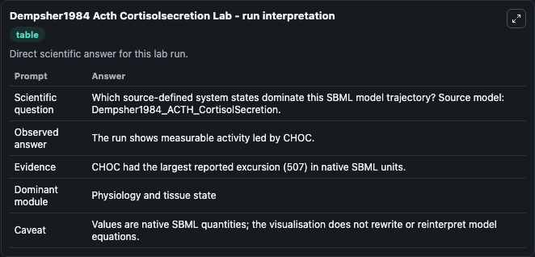
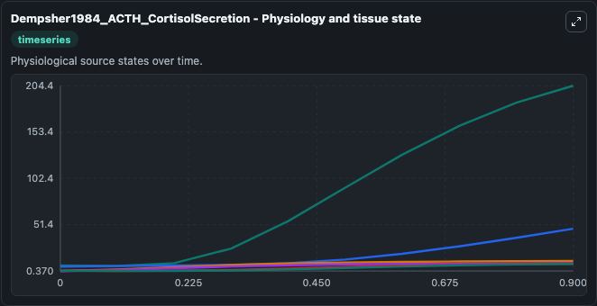
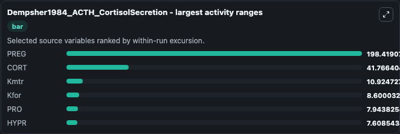
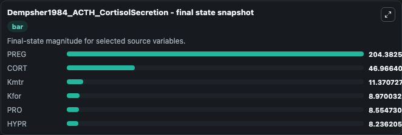
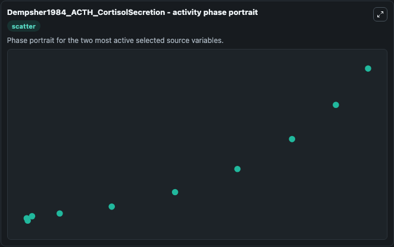

# Dempsher1984 Acth Cortisolsecretion

This Biosimulant lab wraps `Dempsher1984 Acth Cortisolsecretion` as a runnable systems biology model with a companion visualization module.
This a model from the article: A mechanistic model of ACTH-stimulated cortisol secretion. It can be used to explore the configured dynamics and compare scenario outcomes across configurations.

## What You'll See

The lab asks: Which source-defined system states dominate this SBML model trajectory? Source model: Dempsher1984_ACTH_CortisolSecretion. It runs for 1.0 time units with a communication step of 0.1. The run uses the model defaults declared by the curated SBML wrapper. The generated visualizations focus on PRO, PREG, Kmtr, Kfor, HYPR, and CORT, combining trajectory, endpoint-comparison, and summary-table views from one completed dark-mode run.

In this captured run, **PREG** moved from 6.560 to 204.4 across 1.0 simulation windows.


### Output Visualizations



*Summary table for Dempsher1984 Acth Cortisolsecretion, reporting the scientific question, observed answer, dominant module, and caveat.*



*Trajectories of PREG, CORT, Kmtr, Kfor, PRO, and HYPR across the 1.0 simulation. In this run **PREG** climbed from 6.560 to 204.4 — the largest movements among the focused observables.*



*Largest-excursion ranking of the focused observables — the absolute movement magnitude during the run. Top 3: **PREG** = 198.4, **CORT** = 41.766, **Kmtr** = 10.925, with 3 more observables below.*



*Endpoint snapshot of the focused observables — final values from the captured run. Top 3 by value: **PREG** = 204.4, **CORT** = 46.966, **Kmtr** = 11.371, with 3 more observables below.*



*Visualization card from the Dempsher1984 Acth Cortisolsecretion dark-mode run.*


## Model Context

- Core model: `models/core`
- Visualization model: `models/visualisation`
- Standard: `other`
- Upstream source: `biomodels_ebi:MODEL0912835813`
- License: `CC0`

## Inputs

| Input | Maps To | Default | Notes |
|---|---|---|---|
| Initial Model State Pro | `systemsbiology_sbml_dempsher1984_acth_cortisolsecretion_model0912835813_model.initial_model_state_pro` | | Source state initial condition exposed as a model-specific control because no explicit intervention parameter is identifiable. Maps to SBML symbol `PRO`. |
| Initial Preg | `systemsbiology_sbml_dempsher1984_acth_cortisolsecretion_model0912835813_model.initial_preg` | | Source state initial condition exposed as a model-specific control because no explicit intervention parameter is identifiable. Maps to SBML symbol `PREG`. |
| Initial Kmtr | `systemsbiology_sbml_dempsher1984_acth_cortisolsecretion_model0912835813_model.initial_kmtr` | | Source state initial condition exposed as a model-specific control because no explicit intervention parameter is identifiable. Maps to SBML symbol `Kmtr`. |
| Initial Kfor | `systemsbiology_sbml_dempsher1984_acth_cortisolsecretion_model0912835813_model.initial_kfor` | | Source state initial condition exposed as a model-specific control because no explicit intervention parameter is identifiable. Maps to SBML symbol `Kfor`. |
| Initial Hypr | `systemsbiology_sbml_dempsher1984_acth_cortisolsecretion_model0912835813_model.initial_hypr` | | Source state initial condition exposed as a model-specific control because no explicit intervention parameter is identifiable. Maps to SBML symbol `HYPR`. |
| Initial Cort | `systemsbiology_sbml_dempsher1984_acth_cortisolsecretion_model0912835813_model.initial_cort` | | Source state initial condition exposed as a model-specific control because no explicit intervention parameter is identifiable. Maps to SBML symbol `CORT`. |

## Outputs

| Output | Maps To | Role |
|---|---|---|
| `state` | `systemsbiology_sbml_dempsher1984_acth_cortisolsecretion_model0912835813_model.state` | Available to the visualization model and downstream workflows. |
| `summary` | `systemsbiology_sbml_dempsher1984_acth_cortisolsecretion_model0912835813_model.summary` | Available to the visualization model and downstream workflows. |
| `species_labels` | `systemsbiology_sbml_dempsher1984_acth_cortisolsecretion_model0912835813_model.species_labels` | Available to the visualization model and downstream workflows. |
| `pro` | `systemsbiology_sbml_dempsher1984_acth_cortisolsecretion_model0912835813_model.pro` | Available to the visualization model and downstream workflows. |
| `preg` | `systemsbiology_sbml_dempsher1984_acth_cortisolsecretion_model0912835813_model.preg` | Available to the visualization model and downstream workflows. |
| `kmtr` | `systemsbiology_sbml_dempsher1984_acth_cortisolsecretion_model0912835813_model.kmtr` | Available to the visualization model and downstream workflows. |
| `kfor` | `systemsbiology_sbml_dempsher1984_acth_cortisolsecretion_model0912835813_model.kfor` | Available to the visualization model and downstream workflows. |
| `hypr` | `systemsbiology_sbml_dempsher1984_acth_cortisolsecretion_model0912835813_model.hypr` | Available to the visualization model and downstream workflows. |
| `cort` | `systemsbiology_sbml_dempsher1984_acth_cortisolsecretion_model0912835813_model.cort` | Available to the visualization model and downstream workflows. |

## Runtime

- Duration: `1.0`
- Communication step: `0.1`

## Running Locally

```bash
biosimulant labs serve
```
