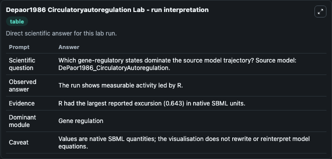
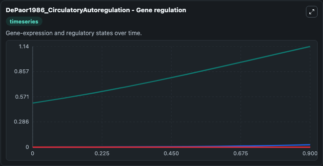
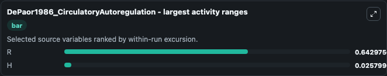
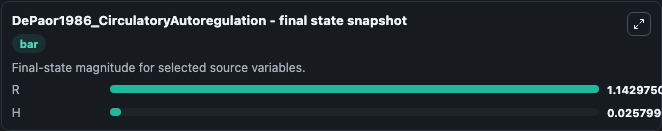
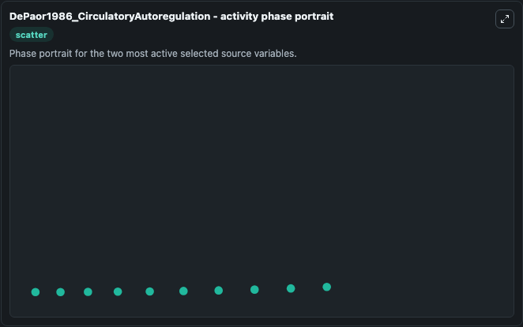

# Depaor1986 Circulatoryautoregulation

This Biosimulant lab wraps `Depaor1986 Circulatoryautoregulation` as a runnable systems biology model with a companion visualization module.
This a model from the article: A feedback oscillator model for circulatory autoregulation Annraoi M. It can be used to explore the configured dynamics and compare scenario outcomes across configurations.

## What You'll See

The lab asks: Which gene-regulatory states dominate the source model trajectory? Source model: DePaor1986_CirculatoryAutoregulation. It runs for 1.0 time units with a communication step of 0.1. The run uses the model defaults declared by the curated SBML wrapper. The generated visualizations focus on X3, X2, X1, R, and H, combining trajectory, endpoint-comparison, and summary-table views from one completed dark-mode run.

In this captured run, **R** moved from 0.5000 to 1.143 across 1.0 simulation windows.


### Output Visualizations



*Summary table for Depaor1986 Circulatoryautoregulation, reporting the scientific question, observed answer, dominant module, and caveat.*



*Trajectories of R, H, X3, X2, and X1 across the 1.0 simulation. In this run **R** climbed from 0.5000 to 1.143 — the largest movements among the focused observables.*



*Largest-excursion ranking of the focused observables — the absolute movement magnitude during the run. Top 2: **R** = 0.6430, **H** = 0.0258.*



*Endpoint snapshot of the focused observables — final values from the captured run. Top 2 by value: **R** = 1.143, **H** = 0.0258.*



*Visualization card from the Depaor1986 Circulatoryautoregulation dark-mode run.*


## Model Context

- Core model: `models/core`
- Visualization model: `models/visualisation`
- Standard: `other`
- Upstream source: `biomodels_ebi:MODEL1172940336`
- License: `CC0`

## Inputs

| Input | Maps To | Default | Notes |
|---|---|---|---|
| Initial Model State X3 | `systemsbiology_sbml_depaor1986_circulatoryautoregulation_model1172940336_model.initial_model_state_x3` | | Source state initial condition exposed as a model-specific control because no explicit intervention parameter is identifiable. Maps to SBML symbol `x3`. |
| Initial Model State X2 | `systemsbiology_sbml_depaor1986_circulatoryautoregulation_model1172940336_model.initial_model_state_x2` | | Source state initial condition exposed as a model-specific control because no explicit intervention parameter is identifiable. Maps to SBML symbol `x2`. |
| Initial Model State X1 | `systemsbiology_sbml_depaor1986_circulatoryautoregulation_model1172940336_model.initial_model_state_x1` | | Source state initial condition exposed as a model-specific control because no explicit intervention parameter is identifiable. Maps to SBML symbol `x1`. |
| Initial Model State R | `systemsbiology_sbml_depaor1986_circulatoryautoregulation_model1172940336_model.initial_model_state_r` | | Source state initial condition exposed as a model-specific control because no explicit intervention parameter is identifiable. Maps to SBML symbol `r`. |
| Initial Model State H | `systemsbiology_sbml_depaor1986_circulatoryautoregulation_model1172940336_model.initial_model_state_h` | | Source state initial condition exposed as a model-specific control because no explicit intervention parameter is identifiable. Maps to SBML symbol `h`. |

## Outputs

| Output | Maps To | Role |
|---|---|---|
| `state` | `systemsbiology_sbml_depaor1986_circulatoryautoregulation_model1172940336_model.state` | Available to the visualization model and downstream workflows. |
| `summary` | `systemsbiology_sbml_depaor1986_circulatoryautoregulation_model1172940336_model.summary` | Available to the visualization model and downstream workflows. |
| `species_labels` | `systemsbiology_sbml_depaor1986_circulatoryautoregulation_model1172940336_model.species_labels` | Available to the visualization model and downstream workflows. |
| `model_state_x3` | `systemsbiology_sbml_depaor1986_circulatoryautoregulation_model1172940336_model.model_state_x3` | Available to the visualization model and downstream workflows. |
| `model_state_x2` | `systemsbiology_sbml_depaor1986_circulatoryautoregulation_model1172940336_model.model_state_x2` | Available to the visualization model and downstream workflows. |
| `model_state_x1` | `systemsbiology_sbml_depaor1986_circulatoryautoregulation_model1172940336_model.model_state_x1` | Available to the visualization model and downstream workflows. |
| `model_state_r` | `systemsbiology_sbml_depaor1986_circulatoryautoregulation_model1172940336_model.model_state_r` | Available to the visualization model and downstream workflows. |
| `model_state_h` | `systemsbiology_sbml_depaor1986_circulatoryautoregulation_model1172940336_model.model_state_h` | Available to the visualization model and downstream workflows. |

## Runtime

- Duration: `1.0`
- Communication step: `0.1`

## Running Locally

```bash
biosimulant labs serve
```
